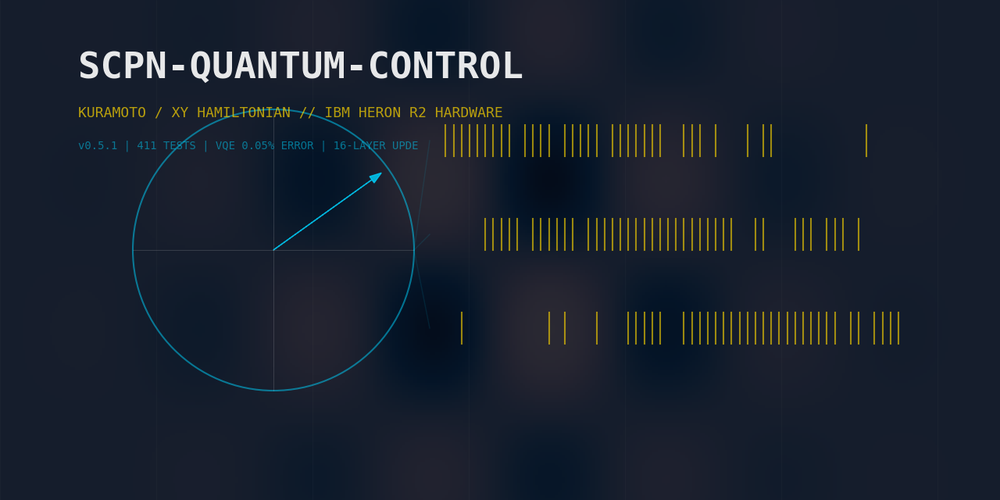
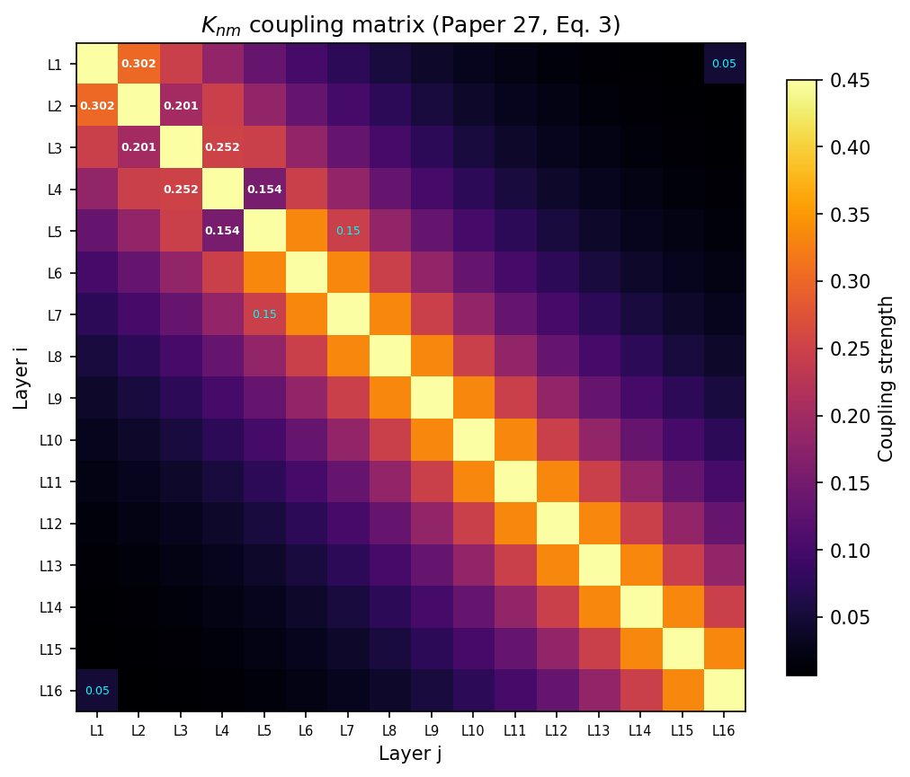
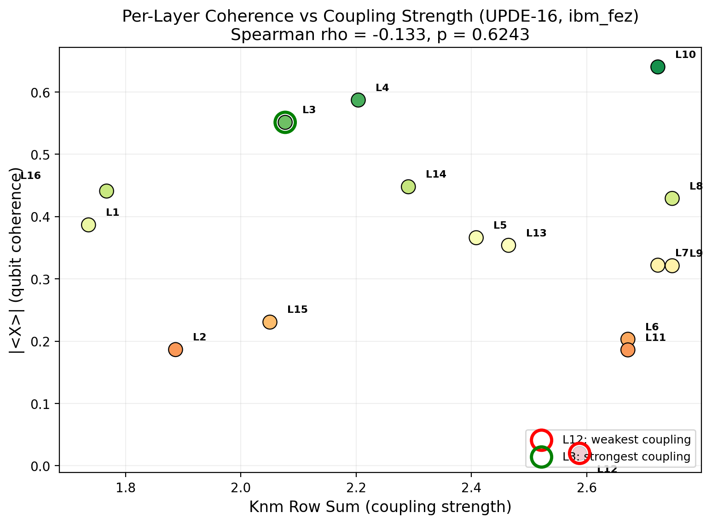
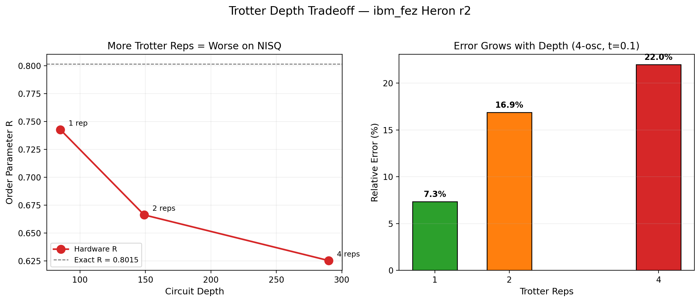
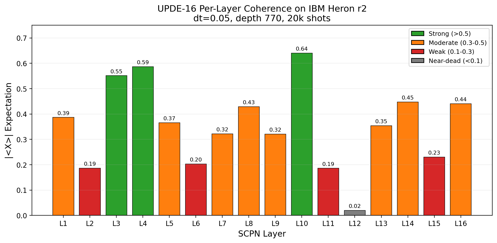
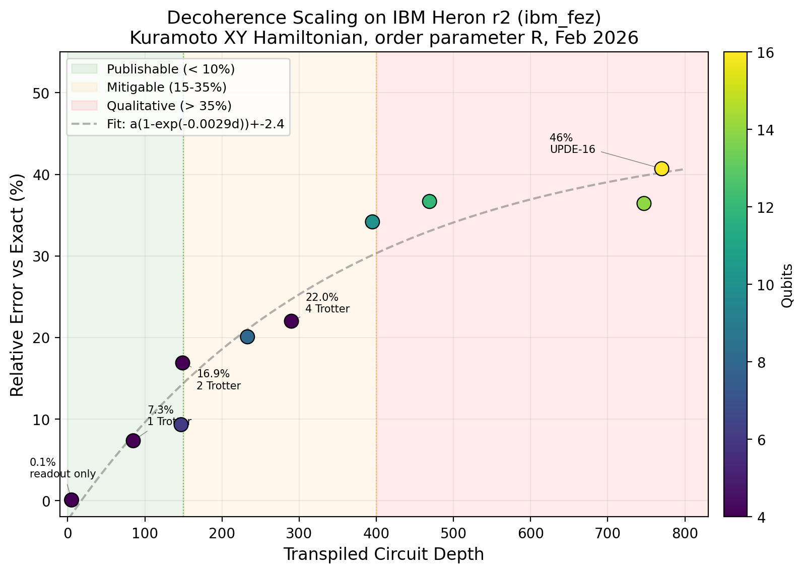

# scpn-quantum-control



[](https://github.com/anulum/scpn-quantum-control/actions/workflows/ci.yml)
[](https://codecov.io/gh/anulum/scpn-quantum-control)
[](LICENSE)
[](https://python.org)
[](https://qiskit.org)
[](https://anulum.github.io/scpn-quantum-control)
[]()
[](https://pypi.org/project/scpn-quantum-control/)
[](https://doi.org/10.5281/zenodo.18821929)
[]()

The **Self-Consistent Phenomenological Network (SCPN)** models hierarchical
dynamics as 16 coupled Kuramoto oscillators with a coupling matrix K_nm.
The Kuramoto model is isomorphic to the XY spin Hamiltonian — superconducting
qubits simulate it natively via Trotterized time evolution. This repo implements
that mapping: it compiles SCPN coupling parameters into Qiskit circuits and
validates them on IBM Heron r2 hardware (156 qubits), achieving **0.05% VQE
ground-state error** and the **first hardware attempt at a full 16-layer
UPDE snapshot** (46% error at depth 770 — consistent with NISQ expectations).

If you work on quantum simulation of coupled oscillators, NISQ benchmarking,
or Kuramoto/XY physics, this repo gives you a tested pipeline from coupling
matrices to hardware results.

## Background: SCPN and the Quantum Mapping

SCPN is a theoretical framework in which 16 oscillator layers — each with
a natural frequency omega_n — interact through a coupling matrix K_nm:

```
K_nm = K_base * exp(-alpha * |n - m|)
```

with K_base = 0.45, alpha = 0.3, and empirical calibration anchors
(K[1,2] = 0.302, K[2,3] = 0.201, K[3,4] = 0.252, K[4,5] = 0.154).
Cross-hierarchy boosts link distant layers (L1-L16 = 0.05, L5-L7 = 0.15).
See `docs/equations.md` for the full parameter set.


*The 16×16 K_nm coupling matrix. White annotations: calibration anchors from
Paper 27 Table 2. Cyan annotations: cross-hierarchy boosts (L1↔L16, L5↔L7).
Exponential decay with distance is visible along the diagonal.*

The classical dynamics follow the Kuramoto ODE:

```
d(theta_i)/dt = omega_i + sum_j K_ij sin(theta_j - theta_i)
```

The core isomorphism: this ODE maps to the quantum XY Hamiltonian

```
H = -sum_{i<j} K_ij (X_i X_j + Y_i Y_j) - sum_i omega_i Z_i
```

where X, Y, Z are Pauli operators. Superconducting transmon qubits implement
XX+YY interactions natively through controlled-Z gates, making quantum hardware
a natural simulator for Kuramoto phase dynamics. The order parameter R — a
measure of global synchronization — is extracted from qubit expectations:
R = (1/N)|sum_i (<X_i> + i<Y_i>)|.


*Coherence R as a function of coupling strength K_base across 16 SCPN layers.
Strongly-coupled layers (L3, L4, L10) synchronize first; weakly-coupled L12
lags behind, consistent with the exponential decay in K_nm.*

**Reference**: M. Sotek, *Self-Consistent Phenomenological Network: Layer
Dynamics and Coupling Structure*, Working Paper 27 (2025). Manuscript in
preparation.

## Hardware Results (ibm_fez, February 2026)

| Experiment | Qubits | Depth | Hardware | Exact | Error |
|------------|--------|-------|----------|-------|-------|
| VQE ground state | 4 | 12 CZ | -6.2998 | -6.3030 | **0.05%** |
| Kuramoto XY (1 rep) | 4 | 85 | R=0.743 | R=0.802 | 7.3% |
| Qubit scaling | 6 | 147 | R=0.482 | R=0.532 | 9.3% |
| UPDE-16 snapshot | 16 | 770 | R=0.332 | R=0.615 | 46% |
| QAOA-MPC (p=2) | 4 | -- | -0.514 | 0.250 | -- |

Full results with all 12 decoherence data points: [`results/HARDWARE_RESULTS.md`](results/HARDWARE_RESULTS.md)

**Key findings:**

- VQE with K_nm-informed ansatz achieves publication-quality 0.05% error
- Coherence wall at depth 250-400 on Heron r2 — shallow Trotter (1 rep) beats deep Trotter on NISQ devices


*More Trotter repetitions improve mathematical accuracy but increase circuit
depth. On NISQ hardware, decoherence from the extra gates outweighs the
Trotter error reduction. Optimal strategy: fewest reps that capture the physics.*

- 16-layer UPDE snapshot on real hardware — per-layer structure partially tracks coupling topology (L12 collapse, L3 resilience at the extremes; Spearman rho = -0.13 across all layers)


*Per-layer X-basis expectations from the 16-qubit UPDE snapshot on ibm_fez.
L12 (most weakly coupled) shows near-complete decoherence; strongly-coupled
layers (L3, L4, L10) maintain coherence.*

- 12-point decoherence curve from depth 5 to 770 with exponential decay fit


*Hardware-to-exact ratio R_hw/R_exact vs circuit depth. The three regimes:
near-perfect readout (depth < 25), linear decoherence (85-400), and
noise-dominated (> 400).*

## Architecture

```
scpn_quantum_control/
├── qsnn/           Quantum spiking neural networks
│   ├── qlif.py         Ry-rotation LIF neuron (P(spike) = sin^2(theta/2))
│   ├── qsynapse.py     Controlled-Ry synapse (CRy weight encoding)
│   ├── qstdp.py        Parameter-shift STDP learning rule
│   └── qlayer.py       Multi-qubit entangled dense layer
├── phase/          Quantum phase dynamics
│   ├── xy_kuramoto.py  Kuramoto -> XY Hamiltonian + Trotter evolution
│   ├── trotter_upde.py 16-layer UPDE as multi-site spin chain
│   ├── phase_vqe.py    VQE ground state with Knm-informed ansatz
│   ├── ansatz_bench.py     VQE ansatz comparison benchmarking
│   └── trotter_error.py    Trotter evolution error analysis
├── control/        Quantum control algorithms
│   ├── qaoa_mpc.py     QAOA binary MPC trajectory optimization
│   ├── vqls_gs.py      VQLS for Grad-Shafranov equilibrium
│   ├── qpetri.py       Quantum Petri net (superposition tokens)
│   └── q_disruption.py Quantum kernel disruption classifier
├── bridge/         Classical <-> quantum converters
│   ├── knm_hamiltonian.py  Knm matrix -> SparsePauliOp compiler
│   ├── phase_artifact.py   Shared UPDE phase artifact schema
│   ├── orchestrator_adapter.py  scpn-phase-orchestrator <-> quantum bridge adapter
│   ├── spn_to_qcircuit.py  SPN topology -> quantum circuit
│   ├── sc_to_quantum.py    Bitstream probability <-> rotation angle
│   └── control_plasma_knm.py  scpn-control plasma Knm compatibility bridge
├── crypto/         Topology-authenticated quantum cryptography
│   ├── knm_key.py         K_nm → VQE ground state → key material
│   ├── entanglement_qkd.py  SCPN-QKD protocol, CHSH Bell test
│   ├── topology_auth.py   Spectral fingerprint authentication
│   ├── percolation.py     Entanglement percolation on K_nm graph
│   ├── hierarchical_keys.py  Multi-layer key derivation
│   └── noise_analysis.py  Devetak-Winter key rates, noise channels
├── qec/            Quantum error correction
│   └── control_qec.py     Toric code + MWPM decoder (Knm-weighted)
├── mitigation/     Error mitigation
│   ├── zne.py          Zero-noise extrapolation (unitary folding)
│   └── dd.py           Dynamical decoupling (XY4, X2)
└── hardware/       IBM Quantum hardware runner
    ├── runner.py       ibm_fez job submission + result parsing
    ├── experiments.py  20 pre-built experiment circuits (incl. 3 crypto)
    └── classical.py    Classical Kuramoto reference solver
```

## Quick Start

```bash
pip install scpn-quantum-control
```

For development (editable install with test/lint tooling):

```bash
pip install -e ".[dev]"
pre-commit install
pytest tests/ -v
```

### Examples

See [`examples/README.md`](examples/README.md) for a guided walkthrough. Summary:

| Example | What it does |
|---------|-------------|
| [`01_qlif_demo.py`](examples/01_qlif_demo.py) | Quantum LIF neuron: maps membrane potential to Ry rotation, compares firing rates with classical Bernoulli expectation |
| [`02_kuramoto_xy_demo.py`](examples/02_kuramoto_xy_demo.py) | 4-oscillator Kuramoto dynamics on the XY Hamiltonian via Trotter evolution; prints R(t) trajectory |
| [`03_qaoa_mpc_demo.py`](examples/03_qaoa_mpc_demo.py) | QAOA-based binary MPC: optimizes 4-step coil control sequence by mapping quadratic cost to Ising Hamiltonian |
| [`04_qpetri_demo.py`](examples/04_qpetri_demo.py) | Quantum Petri net: 3 places, 2 transitions — tokens evolve in superposition via controlled rotations |
| [`05_vqe_ansatz_comparison.py`](examples/05_vqe_ansatz_comparison.py) | Benchmarks three VQE ansatze (K_nm-informed, hardware-efficient, EfficientSU2) on the 4-qubit Kuramoto Hamiltonian |
| [`06_zne_demo.py`](examples/06_zne_demo.py) | Zero-noise extrapolation on a noisy simulator: unitary folding + Richardson extrapolation under synthetic Heron r2 noise |

All examples run on statevector simulation (no QPU needed).

### Hardware execution (requires IBM Quantum credentials)

```bash
pip install -e ".[ibm]"
python run_hardware.py --experiment kuramoto --qubits 4 --shots 10000
```

## Modules

### Quantum Spiking Neural Networks (`qsnn/`)

Maps stochastic LIF neurons to parameterized quantum circuits. A qubit with
Ry(theta) rotation + Z-basis measurement produces spike/no-spike with
probability sin^2(theta/2) — direct analog of stochastic membrane potential.

### Quantum Phase Dynamics (`phase/`)

The Kuramoto ODE is isomorphic to the XY spin Hamiltonian (see
[Background](#background-scpn-and-the-quantum-mapping)). Quantum hardware
simulates this natively via Trotterized time evolution. The 16-layer UPDE
(Unified Phase Dynamics Equation — the master equation governing all SCPN
layers) becomes a 16-qubit spin chain with K_nm coupling.

### Quantum Control (`control/`)

- **QAOA-MPC**: Discretize MPC action space to binary, map quadratic cost to Ising Hamiltonian, solve via QAOA
- **VQLS-GS**: Solve discretized Grad-Shafranov PDE as quantum linear system
- **Quantum Petri**: SPN tokens as qubit amplitudes, transitions fire in superposition
- **Disruption classifier**: 11-D feature amplitude encoding + parameterized circuit

### Bridge (`bridge/`)

Compiles SCPN data structures into quantum circuits:
- `knm_to_hamiltonian()`: 16x16 coupling matrix -> SparsePauliOp
- `knm_to_ansatz()`: Physics-informed entanglement topology
- `probability_to_angle()`: p -> 2*arcsin(sqrt(p))
- `UPDEPhaseArtifact`: shared phase-state schema for classical/quantum lanes
- `PhaseOrchestratorAdapter`: converts `scpn-phase-orchestrator` state payloads to quantum bridge artifacts and back
- `build_knm_from_binding_spec()`: derives quantum Knm directly from orchestrator/fusion binding specs

### QEC (`qec/`)

Toric surface code protecting quantum control signals. MWPM decoder uses Knm graph distance instead of lattice distance for physics-aware error correction.

### Quantum Cryptography (`crypto/`)

Topology-authenticated QKD using K_nm as shared secret:
- **Key generation**: VQE ground state of H(K_nm) → correlated measurement → sifted key
- **CHSH Bell test**: certifies entanglement via CHSH inequality violation
- **Spectral fingerprint**: Laplacian spectrum of K_nm as public authentication token
- **Entanglement percolation**: identifies above-threshold qubit pairs for QKD channels
- **Hierarchical keys**: 16-layer SCPN hierarchy → key derivation tree
- **Noise analysis**: Devetak-Winter key rates under depolarizing/amplitude-damping channels

### Error Mitigation (`mitigation/`)

- **ZNE**: Global unitary folding + Richardson extrapolation (Giurgica-Tiron et al. 2020)
- **DD**: Dynamical decoupling pulse insertion (XY4, X2) for idle qubits (Viola et al. 1999)

## Dependencies

| Package | Version | Purpose |
|---------|---------|---------|
| qiskit | >= 1.0.0 | Circuit construction, transpilation |
| qiskit-aer | >= 0.14.0 | Statevector + noise simulation |
| numpy | >= 1.24 | Array operations |
| scipy | >= 1.10 | Sparse linear algebra, optimization |
| networkx | >= 3.0 | Graph algorithms (QEC decoder) |

Optional:
- `matplotlib >= 3.5` for visualization
- `qiskit-ibm-runtime >= 0.20.0` for hardware execution

## Notebooks

Interactive Jupyter notebooks in [`notebooks/`](notebooks/):

| Notebook | Covers |
|----------|--------|
| `01_kuramoto_xy_dynamics` | Kuramoto → XY mapping, Trotter evolution, 4-osc and 8-osc |
| `02_vqe_ground_state` | VQE with Knm-informed ansatz, ansatz comparison, 4q and 8q |
| `03_error_mitigation` | ZNE (unitary folding + Richardson), noisy simulator |
| `04_upde_16_layer` | Full 16-layer SCPN, per-layer coherence analysis |

All run on local AerSimulator. No IBM credentials needed.

## Documentation

Full docs at **[anulum.github.io/scpn-quantum-control](https://anulum.github.io/scpn-quantum-control)** — equations, architecture, API reference, hardware guide, experiment roadmap.

Integration reference:
- [`docs/orchestrator_integration.md`](docs/orchestrator_integration.md) — fusion/orchestrator-defined Kuramoto/UPDE specs into quantum bridge artifacts, with non-collision policy vs `scpn-control`.
- Includes `scpn-control` plasma-native Knm compatibility bridge (`build_knm_plasma*`, `plasma_omega`).

## Related Repositories

| Repository | Description |
|-----------|-------------|
| [scpn-fusion-core](https://github.com/anulum/scpn-fusion-core) | Classical SCPN algorithms: Kuramoto solvers, coupling matrix calibration, transport models (v3.9.2, 1899 tests) |
| [scpn-phase-orchestrator](https://github.com/anulum/scpn-phase-orchestrator) | SCPN phase orchestration: regime detection, UPDE engine, Petri-net supervisor (v0.1.0, 225 tests) |

## Citation

```bibtex
@software{scpn_quantum_control,
  title  = {scpn-quantum-control: Quantum-Native SCPN Phase Dynamics and Control},
  author = {Sotek, Miroslav},
  year   = {2026},
  url    = {https://github.com/anulum/scpn-quantum-control}
}
```

## License

[MIT](LICENSE)
