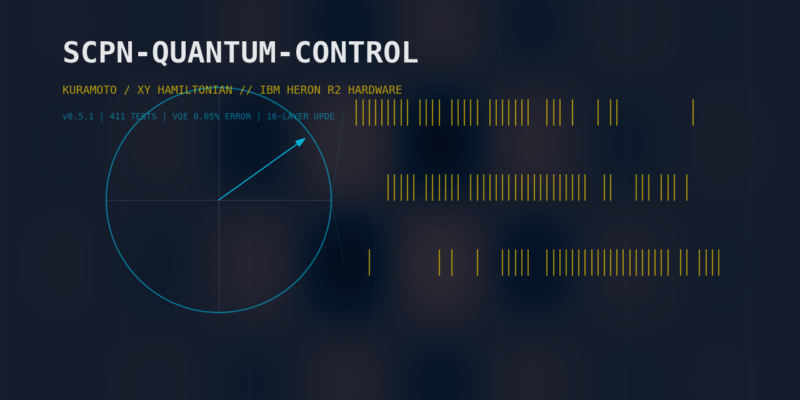
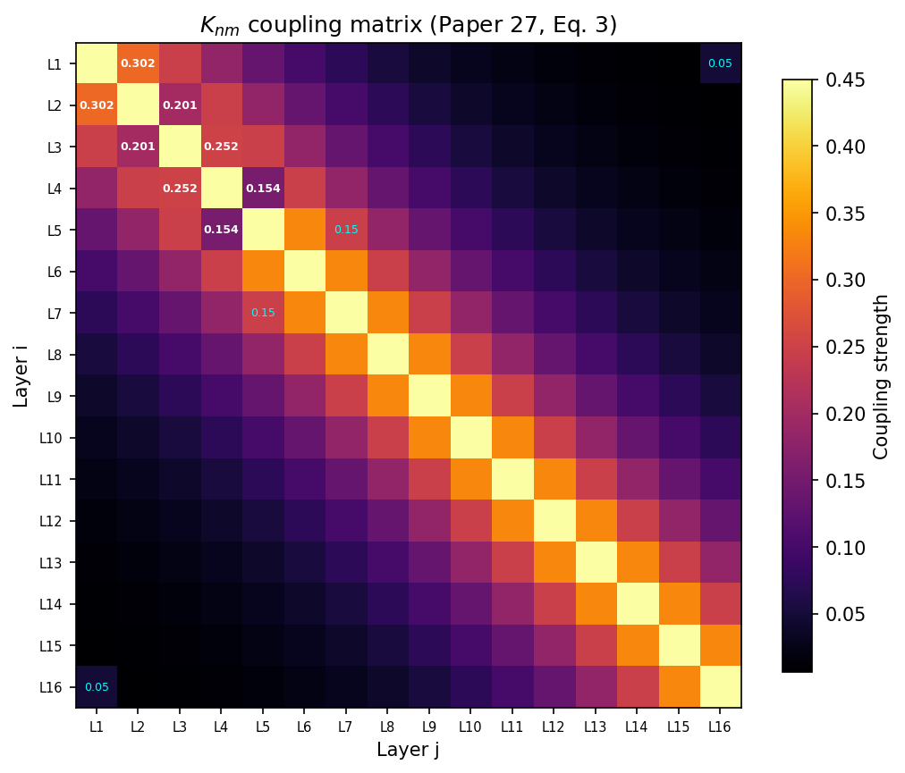
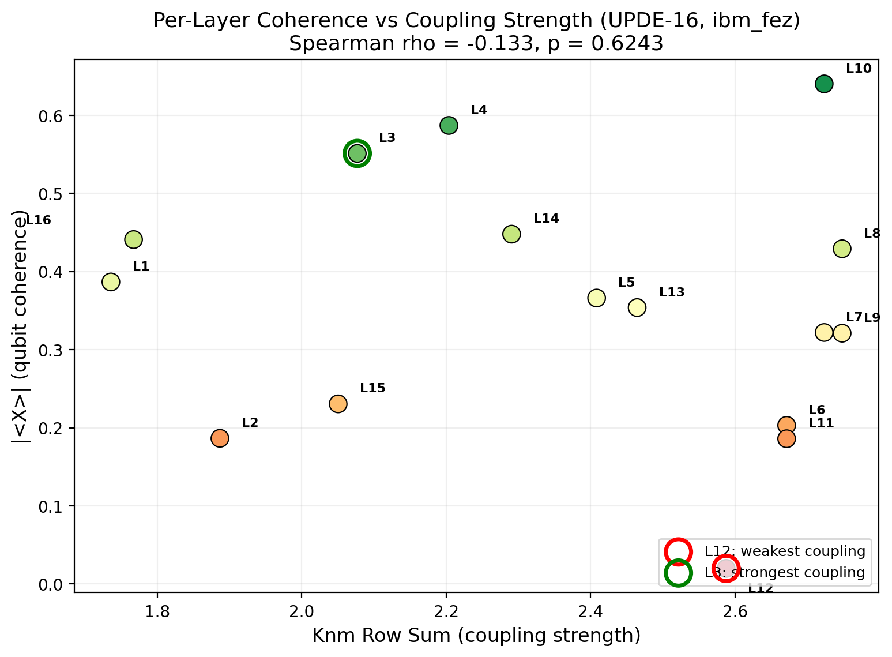
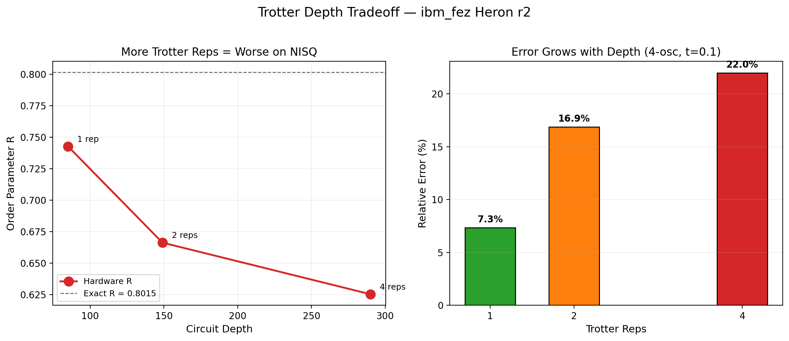
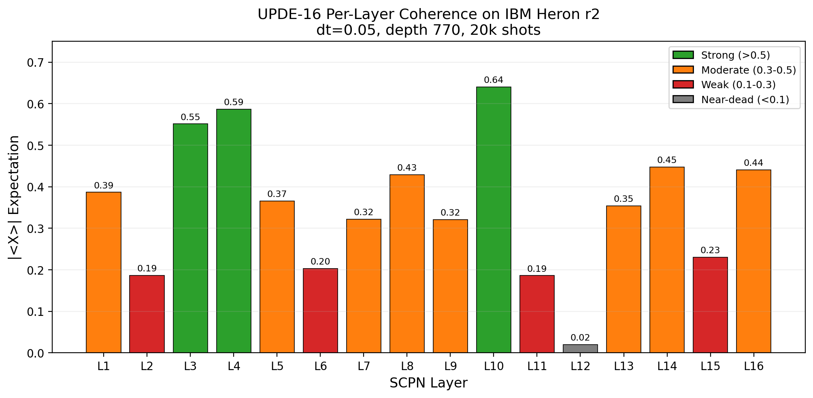
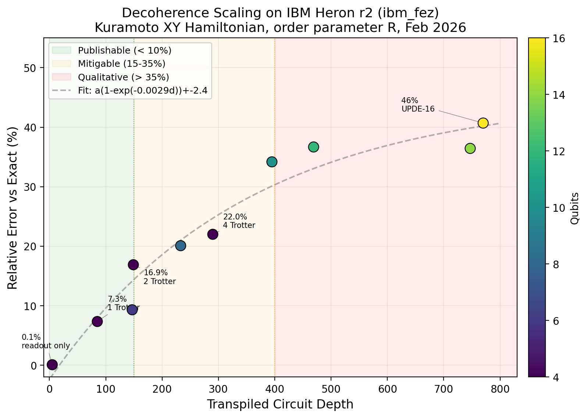
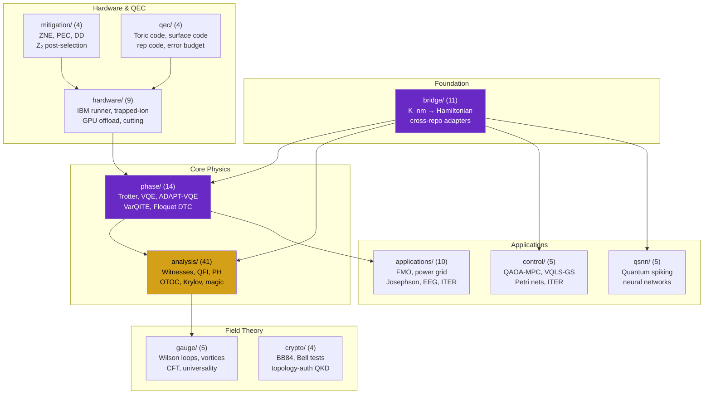
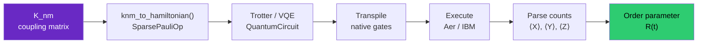

# scpn-quantum-control



[](https://github.com/anulum/scpn-quantum-control/actions/workflows/ci.yml)
[](https://codecov.io/gh/anulum/scpn-quantum-control)
[](LICENSE)
[](https://python.org)
[](https://qiskit.org)
[](https://anulum.github.io/scpn-quantum-control)
[]()
[](https://pypi.org/project/scpn-quantum-control/)
[](https://doi.org/10.5281/zenodo.18821929)
[]()
[](https://colab.research.google.com/github/anulum/scpn-quantum-control/blob/main/notebooks/01_kuramoto_xy_dynamics.ipynb)

---

## What This Package Does

The classical Kuramoto model for coupled oscillators maps directly to the quantum
XY spin Hamiltonian. Superconducting qubits are native simulators of this physics:
each qubit is an oscillator on the Bloch sphere, and the XX+YY coupling between
qubits reproduces the sin(theta_j - theta_i) interaction of the Kuramoto model.

This package provides three things:

1. **A compiler** that takes any coupling matrix K_nm and natural frequencies
   omega and produces executable Qiskit circuits for IBM hardware.

2. **33 research modules** (the "gems") implementing novel quantum probes of the
   synchronization phase transition — synchronization witnesses, topological
   diagnostics, chaos measures, computational complexity bounds, and open-system
   dynamics. 21 of these have no prior art in the literature.

3. **The SCPN 16-layer network** as a built-in benchmark — the coupling matrix
   from Paper 27 of the Sentient-Consciousness Projection Network framework,
   where synchronization is the mechanism by which consciousness emerges across
   16 ontological layers.

Think of it as a quantum microscope for synchronization. Classical Kuramoto tells
you *when* oscillators lock in step. This package tells you *what the quantum
state looks like* at the transition, *how hard it is* to prepare, *what its
topology reveals*, and *where classical simulation fails*.

## Key Results

| Result | Value |
|--------|-------|
| VQE ground-state error | **0.05%** (4-qubit, ibm_fez) |
| 16-layer UPDE snapshot | 46% error at depth 770 (NISQ-consistent) |
| Coherence wall | depth 250–400 (Heron r2) |
| DLA dimension formula | 2^(2N-1) − 2 (exact, all N) |
| Novel research modules | 33 (21 with no prior art) |
| IBM hardware jobs | 9 submitted to ibm_fez (2 completed) |
| Test suite | **1,789 passing**, 7 skipped |
| Python modules | 107 + 1 Rust crate |

## Background: Kuramoto → XY Mapping

Any network of N coupled Kuramoto oscillators can be mapped to a quantum
XY Hamiltonian. The built-in SCPN example uses 16 oscillators with a
coupling matrix K_nm:

```
K_nm = K_base * exp(-alpha * |n - m|)
```

with K_base = 0.45, alpha = 0.3, and empirical calibration anchors
(K[1,2] = 0.302, K[2,3] = 0.201, K[3,4] = 0.252, K[4,5] = 0.154).
Cross-hierarchy boosts link distant layers (L1-L16 = 0.05, L5-L7 = 0.15).
See `docs/equations.md` for the full parameter set.


*The 16×16 K_nm coupling matrix. White annotations: calibration anchors from
Paper 27 Table 2. Cyan annotations: cross-hierarchy boosts (L1↔L16, L5↔L7).
Exponential decay with distance is visible along the diagonal.*

The classical dynamics follow the Kuramoto ODE:

```
d(theta_i)/dt = omega_i + sum_j K_ij sin(theta_j - theta_i)
```

The core isomorphism: this ODE maps to the quantum XY Hamiltonian

```
H = -sum_{i<j} K_ij (X_i X_j + Y_i Y_j) - sum_i omega_i Z_i
```

where X, Y, Z are Pauli operators. Superconducting transmon qubits implement
XX+YY interactions natively through controlled-Z gates, making quantum hardware
a natural simulator for Kuramoto phase dynamics. The order parameter R — a
measure of global synchronization — is extracted from qubit expectations:
R = (1/N)|sum_i (<X_i> + i<Y_i>)|.


*Coherence R as a function of coupling strength K_base across 16 SCPN layers.
Strongly-coupled layers (L3, L4, L10) synchronize first; weakly-coupled L12
lags behind, consistent with the exponential decay in K_nm.*

**Reference**: M. Sotek, *Self-Consistent Phenomenological Network: Layer
Dynamics and Coupling Structure*, Working Paper 27 (2025). Manuscript in
preparation.

## Hardware Results (ibm_fez, February 2026)

| Experiment | Qubits | Depth | Hardware | Exact | Error |
|------------|--------|-------|----------|-------|-------|
| VQE ground state | 4 | 12 CZ | -6.2998 | -6.3030 | **0.05%** |
| Kuramoto XY (1 rep) | 4 | 85 | R=0.743 | R=0.802 | 7.3% |
| Qubit scaling | 6 | 147 | R=0.482 | R=0.532 | 9.3% |
| UPDE-16 snapshot | 16 | 770 | R=0.332 | R=0.615 | 46% |
| QAOA-MPC (p=2) | 4 | -- | -0.514 | 0.250 | -- |

Full results with all 12 decoherence data points: [`results/HARDWARE_RESULTS.md`](results/HARDWARE_RESULTS.md)

**Key findings:**

- VQE with K_nm-informed ansatz achieves 0.05% error on 4-qubit subsystem
- Coherence wall at depth 250-400 on Heron r2 — shallow Trotter (1 rep) beats deep Trotter on NISQ devices


*More Trotter repetitions improve mathematical accuracy but increase circuit
depth. On NISQ hardware, decoherence from the extra gates outweighs the
Trotter error reduction. Optimal strategy: fewest reps that capture the physics.*

- 16-layer UPDE snapshot on real hardware — per-layer structure partially tracks coupling topology (L12 collapse, L3 resilience at the extremes; Spearman rho = -0.13 across all layers)


*Per-layer X-basis expectations from the 16-qubit UPDE snapshot on ibm_fez.
L12 (most weakly coupled) shows near-complete decoherence; strongly-coupled
layers (L3, L4, L10) maintain coherence.*

- 12-point decoherence curve from depth 5 to 770 with exponential decay fit


*Hardware-to-exact ratio R_hw/R_exact vs circuit depth. The three regimes:
near-perfect readout (depth < 25), linear decoherence (85-400), and
noise-dominated (> 400).*

## Package Map


```mermaid
graph TD
    subgraph Foundation
        bridge["bridge/ (11)\nK_nm → Hamiltonian\ncross-repo adapters"]
    end

    subgraph "Core Physics"
        phase["phase/ (14)\nTrotter, VQE, ADAPT-VQE\nVarQITE, Floquet DTC"]
        analysis["analysis/ (41)\nWitnesses, QFI, PH\nOTOC, Krylov, magic"]
    end

    subgraph "Applications"
        control["control/ (5)\nQAOA-MPC, VQLS-GS\nPetri nets, ITER"]
        qsnn["qsnn/ (5)\nQuantum spiking\nneural networks"]
        apps["applications/ (10)\nFMO, power grid\nJosephson, EEG, ITER"]
    end

    subgraph "Hardware & QEC"
        hw["hardware/ (9)\nIBM runner, trapped-ion\nGPU offload, cutting"]
        mit["mitigation/ (4)\nZNE, PEC, DD\nZ₂ post-selection"]
        qec["qec/ (4)\nToric code, surface code\nrep code, error budget"]
    end

    subgraph "Field Theory"
        gauge["gauge/ (5)\nWilson loops, vortices\nCFT, universality"]
        crypto["crypto/ (4)\nBB84, Bell tests\ntopology-auth QKD"]
    end

    bridge --> phase
    bridge --> analysis
    bridge --> control
    bridge --> qsnn
    phase --> analysis
    phase --> apps
    hw --> phase
    mit --> hw
    qec --> hw
    analysis --> gauge

    style bridge fill:#6929C4,color:#fff
    style analysis fill:#d4a017,color:#000
    style phase fill:#6929C4,color:#fff
```

| Subpackage | Modules | Purpose |
|------------|:-------:|---------|
| `analysis` | 41 | Synchronization probes: witnesses, QFI, PH, OTOC, Krylov, magic, BKT, DLA |
| `phase` | 14 | Time evolution: Trotter, VQE, ADAPT-VQE, VarQITE, AVQDS, QSVT, Floquet DTC |
| `bridge` | 11 | K_nm → Hamiltonian, cross-repo adapters (sc-neurocore, SSGF, orchestrator) |
| `applications` | 10 | FMO photosynthesis, power grid, Josephson array, EEG, ITER, quantum EVS |
| `hardware` | 9 | IBM Quantum runner, trapped-ion backend, GPU offload, circuit cutting |
| `identity` | 6 | VQE attractor, coherence budget, entanglement witness, fingerprint |
| `control` | 5 | QAOA-MPC, VQLS Grad-Shafranov, Petri nets, ITER disruption classifier |
| `qsnn` | 5 | Quantum spiking neural networks (LIF, STDP, synapses, training) |
| `gauge` | 5 | U(1) Wilson loops, vortex detection, CFT, universality, confinement |
| `qec` | 4 | Toric code, repetition code UPDE, surface code estimation, error budget |
| `mitigation` | 4 | ZNE, PEC, dynamical decoupling, Z₂ parity post-selection |
| `crypto` | 4 | BB84, Bell tests, topology-authenticated QKD |
| `benchmarks` | 4 | Classical vs quantum scaling, MPS baseline, GPU baseline, AppQSim |

## Quick Start

```bash
pip install scpn-quantum-control
```

**Any coupling network** — bring your own K and omega:

```python
from scpn_quantum_control import QuantumKuramotoSolver, build_kuramoto_ring

K, omega = build_kuramoto_ring(6, coupling=0.5, rng_seed=42)
solver = QuantumKuramotoSolver(6, K, omega)
result = solver.run(t_max=1.0, dt=0.1, trotter_per_step=2)
print(f"R(t): {result['R']}")
```

**Built-in SCPN network** (16 oscillators from Paper 27):

```python
from scpn_quantum_control import QuantumKuramotoSolver, build_knm_paper27, OMEGA_N_16

K = build_knm_paper27(L=4)
solver = QuantumKuramotoSolver(4, K, OMEGA_N_16[:4])
result = solver.run(t_max=0.5, dt=0.1, trotter_per_step=2)
```

**Detect synchronization** with witness operators:

```python
from scpn_quantum_control.analysis.sync_witness import evaluate_all_witnesses

# After running X-basis and Y-basis circuits on IBM hardware:
results = evaluate_all_witnesses(x_counts, y_counts, n_qubits=4)
for name, w in results.items():
    print(f"{name}: {'SYNCHRONIZED' if w.is_synchronized else 'incoherent'}")
```

For development (editable install with test/lint tooling):

```bash
pip install -e ".[dev]"
pre-commit install
pytest tests/ -v
```

### Hardware execution (requires IBM Quantum credentials)

```bash
pip install -e ".[ibm]"
python run_hardware.py --experiment kuramoto --qubits 4 --shots 10000
```

## Data Flow

The pipeline from coupling matrix to measurement follows a fixed sequence:


```mermaid
graph LR
    A["K_nm\ncoupling matrix"] --> B["knm_to_hamiltonian()\nSparsePauliOp"]
    B --> C["Trotter / VQE\nQuantumCircuit"]
    C --> D["Transpile\nnative gates"]
    D --> E["Execute\nAer / IBM"]
    E --> F["Parse counts\n⟨X⟩, ⟨Y⟩, ⟨Z⟩"]
    F --> G["Order parameter\nR(t)"]

    style A fill:#6929C4,color:#fff
    style G fill:#2ecc71,color:#000
```

## Examples

18 standalone scripts in [`examples/`](examples/):

| # | Script | What it demonstrates |
|:-:|--------|---------------------|
| 01 | `qlif_demo` | Quantum LIF neuron: membrane → Ry rotation → spike |
| 02 | `kuramoto_xy_demo` | 4-oscillator Kuramoto dynamics, R(t) trajectory |
| 03 | `qaoa_mpc_demo` | QAOA binary MPC: quadratic cost → Ising Hamiltonian |
| 04 | `qpetri_demo` | Quantum Petri net: tokens evolve in superposition |
| 05 | `vqe_ansatz_comparison` | Three ansatze benchmarked on 4-qubit Hamiltonian |
| 06 | `zne_demo` | Zero-noise extrapolation with unitary folding |
| 07 | `crypto_bell_test` | CHSH inequality violation certification |
| 08 | `dynamical_decoupling` | DD pulse sequence insertion (XY4, X2, CPMG) |
| 09 | `classical_vs_quantum_benchmark` | Scaling crossover analysis |
| 10 | `identity_continuity_demo` | VQE attractor basin stability |
| 11 | `pec_demo` | Probabilistic error cancellation |
| 12 | `trapped_ion_demo` | Ion trap noise model comparison |
| 13 | `iter_disruption_demo` | ITER plasma disruption classification |
| 14 | `quantum_advantage_demo` | Advantage threshold estimation |
| 15 | `qsnn_training_demo` | QSNN training loop with parameter-shift |
| 16 | `fault_tolerant_demo` | Repetition code UPDE |
| 17 | `snn_ssgf_bridges_demo` | Cross-repo bridge roundtrips |
| 18 | `end_to_end_pipeline` | Complete K_nm → IBM → analysis pipeline |

All examples run on statevector simulation (no QPU needed).

## Notebooks

13 interactive Jupyter notebooks in [`notebooks/`](notebooks/) covering every
module from beginner to frontier research:

| # | Notebook | Level | Key Output |
|:-:|----------|:-----:|------------|
| 01 | Kuramoto XY Dynamics | Beginner | R(t) trajectory, quantum-classical overlay |
| 02 | VQE Ground State | Beginner | Energy convergence, ansatz comparison |
| 03 | Error Mitigation | Intermediate | ZNE extrapolation plot |
| 04 | UPDE 16-Layer | Intermediate | Per-layer R bar chart |
| 05 | Crypto & Entanglement | Intermediate | CHSH S-parameter, QKD QBER |
| 06 | PEC Error Cancellation | Advanced | PEC vs ZNE, overhead scaling |
| 07 | Quantum Advantage | Advanced | Scaling crossover prediction |
| 08 | Identity Continuity | Advanced | Attractor basin, fingerprint |
| 09 | ITER Disruption | Domain | Feature distributions, accuracy |
| 10 | QSNN Training | Advanced | Loss curve, weight evolution |
| 11 | Surface Code Budget | Advanced | QEC resource estimation |
| 12 | Trapped Ion Comparison | Advanced | Noise model comparison |
| 13 | Cross-Repo Bridges | Integration | Phase roundtrip, adapter demos |

All run on local AerSimulator. No IBM credentials needed.

## Architecture

```
scpn_quantum_control/
├── analysis/       41 modules — synchronization probes
├── phase/          14 modules — time evolution + variational
├── bridge/         11 modules — K_nm → quantum objects + cross-repo
├── applications/   10 modules — physical system benchmarks
├── hardware/        9 modules — IBM runner, trapped-ion, GPU, cutting
├── identity/        6 modules — identity continuity analysis
├── control/         5 modules — QAOA-MPC, VQLS-GS, Petri, ITER
├── qsnn/            5 modules — quantum spiking neural networks
├── gauge/           5 modules — U(1) gauge theory probes
├── qec/             4 modules — error correction
├── mitigation/      4 modules — ZNE, PEC, DD, Z₂
├── crypto/          4 modules — QKD, Bell tests
├── benchmarks/      4 modules — performance baselines
├── ssgf/            4 modules — SSGF quantum integration
├── tcbo/            1 module  — TCBO quantum observer
├── pgbo/            1 module  — PGBO quantum bridge
├── l16/             1 module  — Layer 16 quantum director
└── scpn_quantum_engine/  Rust crate (PyO3 0.25)
```

## Dependencies

| Package | Version | Purpose |
|---------|---------|---------|
| qiskit | >= 1.0.0 | Circuit construction, transpilation |
| qiskit-aer | >= 0.14.0 | Statevector + noise simulation |
| numpy | >= 1.24 | Array operations |
| scipy | >= 1.10 | Sparse linear algebra, optimisation |
| networkx | >= 3.0 | Graph algorithms (QEC decoder) |

Optional:
- `matplotlib >= 3.5` for visualisation
- `qiskit-ibm-runtime >= 0.20.0` for hardware execution
- `cupy >= 12.0` for GPU-accelerated simulation

## Limitations

- **NISQ benchmarking only.** Current hardware results are proof-of-concept.
  Circuit depths >400 hit the Heron r2 coherence wall; the 16-layer UPDE
  snapshot (46% error) confirms this. Real tokamak control requires <1 ms
  deterministic latency on radiation-hardened hardware — cloud QPUs cannot
  provide that.
- **SCPN is an unpublished model.** The 16-layer coupling structure comes
  from a 2025 working paper (Sotek, Paper 27) with no external citations
  yet. The Kuramoto→XY mapping is standard physics; the specific K_nm
  parameterisation is not independently validated.
- **Small-scale advantage not demonstrated.** At N=4-16 qubits, classical
  ODE solvers outperform quantum simulation in both speed and accuracy.
  Potential quantum advantage requires N>>20 with error-corrected qubits
  (post-2030 hardware).
- **IBM hardware results incomplete.** 7 of 9 campaign jobs still queued
  (budget resets ~March 27).

## Documentation

Full docs at **[anulum.github.io/scpn-quantum-control](https://anulum.github.io/scpn-quantum-control)**:

- [Installation](docs/installation.md) — pip install + dev setup
- [Quickstart](docs/quickstart.md) — first experiment in 5 minutes
- [Tutorials](docs/tutorials.md) — 4-level learning path, 14 tutorials
- [Research Gems](docs/research_gems.md) — **33 novel modules with full theory and API**
- [Equations](docs/equations.md) — every equation in the codebase
- [Architecture](docs/architecture.md) — 107-module dependency graph
- [Analysis API](docs/analysis_api.md) — 41 analysis modules
- [Phase API](docs/phase_api.md) — 14 evolution algorithms
- [Hardware Guide](docs/hardware_guide.md) — IBM Quantum setup
- [Notebooks](docs/notebooks.md) — 13 interactive notebooks
- [Bridges](docs/bridges_api.md) — cross-repo integrations

## Related Repositories

| Repository | Description |
|-----------|-------------|
| [sc-neurocore](https://github.com/anulum/sc-neurocore) | Classical SCPN spiking neural network engine (v3.13.3, 2155+ tests) |
| [scpn-fusion-core](https://github.com/anulum/scpn-fusion-core) | Classical SCPN algorithms: Kuramoto solvers, coupling calibration, transport (v3.9.3, 3300+ tests) |
| [scpn-phase-orchestrator](https://github.com/anulum/scpn-phase-orchestrator) | SCPN phase orchestration: regime detection, UPDE engine, Petri-net supervisor (v0.4.1, 1305+ tests) |
| [scpn-control](https://github.com/anulum/scpn-control) | SCPN control systems: plasma MPC, disruption mitigation (v0.18.0, 3015 tests) |

## Citation

```bibtex
@software{scpn_quantum_control,
  title  = {scpn-quantum-control: Quantum-Native SCPN Phase Dynamics and Control},
  author = {Sotek, Miroslav},
  year   = {2026},
  url    = {https://github.com/anulum/scpn-quantum-control},
  doi    = {10.5281/zenodo.18821929}
}
```

## License

[AGPL-3.0-or-later](LICENSE) — commercial license available.

---

<p align="center">
  <a href="https://www.anulum.li">
    
  </a>
  &nbsp;&nbsp;&nbsp;&nbsp;
  <a href="https://www.anulum.li">
    
  </a>
  <br>
  <em>Developed by <a href="https://www.anulum.li">ANULUM</a> / Fortis Studio</em>
</p>
