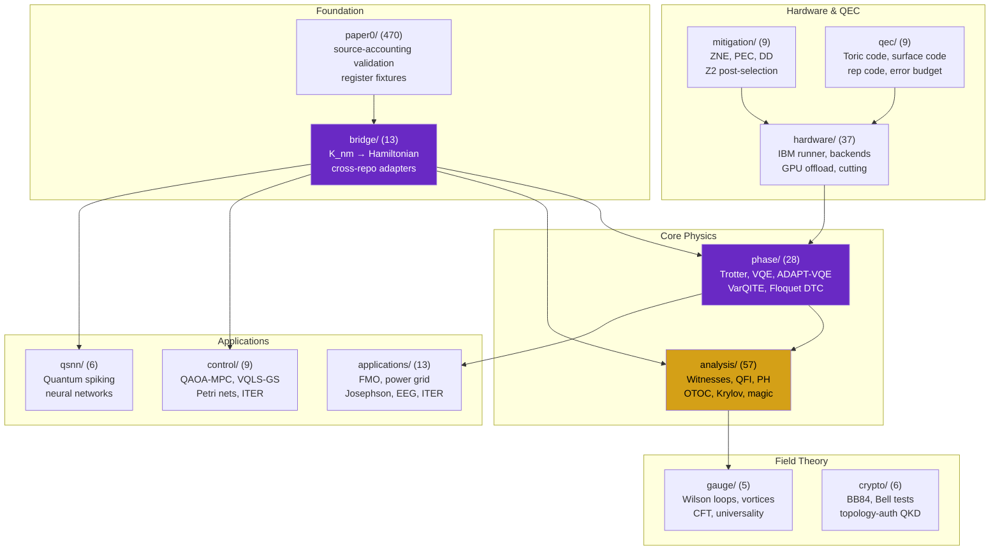

# scpn-quantum-control


[](https://github.com/anulum/scpn-quantum-control/actions/workflows/ci.yml)
[](https://codecov.io/gh/anulum/scpn-quantum-control)
[](LICENSE)
[](https://python.org)
[](https://qiskit.org)
[](https://anulum.li/scpn-quantum-control/)
[](https://anulum.github.io/scpn-quantum-control)
[](https://www.bestpractices.dev/projects/12290)
[](https://securityscorecards.dev/viewer/?uri=github.com/anulum/scpn-quantum-control)
[](https://github.com/astral-sh/ruff)
[](https://mypy-lang.org/)
[](https://github.com/anulum/scpn-quantum-control/actions/workflows/ci.yml)
[](https://pypi.org/project/scpn-quantum-control/)
[](https://pypi.org/project/scpn-quantum-control/)
[](https://pepy.tech/project/scpn-quantum-control)
[](https://doi.org/10.5281/zenodo.18821929)
[]()
[](https://colab.research.google.com/github/anulum/scpn-quantum-control/blob/main/notebooks/01_kuramoto_xy_dynamics.ipynb)

> **Active Development** — scpn-quantum-control is under intensive development.
> The public status wording is anchored to the
> [Hardware Status Ledger](docs/hardware_status_ledger.md),
> which separates theory, simulator, unmitigated hardware, mitigated hardware,
> and noise-limited claims. Current promoted hardware evidence is narrowed to
> artefact-backed `ibm_fez` baseline rows, the April/May 2026
> `ibm_kingston` DLA parity raw-count datasets, and the May 2026 SCPN/FIM
> falsification artefacts. Stable core contracts and backend capability
> artifacts are now part of release/repro hardening and are kept separate from
> non-artefact scientific claims. APIs may evolve as this work progresses.

**Version:** 0.9.7
**Status:** Kuramoto-XY compiler + hardware runners + analysis stack | 49 exported Rust `#[pyfunction]` bindings | 98 tracked notebooks | 22 example files | 97%+ coverage | IBM Heron r2 evidence ledgered

<!-- capability-snapshot:start -->
<!-- SPDX-License-Identifier: AGPL-3.0-or-later -->
<!-- Generated by tools/capability_manifest.py; do not edit counts by hand. -->

# scpn-quantum-control Capability Inventory

| Surface | Current inventory |
|---|---:|
| Package version | 0.9.7 |
| Public API exports | 264 |
| Python source modules | 758 |
| Public Python classes | 1427 |
| Paper 0 validation modules | 466 |
| Domain package families | 28 |
| API documentation pages | 0 |
| Rust PyO3 function bindings | 48 |
| Rust source modules | 24 |
| Notebook files | 98 |
| Example files | 23 |
| Optional extras | 39 |
| Python test files | 1860 |
| Public documentation pages | 223 |
| GitHub Actions workflows | 18 |

Evidence boundary: this snapshot is a static inventory. Performance, coverage, hardware, and scientific-fidelity claims require their own committed evidence artifacts.
<!-- capability-snapshot:end -->

---

## Status Snapshot — 2026-05-18

| Area | Public status |
|---|---|
| Generic compiler surface | `scpn_quantum_control.kuramoto_core` validates arbitrary `K_nm`/`omega` inputs and compiles Hamiltonians, dense matrices, Trotter circuits, and order-parameter measurements. |
| Release and reproducibility scope | Stable core contracts and backend capability artifacts for Kuramoto-XY synchronisation are included in release/readiness checks and promoted only with deterministic evidence manifests. |
| Hardware evidence | `ibm_fez` baseline rows are legacy artefact-backed observations; `ibm_kingston` Phase 1, Phase 2 A+G, Phase 2 B-C, and popcount DLA datasets are promoted with raw-count artefacts. The SCPN/FIM `ibm_kingston` result is promoted as a negative/falsification result for the tested digital circuit family. |
| Simulator and methods evidence | BKT, OTOC, Floquet, MBL, FIM, VQE, GPU, tensor-network, and classical comparison claims stay marked as simulator/classical/methods unless a hardware artefact is named. Generated benchmark artefacts are indexed from the benchmark dashboard and reproducibility CLI. |
| Paper 0 source-validation register | Paper 0 is fully promoted through the source-accounting register: the planner reports `0` remaining work orders and `0` remaining source records after `P0R00001`-`P0R06211`. The generated register contains 466 validation modules with colocated specs, fixtures, loaders, and tests; this is source-bounded ingestion, not external validation evidence. |
| Licence boundary | The possible lightweight core split is documented, but all in-repository code remains AGPL/commercial unless a future release changes metadata and SPDX headers. |

For claim classes, raw-artefact pointers, and promotion rules, see the
[Hardware Status Ledger](docs/hardware_status_ledger.md).

## Richer Presentation

For a richer presentation of the Phase 1 hardware results, methodology
deep-dives, interactive plots, and architecture diagrams, see the
project website:

**[anulum.li/scpn-quantum-control](https://anulum.li/scpn-quantum-control/)**

Direct entry points:

- [Hardware Status Ledger](docs/hardware_status_ledger.md)
  — claim classes, campaign evidence paths, and publication hygiene rules
- [Hardware Result Packs](docs/hardware_result_packs.md)
  — offline manifest and integrity verifier for promoted IBM raw-count datasets
- [Physics-First Kuramoto-XY](docs/physics_first_kuramoto_xy.md)
  — start from arbitrary oscillator networks before SCPN-specific layers
- [Stable Facades API](docs/stable_facades_api.md)
  — mkdocstrings reference for first-path public facades
- [Paper 0 Validation Register](docs/paper0/paper0_validation_register.md)
  — source-accounting register status, claim boundary, and generated API
  contract for Paper 0 ingestion
- [Phase 1 Results](https://anulum.li/scpn-quantum-control/phase1-results.html)
  — raw-count reproduction of the DLA parity asymmetry on
  ibm_kingston, April 2026, with full Welch table and interactive
  Plotly plot
- [Reproducibility Manifest](https://anulum.li/scpn-quantum-control/reproducibility.html)
  — per-commit pinning, IBM job IDs, dependency constraints, rerun
  protocol
- [Method: GUESS Mitigation](https://anulum.li/scpn-quantum-control/method-guess.html)
  — symmetry-guided ZNE, shot-budget-free for the XY Hamiltonian
- [Method: DLA Parity Theorem](https://anulum.li/scpn-quantum-control/method-dla-parity.html)
  — $\mathfrak{su}(2^{n-1}) \oplus \mathfrak{su}(2^{n-1})$
  decomposition and hardware reproduction path
- [Method: Pulse Shaping](https://anulum.li/scpn-quantum-control/method-pulse-shaping.html)
  — ICI three-level (1,665× Rust) and (α, β)-hypergeometric
  (44× Rust)
- [The Science](https://anulum.li/scpn-quantum-control/science.html)
  — plain-language primer on SCPN, Kuramoto-XY, and why the DLA
  parity result matters
- [Methods Benchmark Dashboard](docs/methods_benchmark_dashboard.md)
  — generated Rust/VQE, GPU, tensor-network, FIM, and reproducibility
  artefact index
- [Roadmap](ROADMAP.md)
  — canonical active work queue and completed release-safety tasks

---

## Quick Start

```bash
pip install scpn-quantum-control
```

```python
import numpy as np
from scpn_quantum_control.phase.xy_kuramoto import QuantumKuramotoSolver

# 8 oscillators, exponential-decay coupling, heterogeneous frequencies
N = 8
K = 0.5 * np.exp(-0.3 * np.abs(np.subtract.outer(range(N), range(N))))
omega = np.linspace(0.8, 1.2, N)

# Simulate: Trotter evolution → order parameter R(t)
solver = QuantumKuramotoSolver(N, K, omega)
result = solver.run(t_max=1.0, dt=0.1)
print(f"Final R = {result['R'][-1]:.3f}")
# → R rises from ~0.3 (incoherent) toward 1.0 (synchronised)
```

No IBM credentials needed — runs on local statevector simulator.
Pass any coupling matrix; the built-in SCPN benchmark is just one example.

---

## What This Package Does

**A Kuramoto-XY compiler and hardware-evidence workbench for heterogeneous
coupled oscillators.** The repository contains legacy `ibm_fez` baseline
artefacts, promoted `ibm_kingston` DLA parity datasets, and SCPN/FIM
falsification artefacts with raw counts, job IDs, integrity checks, and
count-to-statistic reproduction harnesses.

The package provides:

1. **A Kuramoto-to-quantum compiler** — any coupling matrix K_nm and natural
   frequencies omega compile directly into executable Qiskit circuits for IBM
   hardware. Rust-accelerated Hamiltonian construction (5,401× faster than Qiskit).

2. **Tracked research module families** probing the synchronisation phase
   transition — synchronisation witnesses, OTOC scrambling, Krylov complexity,
   persistent homology, DLA parity theorem, Paper 0 source-accounting fixtures,
   and more. Novel constructions and first applications are documented in the
   research-gems and API pages; exact file counts use the package table below.

3. **Hardware evidence with claim classes** — legacy `ibm_fez` baseline rows,
  promoted `ibm_kingston` DLA parity datasets, and the SCPN/FIM negative
  hardware result are separated from simulator-only, frontier, queued-job, and
  aggregate-only outputs.
   Stable core contracts and backend capability artifacts are included in this
   hardening boundary and are replayed via reproducibility tooling.

4. **Paper 0 source-validation register** — source-bounded Paper 0 ingestion is
   complete across `P0R00001`-`P0R06211`. The register is exposed under
   `scpn_quantum_control.paper0` with generated validation modules, spec
   loaders, fixture runners, and focused tests. It records what the source
   ledger says and what generated fixtures preserve; it does not promote those
   source statements into measured hardware or external scientific validation.

Think of it as a **quantum microscope for synchronisation**: classical Kuramoto
tells you *when* oscillators lock in step; this package tells you *what the
quantum state looks like* at the transition, *how entangled it is*, *how fast
information scrambles*, and *whether the system thermalises*.

> **Advanced benchmark:** The built-in SCPN 16-layer coupling matrix (Paper 27)
> provides a heterogeneous-frequency benchmark for structured
> oscillator-network experiments. Publication-facing claims should treat this
> as a classical complex-network input to quantum-inspired Hamiltonian,
> tensor-network, topological, and DLA analyses, not as a quantum-biological or
> clinical causation claim. See
> [SCPN Foundations](https://anulum.github.io/scpn-quantum-control/theory/).

## Key Results

### Hardware Evidence

| Result | Value |
|--------|-------|
| `ibm_kingston` DLA parity Phase 1 | 342 circuits, raw counts, job IDs, integrity checks, and reproduction harness in `data/phase1_dla_parity/` |
| `ibm_kingston` DLA parity Phase 2 | Promoted A+G `n=4` replication, B-C mixed `n=6,8` scaling, and popcount controls in `data/phase2_dla_parity/`, `data/phase2_scaling_bc/`, and `data/phase2_popcount_control/`; no DLA-parity-only or monotone-scaling claim |
| `ibm_kingston` SCPN/FIM hardware test | Pilot and repeated follow-up artefacts in `data/scpn_fim_hamiltonian/`; promoted as a negative result for simple digital `lambda=4` hardware protection on the tested circuit family |
| `ibm_fez` baseline rows | Legacy QPU observations retained in `results/ibm_hardware_2026-03-28/` and `results/march_2026/`; quote only artefact-backed values through the ledger |
| Quarantined IBM outputs | V2/frontier/queued-job/aggregate-only artefacts are not promoted until raw counts, retrieval manifests, and analysis code are reviewed |

### Simulation

| Result | Value |
|--------|-------|
| Critical coupling K_c(∞) | **≈ 2.2** (BKT finite-size scaling) |
| DTC with heterogeneous ω | **15/15** amplitudes show subharmonic response |
| OTOC scrambling | **4× faster** at K=4 vs K=1 (n=8) |
| Schmidt gap transition | **K = 3.44** (n=8, 60-point resolution) |
| DLA dimension formula | **2^(2N-1) − 2** (exact, all N) |

### Software

| Metric | Value |
|--------|-------|
| Rust engine bindings | **49** exported `#[pyfunction]` bindings in the tracked Rust crate; low-level helper `fn` definitions are an implementation detail. |
| Source package surface | **697** tracked Python source files under `src/scpn_quantum_control`, excluding package initialisers; **470** of these are generated Paper 0 source-accounting validation modules. |
| Research module families | Analysis, phase, hardware, bridge, mitigation, QEC, applications, forecasting, and Paper 0 validation families; exact current counts are listed in the package map below. |
| Publication figures | **17** (simulation + hardware, including the Phase 1 DLA parity panels and exact-simulation crossover) |
| Test suite | CI-gated suite with 97%+ coverage; current tracked test-function count is **9,139** by `tests/test_*.py` collection. |
| Reproducibility CLI | `scpn-bench reproduce-methods`, `scpn-bench fim-all`, and `scpn-bench all` regenerate committed methods/FIM artefacts without IBM submission |

### Exact-Simulation Wall-Time (Not broad quantum-advantage claim)

This section covers exact Hilbert-space simulation crossover only.
No broad observable-level quantum-advantage claim is closed yet.
Any broader advantage claim requires comparison against state-of-the-art
tensor-network or GPU baselines and explicit accounting for data-loading and
state-preparation cost.

No quantum advantage at n ≤ 16 in this exact-simulation path. Classical ODE is
faster for all accessible sizes. The value of the quantum approach is
characterisation (entanglement, MBL, witnesses), not speed.

| Method | n=4 | n=8 | n=12 | n=16 |
|--------|----:|----:|-----:|-----:|
| Classical Kuramoto ODE (scipy) | 0.4 ms | 1.4 ms | 2.8 ms | ~11 ms |
| Exact diagonalisation (numpy eigh) | 0.1 ms | 164 ms | 26.8 s | OOM (32 GB) |
| Qiskit statevector | ~50 ms | ~2 s | ~minutes | impractical |
| Rust Hamiltonian + numpy eigh | 0.02 ms | 30 ms | ~5 s | ~2 min (est.) |
| IBM hardware (per-job, 4000 shots) | ~5 s | ~10 s | ~20 s | ~40 s |

Measured on Ubuntu 24.04, AMD Ryzen, 32 GB RAM. Rust speedup applies to
Hamiltonian construction only; the eigh bottleneck is LAPACK in all cases.

### Publications

- [Preprint: Quantum Kuramoto-XY on 156-qubit processor](https://anulum.github.io/scpn-quantum-control/preprint/)
- [Paper: Synchronisation Witness Operators](https://anulum.github.io/scpn-quantum-control/paper_sync_witnesses/) (novel NISQ-ready formalism)
- [Paper: DLA Parity Theorem](https://anulum.github.io/scpn-quantum-control/paper_dla_parity/) (exact closed-form)

## Background: Kuramoto → XY Mapping

Any network of N coupled Kuramoto oscillators can be represented by a linear
Kuramoto-XY Hamiltonian analogue or embedding. This is not a claim that a
gate-model circuit directly Trotterises the nonlinear classical Kuramoto ODE;
direct nonlinear simulation requires an explicit Koopman, Carleman, or
equivalent embedding. The built-in SCPN example uses 16 oscillators with a
coupling matrix K_nm:

```
K_nm = K_base * exp(-alpha * |n - m|)
```

with K_base = 0.45, alpha = 0.3, and empirical calibration anchors
(K[1,2] = 0.302, K[2,3] = 0.201, K[3,4] = 0.252, K[4,5] = 0.154).
Cross-hierarchy boosts link distant layers (L1-L16 = 0.05, L5-L7 = 0.15).
See `docs/equations.md` for the full parameter set.


*The 16×16 K_nm coupling matrix. White annotations: calibration anchors from
Paper 27 Table 2. Cyan annotations: cross-hierarchy boosts (L1↔L16, L5↔L7).
Exponential decay with distance is visible along the diagonal.*

The classical dynamics follow the Kuramoto ODE:

```
d(theta_i)/dt = omega_i + sum_j K_ij sin(theta_j - theta_i)
```

The working quantum analogue uses the XY Hamiltonian

```
H = -sum_{i<j} K_ij (X_i X_j + Y_i Y_j) - sum_i omega_i Z_i
```

where X, Y, Z are Pauli operators. Superconducting transmon devices can compile
XX+YY interactions through native-gate decompositions, making quantum hardware
a useful test bed for the corresponding Hamiltonian dynamics. The order parameter R — a
measure of global synchronization — is extracted from qubit expectations:
R = (1/N)|sum_i (<X_i> + i<Y_i>)|.


*Coherence R as a function of coupling strength K_base across 16 SCPN layers.
Strongly-coupled layers (L3, L4, L10) synchronize first; weakly-coupled L12
lags behind, consistent with the exponential decay in K_nm.*

**Reference**: M. Sotek, *Self-Consistent Phenomenological Network: Layer
Dynamics and Coupling Structure*, Working Paper 27 (2025). Manuscript in
preparation.

## Hardware Results (ibm_fez, February 2026)

| Experiment | Qubits | Depth | Hardware | Exact | Error |
|------------|--------|-------|----------|-------|-------|
| VQE ground state | 4 | 12 CZ | -6.2998 | -6.3030 | **0.05%** |
| Kuramoto XY (1 rep) | 4 | 85 | R=0.743 | R=0.802 | 7.3% |
| Qubit scaling | 6 | 147 | R=0.482 | R=0.532 | 9.3% |
| UPDE-16 snapshot | 16 | 770 | R=0.332 | R=0.615 | 46% |
| QAOA-MPC (p=2) | 4 | -- | -0.514 | 0.250 | -- |

Full results with all 12 decoherence data points: [`results/HARDWARE_RESULTS.md`](results/HARDWARE_RESULTS.md)

**Key findings:**

- VQE with K_nm-informed ansatz achieves 0.05% error on 4-qubit subsystem
- Coherence wall at depth 250-400 on Heron r2 — shallow Trotter (1 rep) beats deep Trotter on NISQ devices


*More Trotter repetitions improve mathematical accuracy but increase circuit
depth. On NISQ hardware, decoherence from the extra gates outweighs the
Trotter error reduction. Optimal strategy: fewest reps that capture the physics.*

- 16-layer UPDE snapshot on real hardware — per-layer structure partially tracks coupling topology (L12 collapse, L3 resilience at the extremes; Spearman rho = -0.13 across all layers)


*Per-layer X-basis expectations from the 16-qubit UPDE snapshot on ibm_fez.
L12 (most weakly coupled) shows near-complete decoherence; strongly-coupled
layers (L3, L4, L10) maintain coherence.*

- 12-point decoherence curve from depth 5 to 770 with exponential decay fit


*Hardware-to-exact ratio R_hw/R_exact vs circuit depth. The three regimes:
near-perfect readout (depth < 25), linear decoherence (85-400), and
noise-dominated (> 400).*

## Package Map

Counts below are tracked Python source files under `src/scpn_quantum_control`,
excluding package initialisers. Generated Paper 0 files are kept visible because
they are part of the shipped source-accounting API, but they are not external
scientific validation evidence.


```mermaid
graph TD
    subgraph Foundation
        bridge["bridge/ (13)\nK_nm → Hamiltonian\ncross-repo adapters"]
        paper0["paper0/ (470)\nsource-accounting validation\nregister fixtures"]
    end

    subgraph "Core Physics"
        phase["phase/ (28)\nTrotter, VQE, ADAPT-VQE\nVarQITE, Floquet DTC"]
        analysis["analysis/ (57)\nWitnesses, QFI, PH\nOTOC, Krylov, magic"]
    end

    subgraph "Applications"
        control["control/ (9)\nQAOA-MPC, VQLS-GS\nPetri nets, ITER"]
        qsnn["qsnn/ (6)\nQuantum spiking\nneural networks"]
        apps["applications/ (13)\nFMO, power grid\nJosephson, EEG, ITER"]
    end

    subgraph "Hardware & QEC"
        hw["hardware/ (37)\nIBM runner, backends\nGPU offload, cutting"]
        mit["mitigation/ (9)\nZNE, PEC, DD\nZ2 post-selection"]
        qec["qec/ (9)\nToric code, surface code\nrep code, error budget"]
    end

    subgraph "Field Theory"
        gauge["gauge/ (5)\nWilson loops, vortices\nCFT, universality"]
        crypto["crypto/ (6)\nBB84, Bell tests\ntopology-auth QKD"]
    end

    bridge --> phase
    bridge --> analysis
    bridge --> control
    bridge --> qsnn
    paper0 --> bridge
    phase --> analysis
    phase --> apps
    hw --> phase
    mit --> hw
    qec --> hw
    analysis --> gauge

    style bridge fill:#6929C4,color:#fff
    style analysis fill:#d4a017,color:#000
    style phase fill:#6929C4,color:#fff
```

| Subpackage | Modules | Purpose |
|------------|:-------:|---------|
| `paper0` | 470 | Source-accounting validation modules and fixtures for processed Paper 0 records |
| `analysis` | 57 | Synchronisation probes: witnesses, QFI, PH, OTOC, Krylov, magic, BKT, DLA |
| `hardware` | 37 | IBM Quantum runner, plugin backends registry, AsyncHardwareRunner, trapped-ion backend, GPU offload, circuit cutting, fast sparse, qubit mapper (DynQ), provenance |
| `phase` | 28 | Time evolution: Trotter, VQE, ADAPT-VQE, VarQITE, AVQDS, QSVT, Floquet DTC, Lindblad |
| `applications` | 13 | FMO photosynthesis, power grid, Josephson array, EEG, ITER, quantum EVS |
| `bridge` | 13 | K_nm → Hamiltonian, cross-repo adapters (sc-neurocore, SSGF, orchestrator) |
| `control` | 9 | QAOA-MPC, VQLS Grad-Shafranov, Petri nets, ITER disruption, topological optimiser |
| `mitigation` | 9 | ZNE, PEC, dynamical decoupling, Z2 parity, CPDR, symmetry verification, GUESS, compound |
| `qec` | 9 | Toric code, repetition code UPDE, surface code, biological surface code, error budget, multi-scale, syndrome flow |
| `benchmarks` | 7 | Classical vs quantum scaling, MPS baseline, GPU baseline, AppQSim |
| `crypto` | 6 | BB84, Bell tests, topology-authenticated QKD, key hierarchy |
| `identity` | 6 | VQE attractor, coherence budget, entanglement witness, fingerprint |
| `qsnn` | 7 | Quantum spiking neural networks (LIF, trace STDP, synapses, dynamic coupling, training, neuromorphic bridge) |
| `gauge` | 5 | U(1) Wilson loops, vortex detection, CFT, universality, confinement |
| `psi_field` | 4 | U(1) compact lattice gauge: lattice, infoton, observables, SCPN mapping |
| `ssgf` | 4 | SSGF quantum integration |
| `accel` | 3 | Multi-language dispatcher + Julia tier (Rust → Julia → Python fallback chain) |
| `dla_parity` | 4 | DLA parity helpers and campaign analysis support |
| `fep` | 2 | Friston Free Energy Principle: variational free energy, predictive coding |
| `forecasting` | 1 | Held-out synchronisation forecasting over hardware traces and source-backed topology replays |
| `benchmark_harness` | 1 | Reproducible benchmark harness entry point |
| `tcbo` | 1 | TCBO quantum observer |
| `pgbo` | 1 | PGBO quantum bridge |
| `l16` | 1 | Layer 16 quantum director |

## Quick Start

```bash
pip install scpn-quantum-control
```

**Any coupling network** — bring your own K and omega:

```python
from scpn_quantum_control import QuantumKuramotoSolver, build_kuramoto_ring

K, omega = build_kuramoto_ring(6, coupling=0.5, rng_seed=42)
solver = QuantumKuramotoSolver(6, K, omega)
result = solver.run(t_max=1.0, dt=0.1, trotter_per_step=2)
print(f"R(t): {result['R']}")
```

**Built-in SCPN network** (16 oscillators from Paper 27):

```python
from scpn_quantum_control import QuantumKuramotoSolver, build_knm_paper27, OMEGA_N_16

K = build_knm_paper27(L=4)
solver = QuantumKuramotoSolver(4, K, OMEGA_N_16[:4])
result = solver.run(t_max=0.5, dt=0.1, trotter_per_step=2)
```

**Detect synchronization** with witness operators:

```python
from scpn_quantum_control.analysis.sync_witness import evaluate_all_witnesses

# After running X-basis and Y-basis circuits on IBM hardware:
results = evaluate_all_witnesses(x_counts, y_counts, n_qubits=4)
for name, w in results.items():
    print(f"{name}: {'SYNCHRONIZED' if w.is_synchronized else 'incoherent'}")
```

For development (editable install with test/lint tooling):

```bash
pip install -e ".[dev]"
pre-commit install
pytest tests/ -v
```

### Hardware execution (requires IBM Quantum credentials)

```bash
pip install -e ".[ibm]"
python run_hardware.py --experiment kuramoto --qubits 4 --shots 10000
```

## Data Flow

The pipeline from coupling matrix to measurement follows a fixed sequence:


```mermaid
graph LR
    A["K_nm\ncoupling matrix"] --> B["knm_to_hamiltonian()\nSparsePauliOp"]
    B --> C["Trotter / VQE\nQuantumCircuit"]
    C --> D["Transpile\nnative gates"]
    D --> E["Execute\nAer / IBM"]
    E --> F["Parse counts\n⟨X⟩, ⟨Y⟩, ⟨Z⟩"]
    F --> G["Order parameter\nR(t)"]

    style A fill:#6929C4,color:#fff
    style G fill:#2ecc71,color:#000
```

## Examples

22 standalone scripts in [`examples/`](examples/):

| # | Script | What it demonstrates |
|:-:|--------|---------------------|
| 01 | `qlif_demo` | Quantum LIF neuron: membrane → Ry rotation → spike |
| 02 | `kuramoto_xy_demo` | 4-oscillator Kuramoto dynamics, R(t) trajectory |
| 03 | `qaoa_mpc_demo` | QAOA binary MPC: quadratic cost → Ising Hamiltonian |
| 04 | `qpetri_demo` | Quantum Petri net: tokens evolve in superposition |
| 05 | `vqe_ansatz_comparison` | Three ansatze benchmarked on 4-qubit Hamiltonian |
| 06 | `zne_demo` | Zero-noise extrapolation with unitary folding |
| 07 | `crypto_bell_test` | CHSH inequality violation certification |
| 08 | `dynamical_decoupling` | DD pulse sequence insertion (XY4, X2, CPMG) |
| 09 | `classical_vs_quantum_benchmark` | Scaling crossover analysis |
| 10 | `identity_continuity_demo` | VQE attractor basin stability |
| 11 | `pec_demo` | Probabilistic error cancellation |
| 12 | `trapped_ion_demo` | Ion trap noise model comparison |
| 13 | `iter_disruption_demo` | ITER plasma disruption classification |
| 14 | `quantum_advantage_demo` | Advantage threshold estimation |
| 15 | `qsnn_training_demo` | QSNN training loop with parameter-shift |
| 16 | `fault_tolerant_demo` | Repetition code UPDE |
| 17 | `snn_ssgf_bridges_demo` | Cross-repo bridge roundtrips |
| 18 | `end_to_end_pipeline` | Complete K_nm → IBM → analysis pipeline |
| 19 | `sync_witness_operator` | Synchronisation witness operator demo |
| 20 | `quantum_persistent_homology` | Persistent homology analysis |
| 21 | `biological_qec_scpn16` | Biological surface code on 16-layer SCPN |
| 22 | `quantum_neuromorphic_bridge` | QSNN quantum LIF + trace STDP + dynamic coupling bridge |

All examples run on statevector simulation (no QPU needed).

## Notebooks

47 Jupyter notebooks in [`notebooks/`](notebooks/) — 13 core tutorials
plus 34 FIM investigation notebooks (NB14–47). Core notebooks:

| # | Notebook | Level | Key Output |
|:-:|----------|:-----:|------------|
| 01 | Kuramoto XY Dynamics | Beginner | R(t) trajectory, quantum-classical overlay |
| 02 | VQE Ground State | Beginner | Energy convergence, ansatz comparison |
| 03 | Error Mitigation | Intermediate | ZNE extrapolation plot |
| 04 | UPDE 16-Layer | Intermediate | Per-layer R bar chart |
| 05 | Crypto & Entanglement | Intermediate | CHSH S-parameter, QKD QBER |
| 06 | PEC Error Cancellation | Advanced | PEC vs ZNE, overhead scaling |
| 07 | Quantum Advantage | Advanced | Scaling crossover prediction |
| 08 | Identity Continuity | Advanced | Attractor basin, fingerprint |
| 09 | ITER Disruption | Domain | Feature distributions, accuracy |
| 10 | QSNN Training | Advanced | Loss curve, weight evolution |
| 11 | Surface Code Budget | Advanced | QEC resource estimation |
| 12 | Trapped Ion Comparison | Advanced | Noise model comparison |
| 13 | Cross-Repo Bridges | Integration | Phase roundtrip, adapter demos |

All run on local AerSimulator. No IBM credentials needed.

## Architecture

```
scpn_quantum_control/
├── paper0/        470 modules — source-accounting validation register
├── analysis/       57 modules — synchronisation probes
├── hardware/       37 modules — IBM runner, backends, GPU, cutting, provenance
├── phase/          28 modules — time evolution + variational + Lindblad
├── bridge/         13 modules — K_nm → quantum objects + cross-repo
├── applications/   13 modules — physical system benchmarks
├── control/         9 modules — QAOA-MPC, VQLS-GS, Petri, ITER, topological
├── mitigation/      9 modules — ZNE, PEC, DD, Z2, CPDR, symmetry
├── qec/             9 modules — error correction + biological surface code
├── benchmarks/      7 modules — performance baselines
├── identity/        6 modules — identity continuity analysis
├── qsnn/            7 modules — quantum spiking neural networks + neuromorphic bridge
├── crypto/          6 modules — QKD, Bell tests, key hierarchy
├── gauge/           5 modules — U(1) gauge theory probes
├── ssgf/            4 modules — SSGF quantum integration
├── tcbo/            1 module  — TCBO quantum observer
├── pgbo/            1 module  — PGBO quantum bridge
├── l16/             1 module  — Layer 16 quantum director
└── scpn_quantum_engine/  Rust crate (PyO3 0.25, 49 exported #[pyfunction] bindings)
```

## Dependencies

| Package | Version | Purpose |
|---------|---------|---------|
| qiskit | >= 2.2,<3.0 | Circuit construction, transpilation |
| qiskit-aer | >= 0.15,<1.0 | Statevector + noise simulation |
| numpy | >= 1.24 | Array operations |
| scipy | >= 1.10 | Sparse linear algebra, optimisation |
| networkx | >= 3.0 | Graph algorithms (QEC decoder) |

Optional:
- `matplotlib >= 3.5` for visualisation
- `qiskit-ibm-runtime >= 0.40,<1.0` for hardware execution
- `cupy >= 12.0` for GPU-accelerated simulation

## Limitations

- **NISQ benchmarking only.** Current hardware results are proof-of-concept.
  Circuit depths >400 hit the Heron r2 coherence wall; the 16-layer UPDE
  snapshot (46% error) confirms this. Real tokamak control requires <1 ms
  deterministic latency on radiation-hardened hardware — cloud QPUs cannot
  provide that.
- **SCPN is an unpublished model.** The 16-layer coupling structure comes
  from a 2025 working paper (Sotek, Paper 27) with no external citations
  yet. The Kuramoto→XY mapping is standard physics; the specific K_nm
  parameterisation is not independently validated.
- **Small-scale broad advantage not demonstrated.** At N=4-16 qubits,
  classical ODE solvers outperform quantum simulation in both speed and
  accuracy. The exact Hilbert-space crossover is a resource boundary, not
  a demonstrated general advantage.
- **IBM hardware claim hygiene.** Do not cite queued-job, placeholder,
  aggregate-only, or frontier JSON as hardware validation. The promoted
  raw-count campaign is `data/phase1_dla_parity/`; legacy `ibm_fez`
  observations must name their committed artifact row.

## Documentation

Full docs at **[anulum.github.io/scpn-quantum-control](https://anulum.github.io/scpn-quantum-control)**:

- [Installation](docs/installation.md) — pip install + all optional extras
- [Quickstart](docs/quickstart.md) — first experiment in 5 minutes
- [Tutorials](docs/tutorials.md) — 4-level learning path, 14 tutorials
- [Stable Facades API](docs/stable_facades_api.md) — first-path public API for notebooks, tutorials, and integrations
- [API Overview](docs/api.md) — stable facade route first, advanced module references second
- [Research Gems](docs/research_gems.md) — **33 analysis modules with theory and API**
- [Equations](docs/equations.md) — every equation in the codebase
- [Architecture](docs/architecture.md) — dependency graph + 20 subpackages
- [Analysis API](docs/analysis_api.md) — advanced reference for 46 analysis modules
- [Phase API](docs/phase_api.md) — advanced reference for 29 evolution algorithms
- [Application Benchmark Plugins](docs/application_benchmarks.md) — EEG, plasma, power-grid, and FEP datasets through QPU artifacts
- [Classical Baselines](docs/classical_baselines.md) — SciPy ODE, QuTiP Lindblad, and MPS TEBD provenance surfaces
- [Hardware Guide](docs/hardware_guide.md) — IBM Quantum setup
- [Notebooks](docs/notebooks.md) — 98 tracked notebooks (47 core + 51 Colab)
- [Bridges](docs/bridges_api.md) — cross-repo integrations
- [Language Policy](docs/language_policy.md) — Rust / Julia / Go / Mojo accel chain
- [Pipeline Performance](docs/pipeline_performance.md) — every module's measured wall-time + multi-language benchmarks
- [Issue Triage](docs/triage.md) — label taxonomy, SLAs, routing
- [Falsification](docs/falsification.md) — 8 named claims + falsifiers

## Related Repositories

| Repository | Description |
|-----------|-------------|
| [sc-neurocore](https://github.com/anulum/sc-neurocore) | Classical SCPN spiking neural network engine (v3.13.3, 2155+ tests) |
| `scpn-fusion-core` | Classical SCPN algorithms: Kuramoto solvers, coupling calibration, transport (v3.9.3, 3300+ tests) |
| [scpn-phase-orchestrator](https://github.com/anulum/scpn-phase-orchestrator) | SCPN phase orchestration: regime detection, UPDE engine, Petri-net supervisor (v0.5.0, 2321 tests) |
| `scpn-control` | SCPN control systems: plasma MPC, disruption mitigation (v0.18.0, 3015 tests) |

## Citation

```bibtex
@software{scpn_quantum_control,
  title  = {scpn-quantum-control: Quantum-Native SCPN Phase Dynamics and Control},
  author = {Sotek, Miroslav},
  year   = {2026},
  url    = {https://github.com/anulum/scpn-quantum-control},
  doi    = {10.5281/zenodo.18821929}
}
```

## License

[AGPL-3.0-or-later](LICENSE) — commercial license available.

Dual licensing is explicit: the public repository is
`AGPL-3.0-or-later`, and proprietary integration requires a separate
commercial licence grant. The generic Kuramoto-XY facade is documented
as a possible future core-package boundary, but it is not a separate
permissive package today. Until an explicit release changes SPDX
headers and package metadata, all in-repository code remains under the
AGPL/commercial terms above.

| Use case | Route |
|----------|-------|
| Academic research, teaching, private experiments | Use the AGPL terms in `LICENSE`. |
| AGPL-compatible open-source redistribution | Use the AGPL terms and preserve notices/source obligations. |
| Closed-source product, internal proprietary tool, SaaS, consulting deliverable, or embedded deployment | Obtain a commercial licence before distribution or network service use. |
| Future lightweight core package | Not available yet; no permissive relicensing is implied by the facade docs. |

### Commercial Licensing

AGPL-3.0 requires derivative works and network-service modifications to
provide corresponding source under the AGPL. If you need to integrate
scpn-quantum-control into proprietary software without publishing your
source code, use the commercial route:

1. Email **protoscience@anulum.li** with organisation name, product or
   service description, deployment model, expected users, and whether
   source redistribution is required.
2. Select the licence tier below or request an enterprise quote.
3. Execute the commercial licence grant before shipping the proprietary
   integration or offering it as a network service.

| Tier | Price | Includes |
|------|-------|----------|
| **Indie** | CHF 49/month | Single developer, one product |
| **Pro** | CHF 199/month | Team up to 10, unlimited products |
| **Perpetual** | CHF 999 one-time | Permanent license, one major version |
| **Enterprise** | Custom | SLA, priority support, custom modules |

Reference files: [`LICENSE`](LICENSE), [`NOTICE.md`](NOTICE.md), and
[`docs/core_package_boundary.md`](docs/core_package_boundary.md).

Contact: **protoscience@anulum.li** | [anulum.li](https://www.anulum.li)

---

<p align="center">
  <a href="https://www.anulum.li">
    
  </a>
  &nbsp;&nbsp;&nbsp;&nbsp;
  <a href="https://www.anulum.li">
    
  </a>
  <br>
  <em>Developed by <a href="https://www.anulum.li">ANULUM</a> / Fortis Studio</em>
</p>
