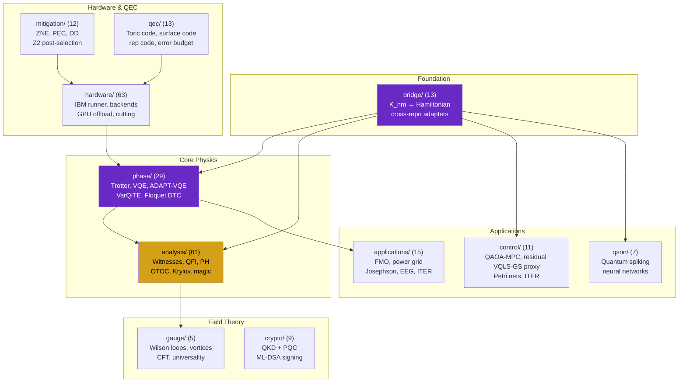
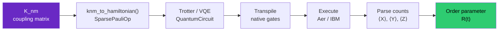

# scpn-quantum-control


[](https://github.com/anulum/scpn-quantum-control/actions/workflows/ci.yml)
[](https://codecov.io/gh/anulum/scpn-quantum-control)
[](LICENSE)
[](https://python.org)
[](https://qiskit.org)
[](https://anulum.li/scpn-quantum-control/)
[](https://anulum.github.io/scpn-quantum-control)
[](https://www.bestpractices.dev/projects/12290)
[](https://securityscorecards.dev/viewer/?uri=github.com/anulum/scpn-quantum-control)
[](https://github.com/astral-sh/ruff)
[](https://mypy-lang.org/)
[](https://github.com/anulum/scpn-quantum-control/actions/workflows/ci.yml)
[](https://pypi.org/project/scpn-quantum-control/)
[](https://pypi.org/project/scpn-quantum-control/)
[](https://pepy.tech/project/scpn-quantum-control)
[](https://doi.org/10.5281/zenodo.18821929)
[]()
[](https://colab.research.google.com/github/anulum/scpn-quantum-control/blob/main/notebooks/01_kuramoto_xy_dynamics.ipynb)

> **Active Development** — scpn-quantum-control is under intensive development.
> The public status wording is anchored to the
> [Hardware Status Ledger](docs/hardware_status_ledger.md),
> which separates theory, simulator, unmitigated hardware, mitigated hardware,
> and noise-limited claims. Current promoted hardware evidence is narrowed to
> artefact-backed `ibm_fez` baseline rows, the April/May 2026
> `ibm_kingston` DLA parity raw-count datasets, and the May 2026 SCPN/FIM
> falsification artefacts. Stable core contracts and backend capability
> artefacts are now part of release/repro hardening and are kept separate from
> non-artefact scientific claims. APIs may evolve as this work progresses.

**Version:** 0.10.0
**Status:** Kuramoto-XY compiler + hardware runners + analysis stack + bounded differentiable-programming surface | generated capability inventory below | CI coverage gate 90% | IBM Heron r2 evidence ledgered

> **Honest scope — read first.** At the system sizes reachable today
> (n ≤ 16 qubits) classical ODE and exact solvers are **faster and more accurate**
> than the quantum routes here; there is **no demonstrated broad quantum
> advantage**. The value of the quantum approach is characterisation
> (entanglement, MBL, synchronisation witnesses, DLA parity) and auditable
> hardware evidence, not speed. See the Limitations section below for the full
> disclosure.

## What this repository is for

`scpn-quantum-control` is an evidence-governed workbench for turning
coupled-oscillator models into quantum-control experiments, simulator studies,
gradient-bearing optimisation loops, and auditable hardware-result packages.
It is for teams that need a repeatable path from a physical model to a result
that can be reviewed, reproduced, cited, or used in an application pilot.

If your team needs reproducible research or product-grade experimentation, the
repository provides:

- a stable route from `K_nm`/`omega` problem definitions to simulators;
- deterministic artefact-led evidence for method claims;
- bounded optimisation and differentiable-programming surfaces for training,
  verification, and convergence analysis;
- hardware campaign management that separates committed raw-count rows from
  simulator and scoped-failure classes.

It is positioned for use-cases where decision quality depends on evidence:
engineering teams that need a consistent pathway from model specification to
observable contracts, and research teams that need explicit failure modes rather
than implied coverage.

## What you can do first

| Need | First path | Output |
|---|---|---|
| Understand the software | [Onboarding](docs/onboarding.md) -> [Quickstart](docs/quickstart.md) | A small local Kuramoto-XY run and a clear claim boundary. |
| Bring your own coupled system | [Physics-First Kuramoto-XY](docs/physics_first_kuramoto_xy.md) | A validated `K_nm`/`omega` problem compiled to simulator-ready quantum objects. |
| Train or inspect gradients | [Differentiable Tutorials](docs/differentiable_tutorials.md) -> [Differentiable Programming](docs/differentiable_programming.md) -> [Quantum Gradients](docs/quantum_gradients.md) | Exact, finite-shot, framework-comparison, or fail-closed gradient evidence. |
| Review hardware claims | [Hardware Status Ledger](docs/hardware_status_ledger.md) -> [Hardware Result Packs](docs/hardware_result_packs.md) | Raw-count-backed evidence or an explicit blocked promotion route. |
| Use v0.10 control surfaces | [API Overview](docs/api.md) -> [Tutorials](docs/tutorials.md) -> [Example Gallery](docs/examples_gallery.md) | QRNG health checks, PQC trigger signing, UltraScale+ HLS emission, realtime telemetry, Studio federation, and sensing workflows. |
| Evaluate adoption | [API Overview](docs/api.md) -> [Release Readiness Gate](docs/release_readiness.md) | Stable integration surfaces, release gates, and licensing boundaries. |

## Application and commercial value

The practical value is not "quantum black box" experimentation; it is the
ability to reduce integration risk while preserving future hardware options.
This package is designed for organisations that want to:

- de-risk algorithm ideas on simulators and strong classical baselines first;
- compare evidence classes before claiming hardware-level results;
- standardise proof surfaces (contracts, manifests, and ledgers) across pilots;
- move between R&D notebooks and integration-friendly stable facades without
  collapsing into undocumented internal APIs.

Application lanes:

- **Synchronisation diagnostics** — explore where oscillator networks lock,
  decohere, or separate into sectors.
- **Control prototyping** — map power-grid, plasma, EEG/MEG, Josephson-array,
  and other coupled-system candidates into common `K_nm`/`omega` workflows,
  with topology-only candidates separated from measured-magnitude claims.
- **Hardware evidence management** — keep raw-count evidence, simulator output,
  and open claims separated before public release or paper citation.
- **Differentiable computation and gradient-informed optimisation** — supported
  compiler-AD primitives and parameter-shift building blocks with fail-closed
  unsupported paths (full surface: the Differentiable Programming Route below).
- **Product route** — AGPL for open research; proprietary deployment uses the
  commercial licence route described below.

Commercial value comes from reducing unclear research risk: every promoted
result must have a named artefact, every unsupported route fails closed, and
closed-source or SaaS use has a defined commercial licensing route. Open
boundaries remain explicit: the package does not claim broad quantum advantage,
clinical validation, or externally validated SCPN biology — it provides a
reproducible computational workbench and the governance required to promote
claims only when the evidence exists.

<!-- capability-snapshot:start -->
<!-- SPDX-License-Identifier: AGPL-3.0-or-later -->
<!-- Generated by tools/capability_manifest.py; do not edit counts by hand. -->

# scpn-quantum-control Capability Inventory

| Surface | Current inventory |
|---|---:|
| Package version | 0.10.0 |
| Public API exports | 835 |
| Python source modules | 558 |
| Public Python classes | 1003 |
| Domain package families | 31 |
| Rust PyO3 function bindings | 177 |
| Rust source modules | 49 |
| Notebook files | 100 |
| Example files | 37 |
| Optional extras | 43 |
| Python test files | 971 |
| Public documentation pages | 269 |
| GitHub Actions workflows | 24 |

Evidence boundary: this snapshot is a static inventory. Performance, coverage, hardware, and scientific-fidelity claims require their own committed evidence artefacts.
<!-- capability-snapshot:end -->

---

## Status Snapshot — 2026-06-26

| Area | Public status |
|---|---|
| Generic compiler surface | `scpn_quantum_control.kuramoto_core` validates arbitrary `K_nm`/`omega` inputs and compiles Hamiltonians, dense matrices, Trotter circuits, and order-parameter measurements. |
| v0.10 public surfaces | QRNG streaming and health reports, ML-DSA-65 trigger signing, UltraScale+ HLS pulse emission, realtime loop telemetry, NV magnetometry simulation, FRC pulsed-shot QAOA scheduling, control-scope boundary docs, and Studio federation manifests plus evidence bundles. |
| Release and reproducibility scope | Stable core contracts and backend capability artefacts for Kuramoto-XY synchronisation are included in release/readiness checks and promoted only with deterministic evidence manifests. |
| Hardware evidence | `ibm_fez` baseline rows are legacy artefact-backed observations; `ibm_kingston` Phase 1, Phase 2 A+G, Phase 2 B-C, and popcount DLA datasets are promoted with raw-count artefacts. The SCPN/FIM `ibm_kingston` result is promoted as a negative/falsification result for the tested digital circuit family. |
| Simulator and methods evidence | BKT, OTOC, Floquet, MBL, FIM, VQE, GPU, tensor-network, and classical comparison claims stay marked as simulator/classical/methods unless a hardware artefact is named. Generated benchmark artefacts are indexed from the benchmark dashboard and reproducibility CLI. |
| Licence boundary | The possible lightweight core split is documented, but all in-repository code remains AGPL/commercial unless a future release changes metadata and SPDX headers. |

For claim classes, raw-artefact pointers, and promotion rules, see the
[Hardware Status Ledger](docs/hardware_status_ledger.md).

## Plain-Language Summary

`scpn-quantum-control` turns a coupled-oscillator network into quantum
circuits, simulator workflows, hardware-result ledgers, and analysis tools.
SCPN here denotes the **Scale-Coupled Phase Network** — a generalised-Kuramoto
coupling model whose `K_nm` matrix provides a structured, reproducible test
problem. The first supported physics lane is the Kuramoto-XY mapping: provide a
coupling matrix `K_nm` and oscillator frequencies `omega`, then compile the
matching XY Hamiltonian, run local or provider-backed circuits, measure
synchronisation, and compare the result against classical and exact-simulation
baselines.

The repository is not only a circuit generator. It also carries the operational
surfaces needed to use the software responsibly:

- stable public facades for notebooks and integrations;
- Rust acceleration for hot numerical kernels;
- differentiable-programming kernels and conformance rows for supported
  scalar, vector, matrix, broadcast, selection, shape, assembly, cumulative, and reduction
  primitives;
- no-QPU release gates and hardware-result pack verifiers;
- claim-boundary documentation that separates simulator, hardware, and open
  scientific questions.

## Who It Is For

| User | Primary value | Start here |
|---|---|---|
| Quantum algorithm researcher | Compile oscillator networks into XY circuits and inspect synchronisation, entanglement, topology, and control observables. | [Quickstart](docs/quickstart.md), [Tutorials](docs/tutorials.md) |
| Applied physicist or control engineer | Convert domain coupling graphs into reproducible quantum/simulator experiments while retaining classical baselines. | [Physics-First Kuramoto-XY](docs/physics_first_kuramoto_xy.md), [Application Benchmark Plugins](docs/application_benchmarks.md) |
| Hardware experiment operator | Run or replay provider-backed campaigns only when the evidence ledger, raw counts, and release gates permit the claim. | [Hardware Guide](docs/hardware_guide.md), [Hardware Result Packs](docs/hardware_result_packs.md) |
| Software integrator | Use stable facade APIs instead of binding to internal package layout. | [Stable Facades API](docs/stable_facades_api.md), [API Overview](docs/api.md) |
| Commercial evaluator | Assess the route from research prototype to product lane: reproducible simulations, hardware-result governance, Rust kernels, and dual licensing. | [Onboarding](docs/onboarding.md), [Release Readiness Gate](docs/release_readiness.md) |

## Why Teams Would Adopt It

The package is useful when a team needs a single accountable route from a
coupled-system model to quantum-control evidence:

| Need | What the repository supplies | Boundary to respect |
|---|---|---|
| Turn oscillator data into quantum experiments | `K_nm`/`omega` validation, XY Hamiltonians, circuits, and local execution paths. | The mapping is a quantum XY analogue of synchronisation dynamics, not a proof of nonlinear classical equivalence for every system. |
| Optimise trainable objectives | Parameter-shift VQE, composed phase objectives, gradient certificates, and supported compiler/program-AD kernels. | Unsupported gates, adapters, backends, shapes, and transform nests fail closed. |
| Compare simulators, hardware, and papers | Raw-count ledgers, result packs, no-QPU gates, benchmark manifests, and reproducibility docs. | Claims must cite committed evidence artefacts; simulator output is not hardware validation. |
| Prepare a product or research integration | Stable facades, provider capability records, Rust acceleration hooks, API docs, tutorials, and licence boundary text. | Closed-source network services or embedded products need the commercial licence route. |

Market-facing applications include quantum-control prototyping, power-grid and
plasma synchronisation studies, EEG/MEG rhythm modelling under non-clinical
claim limits, quantum-hardware campaign governance, gradient-informed VQE/QNN
research, and reproducible benchmark publication.

## Differentiable Programming Route

The differentiable-programming lane is now documented as a first-path product
surface because gradient evidence is central to quantum optimisation, machine
learning integration, and control. The bounded Phase-QNode promotion state is
a promotion candidate until the claim ledger, external comparison rows, and isolated
CI benchmark artefacts all pass:

| Layer | Current status | Where to start |
|---|---|---|
| Quantum parameter-shift | Supported through `scpn_quantum_control.phase.param_shift` for callable expectation objectives, structured `PhaseVQE` gradients, and local gradient-descent VQE examples. | [Quantum Gradients](docs/quantum_gradients.md), [Variational Methods](docs/variational.md) |
| Program and compiler AD | Supported for registered scalar, vector, and matrix primitives with native lowering reports, deterministic alias/effect metadata summaries including bounded local rebinding/list-alias metadata, typed list-alias provenance, typed loop-carried state provenance, typed control-path alias provenance, typed rebinding-alias provenance, local object-attribute aliases, expression-rebinding aliases, branch-local control-path alias blockers, loop-carried scalar state metadata, executed array-view aliases, `program_ad_effect_ir.v1` round-trip conformance through `program_ad_ir_roundtrip_contracts`, runtime/source control-region and `ProgramADPhiNode` conformance through `program_ad_control_phi_metadata_contracts`, finite/dtype/shape result checks, trainable-mask derivative zeroing, bounded reverse-adjoint generation provenance with `ProgramADAdjointStep` rows through `program_adjoint_replay_provenance_contracts`, fail-closed derivative-losing `sign`/`heaviside` contracts, elementwise primitive conformance for bounded absolute-value, domain, denominator, and inverse-trig boundary contracts, structured numeric primitive conformance for product/interpolation/signal/stencil contracts, cumulative primitive conformance for bounded `cumsum`/`cumprod`/`diff` traces, assembly primitive conformance for like-constructors and static stack conveniences, reduction primitive conformance for bounded statistical, trapezoid, unique-selector, and scalar-q order-statistic reductions, shape primitive conformance for bounded reshape, axis movement, rank promotion, repeat/tile, roll/rot90, and flip-family contracts, broadcast primitive conformance for bounded `broadcast_to`, `broadcast_arrays`, and binary rank-broadcasting paths, selection primitive conformance for bounded static selection folds, strict sort, `where`, and `clip` paths with dynamic masks/selectors, ties, and integer-output selector differentiation still fail-closed, bounded 2x2 static-linalg native lowering, wider static-linalg MLIR-runtime-only verification, and fail-closed unsupported boundaries. Alias/effect summaries, IR round-trip evidence, control/phi provenance, generated adjoint-step provenance, and the source/bytecode frontend execution gate that attaches accepted reports to whole-program results and rejects hard gaps before objective execution with unsupported-semantics source/region/bytecode diagnostics are local bounded evidence, not malformed control/view/list/loop/rebinding-alias promotion, non-executed branch adjoints, full compiler phi lowering, a complete static alias lattice, executable Rust/LLVM/JIT lowering, or full reverse-mode compiler AD. | [Differentiable Programming](docs/differentiable_programming.md), [Differentiable API](docs/differentiable_api.md) |
| Gradient support matrix | Executable support planning now covers registered gates, observables, backends, transforms, and ML/provider adapters with explicit blocked reasons and alternatives. | [Quantum Gradients](docs/quantum_gradients.md), [Differentiable API](docs/differentiable_api.md) |
| Unified readiness ledger | `run_differentiable_readiness_audit()` aggregates the support matrix, transform nesting, QNode tape/transform suites, provider gradients, hardware policy, and provider hardware-preparation audit into one reviewer-facing pass/fail ledger. | [Differentiable Programming](docs/differentiable_programming.md), [Differentiable API](docs/differentiable_api.md) |
| Transform nesting governance | Executable planning now separates supported local `grad`, `value_and_grad`, `hessian`, nested-grad, tape, scalar `jvp`, scalar `vjp`, scalar `jacfwd`, scalar `jacrev`, vector-output native Jacobian execution, native manual `vmap(grad)`, whole-program `grad(vmap(f))` over trace-aware leaves, local Hessian over a whole-program AD scalar objective, JVP/VJP over whole-program AD Hessian transforms, and provider-callback QNode transforms from blocked framework-vectorized, adapter-nested, finite-shot curvature, malformed-provider, and hardware nesting routes. | [Quantum Gradients](docs/quantum_gradients.md), [Differentiable API](docs/differentiable_api.md) |
| Provider-gradient readiness | Executable audit evidence distinguishes deterministic callbacks, finite-shot callbacks, multi-frequency rules, hardware-blocked routes, unknown backends, malformed finite-shot samples, and policy-bound hardware-preparation records. | [Quantum Gradients](docs/quantum_gradients.md), [Differentiable API](docs/differentiable_api.md) |
| Hardware-gradient policy readiness | Executable dry-run policy decisions now gate hardware-gradient preparation by provider/backend allowlist, shot budget, required evidence IDs, and live-execution ticket status. `prepare_provider_hardware_parameter_shift_gradient(...)` packages that approval into provider-preparation evidence, and `run_provider_hardware_gradient_preparation_audit()` verifies supported and blocked preparation routes without submitting QPU jobs. | [Quantum Gradients](docs/quantum_gradients.md), [Differentiable API](docs/differentiable_api.md) |
| Differentiable claim ledger | The Phase-QNode evidence ledger maps implementation, tests, artefact IDs, documentation, known gaps, and promotion status; no promoted claim is accepted without an artefact ID, and support-surface alignment checks keep ledger paths consistent with the generated capability manifest. | [Differentiable Programming](docs/differentiable_programming.md), [Claim Ledger](data/differentiable_phase_qnode/claim_ledger.md) |
| Differentiable public claim table | Public-facing differentiable wording is generated from the committed ledger. Every current row is bounded-candidate only, and the table blocks hardware, provider, QPU, GPU, production-performance, and `isolated_affinity` claims until promotion evidence exists. | [Public Claim Table](data/differentiable_phase_qnode/public_claim_table_20260616.md) |
| Differentiable baseline scorecard | `run_differentiable_baseline_scorecard()` scores the lane against named JAX, PyTorch, PennyLane, Qiskit Runtime, Catalyst, Enzyme, Rust Program AD, provider/hardware, benchmark, docs/API, and adoption baselines. Every current category remains behind-baseline governance evidence until promoted ledger rows and isolated benchmark artefacts exist. | [Differentiable Programming](docs/differentiable_programming.md), [Baseline Scorecard](data/differentiable_phase_qnode/differentiable_baseline_scorecard_20260620.md) |
| Differentiable Rust/Python inventory | `run_differentiable_rust_python_inventory()` classifies differentiable Python, Rust, compiler, provider, hardware, metadata, and deprecation surfaces before broad rustification. Rows record owner modules, tests, docs, benchmark status, mypy targets, docstring status, Rust parity, polyglot status, and blockers without promoting Rust, LLVM/JIT, provider, hardware, GPU, or isolated benchmark claims. | [Differentiable Programming](docs/differentiable_programming.md), [Rust/Python Inventory](data/differentiable_phase_qnode/differentiable_rust_python_inventory_20260620.md) |
| Differentiable external-validation lock | The external-validation package records exact SHA-256 digests for runtime, development, Python 3.11-3.13 CI, CPU framework-overlay, and Enzyme-runner lockfiles. The artefact is reviewer reproduction evidence only and remains `functional_non_isolated`. | [Differentiable Programming](docs/differentiable_programming.md), [Environment Lock](data/differentiable_phase_qnode/external_validation_environment_lock_20260616.md) |
| Differentiable CI reproducibility | The differentiable framework workflow runs sparse and full CPU profiles across Python 3.11-3.13, enforces the module-specific test audit, uploads scheduled benchmark metadata, and exposes a manual optional GPU contract lane that remains `functional_non_isolated`. | [Differentiable Programming](docs/differentiable_programming.md), [Workflow](.github/workflows/differentiable-frameworks.yml) |
| Differentiable artefact bundle | The external-validation package records a reproducible manifest over the committed claim ledger, public claim table, environment lock, domain dataset closure, gradient comparison, maturity audit, and local benchmark evidence. The bundle is checksum provenance only and remains `functional_non_isolated`. | [Artefact Bundle](data/differentiable_phase_qnode/external_validation_artifact_bundle_20260616.md) |
| Differentiable isolated benchmark plan | `run_differentiable_isolated_benchmark_plan()` maps every current non-isolated differentiable benchmark/evidence artefact, including the compiler-promotion batch gate, to a reserved-host rerun command, required runner labels, expected output paths, and explicit blockers. It is planning evidence only and returns `promotion_ready=False` until validated `isolated_affinity` artefacts exist. | [Batch Plan](data/differentiable_phase_qnode/differentiable_isolated_benchmark_plan_20260627.md), [Benchmark API](docs/benchmarks_api.md) |
| Differentiable external-validation report | The technical report summarizes the comparison package, provider-family status, reproducibility artefacts, and remaining promotion blockers without upgrading any row beyond bounded-candidate evidence. | [External Validation Report](docs/differentiable_external_validation_report.md) |
| Hardening-slice gate | `run_differentiable_hardening_slice_gate(...)` records the required Ruff, mypy, module-specific pytest, test-quality audit, claim-ledger validation, and benchmark-classification checks for each differentiable hardening slice. CI, local preflight, and the pre-push hook additionally enforce a module-specific strict-mypy ratchet across the closed differentiable API, claim-ledger, benchmark-evidence, QNN/QGNN/QSNN training and evidence satellites, objective/domain evidence, optimizer-baseline, backend selection, parameter-shift/VQE foundations, structured-ansatz/methodology/benchmark/Kuramoto/UPDE solver foundations, typed trajectory-result containers, layered ADAPT-VQE, Trotter-error bounds, framework-overlay, provider/hardware-gradient safety, Phase-QNode, framework-bridge, transform-nesting, external-comparison, XY compiler, and PennyLane import modules while repository-wide strict mode remains open debt. The same gates now enforce a scoped NumPy-style Ruff docstring ratchet for the differentiable external-validation, module-hardening audit, and hardening-slice gate surfaces while repository-wide docstring enforcement remains open debt. It is checklist/classification evidence only, not benchmark execution. | [Differentiable Programming](docs/differentiable_programming.md), [Differentiable API](docs/differentiable_api.md) |
| Module-hardening audit | `run_differentiable_module_hardening_audit()` discovers every differentiable/gradient/QNode/bridge/compiler module in the promotion scope and verifies a module-specific test plus declared fail-closed diagnostics for each. | [Differentiable Programming](docs/differentiable_programming.md), [Differentiable API](docs/differentiable_api.md) |
| Bounded phase-QNN, open-system, and coupling-recovery evidence | A deterministic data-reuploading binary classifier is available through `train_parameter_shift_qnn_classifier(...)` with multi-frequency parameter-shift descent, prediction evidence, accuracy, convergence certificates, finite-difference gradient verification, seeded finite-shot gradient uncertainty and noisy-convergence evidence, optional named external-gradient agreement records, a conformance suite with unsuitable-scenario evidence, deterministic convergence suites, bounded PyTorch custom `torch.autograd.Function` backward plus SGD integration audit, bounded PyTorch module `state_dict`, Adam optimizer-state replay, CPU/CUDA-smoke-gated device-state replay, weights-only CPU checkpoint replay, long-lived checkpoint matrix diagnostics, multi-scenario training-loop matrix diagnostics, local `torch.export` save/load value replay, static export-shape matrix diagnostics, input-driven dynamic-batch `torch.export` replay, and local AOTAutograd forward/backward FX graph persistence through `run_torch_autograd_function_audit(...)`, `run_torch_module_state_audit(...)`, `run_torch_module_device_state_audit(...)`, `run_torch_module_checkpoint_audit(...)`, `run_torch_long_lived_checkpoint_matrix(...)`, `run_torch_training_loop_matrix(...)`, `run_torch_module_export_audit(...)`, `run_torch_export_shape_matrix(...)`, `run_torch_dynamic_shape_export_audit(...)`, and `run_torch_aot_autograd_export_audit(...)`, non-isolated optimizer-baseline comparisons across parameter-shift, finite-difference, SGD, Adam, L-BFGS-B, diagonal-Fisher natural-gradient, seeded SPSA, and derivative-free grid routes, known-ground-state convergence certificates across natural-gradient, Adam, L-BFGS-B, seeded SPSA, and COBYLA through `run_ground_state_optimizer_convergence_suite(...)`, bounded Lindblad/MCWF objective rows with density-matrix invariant and same-seed trajectory replay certificates through `run_open_system_objective_suite(...)`, bounded Kuramoto and XY coupling time-series recovery evidence through `run_coupling_recovery_suite(...)`, and caller-supplied framework-gradient agreement checks. | [Quantum Gradients](docs/quantum_gradients.md), [Differentiable API](docs/differentiable_api.md), [Lindblad](docs/lindblad.md), [Open-System Hardware](docs/open_system_hardware.md) |
| Registered Phase-QNode family | Local statevector execution, density-matrix execution with bounded single-qubit Kraus channels, arbitrary-depth registered circuit builders with deterministic depth/resource profiles, registered GHZ-chain and hardware-efficient multi-qubit templates, controlled-H/S/T plus Toffoli/CCZ/Fredkin gates with exact Toffoli/Fredkin decompositions, sparse Ising-chain Hamiltonian construction, parameter-shift gradients for pure-state routes, framework parity rows, native JAX deterministic statevector value-and-gradient plus `grad`/`value_and_grad`/`jacfwd`/`jacrev`/`hessian`/`jvp`/`vjp`/`vmap`/`jit` transform lowering for registered local circuits, native JAX PyTree transform lowering with flattened Hessian symmetry evidence for structured registered local circuit parameters, native JAX `pmap` sharding transform lowering with one row per local device, native PyTorch deterministic statevector value-and-gradient lowering, native PyTorch `torch.func.grad`/`jacrev`/`vmap` transform lowering, native PyTorch non-fullgraph `torch.compile` value-and-gradient lowering on CPU, PyTorch compile-boundary diagnostics, verified SCPN MLIR-runtime lowering adapters, and isolated-affinity benchmark metadata are available for the declared gate/observable subset. Unsupported gates, dynamic/provider paths, native LLVM/JIT lowering, interpreter fallback success, noisy-channel gradients/metrics, registered PyTorch fullgraph `torch.compile` promotion, dynamic-shape compile promotion, registered Phase-QNode AOTAutograd/export persistence, dynamic-shape export promotion, incompatible CUDA/device execution, finite-shot native framework lowering, and unregistered observables fail closed with support reports. | [Differentiable API](docs/differentiable_api.md), [Benchmark Harness](docs/benchmark_harness.md) |
| ML framework and tape roadmap | Gradient tape, QNode-style tape records, backend gradient planning, provider-safe callback execution with shot/variance accounting, convergence certificates, optional JAX host-callback parameter-shift interop, deterministic registered Phase-QNode JAX statevector transform lowering, deterministic registered Phase-QNode JAX PyTree transform lowering, deterministic registered Phase-QNode JAX pmap/sharding transform lowering, deterministic registered Phase-QNode PyTorch statevector, `torch.func`, non-fullgraph `torch.compile` transform lowering, compile-boundary diagnostics, bounded PyTorch module-state, device-state, checkpoint, long-lived checkpoint matrix, training-loop matrix, export replay, export-shape matrix diagnostics, dynamic-batch export replay, and local AOTAutograd FX graph persistence, PyTorch module/transform/compiler/device maturity routing, PennyLane gradient-agreement checks, TensorFlow host-boundary tensor bridges, and bounded framework parity rows are available. Full provider-backed QNode migration bridges, finite-shot native framework lowering, dynamic-circuit lowering, compatible CUDA/device artefacts, registered PyTorch fullgraph `torch.compile` promotion, cross-runtime AOTAutograd execution, dynamic-shape AOTAutograd export, dynamic feature-width export promotion, cross-runtime checkpoint/export portability, and arbitrary architectures remain staged surfaces, not yet advertised as production-complete. | [Differentiable Roadmap](docs/differentiable_roadmap.md) |

This matters commercially because optimisation users do not only need circuits.
They need gradients, convergence evidence, framework interop, reproducible
benchmarks, and clear failure modes. The SCPN route aims to combine
Kuramoto-XY physics, quantum-control objectives, hardware-result governance,
and compiler-backed AD under one support matrix.

Rust polyglot parity includes a claim-bounded Program AD IR metadata parser in
`scpn_quantum_engine::program_ad_ir` plus
`program_ad_effect_ir_metadata_summary(...)` and
`program_ad_effect_ir_interpret_forward(...)` plus
`program_ad_effect_ir_interpret_value_and_gradient(...)` for PyO3 consumers.
`program_ad_registry_metadata_mirror(...)` validates the Python registry
coverage snapshot, returns deterministic family/facet counts, and records only
the primitive-name overlap with the already bounded Rust scalar/static-linalg
plus compact interpolation, compact signal, compact stencil, compact cumulative,
elementwise/static-structural, static `diag`/`diagflat`, static `matrix_power`,
fixed `multi_dot`, 2x2 distinct symmetric
`eigvalsh`, 2x2 distinct symmetric `eigh` eigenvalues/nonzero-offdiagonal
eigenvectors, 2x2 real-distinct `eigvals`, 2x2 real-simple `eig`
eigenvalue/eigenvector replay, and 2x2 distinct-positive
`svd(..., compute_uv=False)` singular-value replay plus constant-full-rank
rank-1/Nx2/2xN `pinv` replay. Metadata summaries validate
`program_ad_effect_ir.v1` evidence only; Rust value+gradient replay is bounded
to opcode-bearing scalar, elementwise-array, static structural-array,
static structural-assembly, static source-map indexing, compact interpolation,
compact signal, compact stencil, compact cumulative, static product, corrected moment, strict order-statistic,
and compact static-grid trapezoid
reductions with `dx`/`x`/`xfull` metadata, plus static integer
`np.diag` gather/scatter nodes, static on-diagonal `np.diagflat` construction
nodes, static integer `np.linalg.matrix_power` output nodes, fixed-signature
`np.linalg.multi_dot` matrix-chain output nodes, 2x2 distinct symmetric
`np.linalg.eigvalsh` spectral output nodes, 2x2 distinct symmetric
`np.linalg.eigh` eigenvalue and nonzero-offdiagonal eigenvector output nodes,
2x2 real-distinct `np.linalg.eigvals` spectral output nodes, 2x2 real-simple
`np.linalg.eig` eigenvalue/eigenvector output nodes, and 2x2
distinct-positive `np.linalg.svd(..., compute_uv=False)` singular-value output
nodes plus constant-full-rank rank-1/Nx2/2xN `np.linalg.pinv` output
nodes, including executed runtime branch
metadata when matched by runtime phi provenance. It still fails closed on
legacy opcode-free metadata, aliases, mutation, non-lowered dynamic indexing
semantics, dynamic axes, dynamic trapezoid-grid metadata, dynamic q/method
metadata, dynamic ddof/correction metadata, zero-variance `std` gradients,
broad linalg/spectral array adjoints beyond the bounded 2x2 `eigvalsh`,
`eigh`, `eigvals`, and real-simple `eig`, static rank-2 SVD singular-value, and rank-1/Nx2/2xN `pinv`
boundaries,
source-level/non-executed branch
semantics, general Program AD execution, LLVM/JIT execution, hardware,
provider, and performance promotion. The Rust claim boundary now reports the
BL-02 `dynamic_boundary_fail_closed_audit` for the audited dynamic-boundary
fail-closed corpus.
Python callers can use `scpn_quantum_control.program_ad_rust_bridge` for the
typed fail-closed wrappers; `scpn_quantum_control.differentiable` re-exports
the same symbols for backward compatibility.
Static whole-program bytecode/source frontend inspection now lives in
`scpn_quantum_control.whole_program_frontend`; `scpn_quantum_control.differentiable`
and the package root re-export `compile_whole_program_frontend(...)` and its
report objects for compatibility. The frontend remains no-execution preflight
metadata. `whole_program_value_and_grad(...)` now requires a `frontend_ready`
report before objective execution and attaches that report to
`WholeProgramADResult.frontend_report`; hard gaps fail closed with the
frontend digest plus source/region/bytecode diagnostics. This is not executable
Rust, LLVM, JIT, provider, hardware, or benchmark evidence.
Python compiler interchange lowers captured `program_ad_effect_ir.v1` records
into deterministic `scpn_diff.program_ad_*` MLIR-style operations through
`compile_whole_program_ad_trace_to_mlir(...)`, validated by
`program_ad_mlir_interchange_contracts`. This remains metadata interchange, not
executable Rust, LLVM, JIT, provider, hardware, or performance evidence.

The first production-grade differentiable workflows are deliberately bounded:

1. train small VQE objectives with parameter-shift gradients through `PhaseVQE.solve(gradient_method="parameter_shift")`;
2. verify gradients against finite differences and analytic references through `verify_parameter_shift_gradient(...)` and `verify_vqe_parameter_shift_gradient(...)`;
3. train bounded phase-QNN classifiers through `train_parameter_shift_qnn_classifier(...)`, verify their QNN-specific gradients through `verify_parameter_shift_qnn_classifier_gradient(...)`, record seeded finite-shot uncertainty through `estimate_parameter_shift_qnn_finite_shot_gradient(...)`, package evidence with `run_parameter_shift_qnn_conformance_suite(...)`, certify deterministic local convergence with `run_parameter_shift_qnn_convergence_suite(...)`, replay seeded finite-shot convergence with `run_parameter_shift_qnn_finite_shot_convergence_suite(...)`, verify bounded PyTorch custom-autograd backward, module, optimizer, device-state, checkpoint, long-lived checkpoint matrix, training-loop matrix, export replay, static export-shape matrix diagnostics, dynamic-batch export replay, and local AOTAutograd FX gradient replay with `run_torch_autograd_function_audit(...)`, `run_torch_module_state_audit(...)`, `run_torch_module_device_state_audit(...)`, `run_torch_module_checkpoint_audit(...)`, `run_torch_long_lived_checkpoint_matrix(...)`, `run_torch_training_loop_matrix(...)`, `run_torch_module_export_audit(...)`, `run_torch_export_shape_matrix(...)`, `run_torch_dynamic_shape_export_audit(...)`, and `run_torch_aot_autograd_export_audit(...)`, compare local optimizer baselines with `run_parameter_shift_qnn_optimizer_benchmark_suite(...)`, certify known-ground-state optimizer convergence with `run_ground_state_optimizer_convergence_suite(...)`, evaluate bounded Lindblad/MCWF objective evidence with `run_open_system_objective_suite(...)`, and record caller-supplied framework-gradient agreement with `verify_parameter_shift_qnn_framework_agreement(...)`;
4. execute registered local Phase-QNode circuits with `execute_phase_qnode_circuit(...)`, compare installed framework parity with `run_phase_qnode_framework_parity_suite()`, lower deterministic registered statevector value-and-gradient routes into native JAX with `jax_phase_qnode_value_and_grad(...)`, audit registered JAX native transforms with `jax_phase_qnode_native_transform_audit(...)`, audit structured-parameter JAX PyTree transforms with `jax_phase_qnode_pytree_transform_audit(...)`, audit local-device JAX pmap/sharding transforms with `jax_phase_qnode_sharding_transform_audit(...)`, lower deterministic registered statevector value-and-gradient routes into native PyTorch with `torch_phase_qnode_value_and_grad(...)`, audit registered PyTorch `torch.func` transforms with `torch_phase_qnode_transform_audit(...)`, classify PyTorch compile boundaries with `torch_phase_qnode_compile_boundary_audit(...)`, record PyTorch module/transform/compiler/device maturity with `run_torch_ecosystem_maturity_audit(...)`, and lower supported subsets to textual MLIR metadata with `lower_phase_qnode_circuit_to_mlir(...)`;
5. use compiler/program-AD kernels for supported classical objectives;
6. evaluate hardware-gradient preparation with `evaluate_hardware_gradient_policy(...)`
   and `run_hardware_gradient_policy_readiness_suite()` before any provider job
   is prepared;
7. summarize the focused readiness suites with `run_differentiable_readiness_audit()`;
8. document unsupported gates, backends, shapes, and dynamic program paths
   before they can mislead users.

Future releases will extend this route toward native framework gradients beyond
the current bounded JAX/PyTorch/TensorFlow and registered JAX/PyTorch statevector bridges, full PennyLane/Qiskit
migration bridges beyond agreement checks, finite-shot and provider-backed
native lowering, quantum neural networks, analog oscillator mappings,
open-system gradients, benchmark leaderboards, and real-time feedback control.

## Richer Presentation

For a richer presentation of the Phase 1 hardware results, methodology
deep-dives, interactive plots, and architecture diagrams, see the
project website:

**[anulum.li/scpn-quantum-control](https://anulum.li/scpn-quantum-control/)**

Direct entry points:

- [Onboarding](docs/onboarding.md)
  — what the project is, who should use it, what is mature, and what remains
  claim-bound
- [Hardware Status Ledger](docs/hardware_status_ledger.md)
  — claim classes, campaign evidence paths, and publication hygiene rules
- [Hardware Result Packs](docs/hardware_result_packs.md)
  — offline manifest and integrity verifier for promoted IBM raw-count datasets
- [Physics-First Kuramoto-XY](docs/physics_first_kuramoto_xy.md)
  — start from arbitrary oscillator networks before SCPN-specific layers
- [Differentiable Programming](docs/differentiable_programming.md)
  — current AD surface, support boundaries, and user routes
- [Quantum Gradients](docs/quantum_gradients.md)
  — parameter-shift, VQE gradients, verification tests, and planned backend
  gradient planner
- [Differentiable API](docs/differentiable_api.md)
  — public `scpn_quantum_control.differentiable` reference and usage map
- [Differentiable Roadmap](docs/differentiable_roadmap.md)
  — staged plan for tape, framework adapters, QNN/QGNN/QSNN, analog mapping,
  benchmarks, verification, and dashboards
- [Stable Facades API](docs/stable_facades_api.md)
  — mkdocstrings reference for first-path public facades
- [Phase 1 Results](https://anulum.li/scpn-quantum-control/phase1-results.html)
  — raw-count reproduction of the DLA parity asymmetry on
  ibm_kingston, April 2026, with full Welch table and interactive
  Plotly plot
- [Reproducibility Manifest](https://anulum.li/scpn-quantum-control/reproducibility.html)
  — per-commit pinning, IBM job IDs, dependency constraints, rerun
  protocol
- [Method: GUESS Mitigation](https://anulum.li/scpn-quantum-control/method-guess.html)
  — symmetry-guided ZNE, shot-budget-free for the XY Hamiltonian
- [Method: DLA Parity Theorem](https://anulum.li/scpn-quantum-control/method-dla-parity.html)
  — $\mathfrak{su}(2^{n-1}) \oplus \mathfrak{su}(2^{n-1})$
  decomposition and hardware reproduction path
- [Method: Pulse Shaping](https://anulum.li/scpn-quantum-control/method-pulse-shaping.html)
  — ICI three-level and (α, β)-hypergeometric Rust fast paths (the 1,665× and
  44× figures on the linked page are v0.9.5-era workstation measurements, not
  reproduced by a committed benchmark artefact)
- [The Science](https://anulum.li/scpn-quantum-control/science.html)
  — plain-language primer on SCPN, Kuramoto-XY, and why the DLA
  parity result matters
- [Methods Benchmark Dashboard](docs/methods_benchmark_dashboard.md)
  — generated Rust/VQE, GPU, tensor-network, FIM, and reproducibility
  artefact index
- [Roadmap](ROADMAP.md)
  — canonical active work queue and completed release-safety tasks

---

## Quick Start

```bash
pip install scpn-quantum-control
```

```python
import numpy as np
from scpn_quantum_control.phase.xy_kuramoto import QuantumKuramotoSolver

# 8 oscillators, exponential-decay coupling, heterogeneous frequencies
N = 8
K = 0.5 * np.exp(-0.3 * np.abs(np.subtract.outer(range(N), range(N))))
omega = np.linspace(0.8, 1.2, N)

# Simulate: Trotter evolution → order parameter R(t)
solver = QuantumKuramotoSolver(N, K, omega)
result = solver.run(t_max=1.0, dt=0.1)
print(f"Final R = {result['R'][-1]:.3f}")
# → R rises from ~0.3 (incoherent) toward 1.0 (synchronised)
```

No IBM credentials needed — runs on local statevector simulator.
Pass any coupling matrix; the built-in SCPN benchmark is just one example.

**Any coupling network** — bring your own K and omega:

```python
from scpn_quantum_control import QuantumKuramotoSolver, build_kuramoto_ring

K, omega = build_kuramoto_ring(6, coupling=0.5, rng_seed=42)
solver = QuantumKuramotoSolver(6, K, omega)
result = solver.run(t_max=1.0, dt=0.1, trotter_per_step=2)
print(f"R(t): {result['R']}")
```

**Built-in SCPN network** (16 oscillators from Paper 27):

```python
from scpn_quantum_control import QuantumKuramotoSolver, build_knm_paper27, OMEGA_N_16

K = build_knm_paper27(L=4)
solver = QuantumKuramotoSolver(4, K, OMEGA_N_16[:4])
result = solver.run(t_max=0.5, dt=0.1, trotter_per_step=2)
```

**Detect synchronisation** with witness operators:

```python
from scpn_quantum_control.analysis.sync_witness import evaluate_all_witnesses

# After running X-basis and Y-basis circuits on IBM hardware:
results = evaluate_all_witnesses(x_counts, y_counts, n_qubits=4)
for name, w in results.items():
    print(f"{name}: {'SYNCHRONIZED' if w.is_synchronized else 'incoherent'}")
```

For development (editable install with test/lint tooling):

```bash
pip install -e ".[dev]"
pre-commit install
pytest tests/ -v
```

### Hardware execution (requires IBM Quantum credentials)

```bash
pip install -e ".[ibm]"
python run_hardware.py --experiment kuramoto --qubits 4 --shots 10000
```

---

## What This Package Does

**A Kuramoto-XY compiler and hardware-evidence workbench for heterogeneous
coupled oscillators.** The repository contains legacy `ibm_fez` baseline
artefacts, promoted `ibm_kingston` DLA parity datasets, and SCPN/FIM
falsification artefacts with raw counts, job IDs, integrity checks, and
count-to-statistic reproduction harnesses.

The package provides:

1. **A Kuramoto-to-quantum compiler** — any coupling matrix K_nm and natural
   frequencies omega compile directly into executable Qiskit circuits for IBM
   hardware. Rust-accelerated dense Hamiltonian construction is faster than the
   Qiskit `SparsePauliOp` path for small systems (a parity-checked local
   regression guard, ~96× at L=4 on the i5-11600K baseline, shrinking with
   system size) — reproducible and gated; see
   [Native Speedup Benchmark](docs/native_speedup_benchmark.md).

2. **Tracked research module families** probing the synchronisation phase
   transition — synchronisation witnesses, OTOC scrambling, Krylov complexity,
   persistent homology, DLA parity theorem, and more. Novel constructions and
   first applications are documented in the
   research-gems and API pages; exact file counts use the package table below.

3. **Hardware evidence with claim classes** — legacy `ibm_fez` baseline rows,
  promoted `ibm_kingston` DLA parity datasets, and the SCPN/FIM negative
  hardware result are separated from simulator-only, frontier, queued-job, and
  aggregate-only outputs.
   Stable core contracts and backend capability artefacts are included in this
   hardening boundary and are replayed via reproducibility tooling.


Think of it as a **quantum microscope for synchronisation**: classical Kuramoto
tells you *when* oscillators lock in step; this package tells you *what the
quantum state looks like* at the transition, *how entangled it is*, *how fast
information scrambles*, and *whether the system thermalises*.

> **Advanced benchmark:** The built-in SCPN 16-layer coupling matrix (Paper 27)
> provides a heterogeneous-frequency benchmark for structured
> oscillator-network experiments. Publication-facing claims should treat this
> as a classical complex-network input to quantum-inspired Hamiltonian,
> tensor-network, topological, and DLA analyses, not as a quantum-biological or
> clinical causation claim. See
> [SCPN Foundations](https://anulum.github.io/scpn-quantum-control/theory/).

## Key Results

### Hardware Evidence

| Result | Value |
|--------|-------|
| `ibm_kingston` DLA parity Phase 1 | 342 circuits, raw counts, job IDs, integrity checks, and reproduction harness in `data/phase1_dla_parity/` |
| `ibm_kingston` DLA parity Phase 2 | Promoted A+G `n=4` replication, B-C mixed `n=6,8` scaling, and popcount controls in `data/phase2_dla_parity/`, `data/phase2_scaling_bc/`, and `data/phase2_popcount_control/`; no DLA-parity-only or monotone-scaling claim |
| `ibm_kingston` SCPN/FIM hardware test | Pilot and repeated follow-up artefacts in `data/scpn_fim_hamiltonian/`; promoted as a negative result for simple digital `lambda=4` hardware protection on the tested circuit family |
| `ibm_fez` baseline rows | Legacy QPU observations retained in `results/ibm_hardware_2026-03-28/` and `results/march_2026/`; quote only artefact-backed values through the ledger |
| Quarantined IBM outputs | V2/frontier/queued-job/aggregate-only artefacts are not promoted until raw counts, retrieval manifests, and analysis code are reviewed |

### Simulation

| Result | Value |
|--------|-------|
| Critical coupling K_c(∞) | **≈ 2.2** (BKT finite-size scaling) |
| DTC with heterogeneous ω | **15/15** amplitudes show subharmonic response |
| OTOC scrambling | **4× faster** at K=4 vs K=1 (n=8) |
| Schmidt gap transition | **K = 3.44** (n=8, 60-point resolution) |
| DLA dimension formula | **2^(2N-1) − 2** (exact, all N) |

### Software

| Metric | Value |
|--------|-------|
| Rust engine bindings | **177** exported `#[pyfunction]` bindings in the tracked Rust crate; low-level helper `fn` definitions are an implementation detail. |
| Source package surface | Tracked Python source files under `src/scpn_quantum_control` (excluding package initialisers) — the current count lives in the generated capability inventory above. |
| Research module families | Analysis, phase, hardware, bridge, mitigation, QEC, applications, forecasting, and benchmark families; exact current counts are listed in the package map below. |
| Publication figures | **17** (simulation + hardware, including the Phase 1 DLA parity panels and exact-simulation crossover) |
| Test, coverage, and typing gates | CI enforces **90% line coverage** through `tools/coverage_policy.json`, collects branch telemetry without inventing an unmeasured branch threshold, and strict-mypy checks production Python. Tests use the additive cohort in `tools/test_typing_policy.json` rather than claiming the legacy test tree is already strict. See [Test Infrastructure](docs/test_infrastructure.md) and the generated capability inventory for current scope. |
| Reproducibility CLI | `scpn-bench reproduce-methods`, `scpn-bench fim-all`, and `scpn-bench all` regenerate committed methods/FIM artefacts without IBM submission |

### Exact-Simulation Wall-Time (Not broad quantum-advantage claim)

This section covers exact Hilbert-space simulation crossover only.
No broad observable-level quantum-advantage claim is closed yet.
Any broader advantage claim remains blocked until external tensor-network or
GPU baselines and explicit data-loading plus state-preparation costs are
accounted for.

No quantum advantage at n ≤ 16 in this exact-simulation path. Classical ODE is
faster for all accessible sizes. The value of the quantum approach is
characterisation (entanglement, MBL, witnesses), not speed.

| Method | n=4 | n=8 | n=12 | n=16 |
|--------|----:|----:|-----:|-----:|
| Classical Kuramoto ODE (scipy) | 0.4 ms | 1.4 ms | 2.8 ms | ~11 ms |
| Exact diagonalisation (numpy eigh) | 0.1 ms | 164 ms | 26.8 s | OOM (32 GB) |
| Qiskit statevector | ~50 ms | ~2 s | ~minutes | impractical |
| Rust Hamiltonian + numpy eigh | 0.02 ms | 30 ms | ~5 s | ~2 min (est.) |
| IBM hardware (per-job, 4000 shots) | ~5 s | ~10 s | ~20 s | ~40 s |

Measured on Ubuntu 24.04, AMD Ryzen, 32 GB RAM. Rust speedup applies to
Hamiltonian construction only; the eigh bottleneck is LAPACK in all cases.

### Publications

- [Preprint: Quantum Kuramoto-XY on 156-qubit processor](https://anulum.github.io/scpn-quantum-control/preprint/)
- [Paper: Synchronisation Witness Operators](https://anulum.github.io/scpn-quantum-control/paper_sync_witnesses/) (novel NISQ-ready formalism)
- [Paper: DLA Parity Theorem](https://anulum.github.io/scpn-quantum-control/paper_dla_parity/) (exact closed-form)

## Background: Kuramoto → XY Mapping

Any network of N coupled Kuramoto oscillators can be represented by a linear
Kuramoto-XY Hamiltonian analogue or embedding. This is not a claim that a
gate-model circuit directly Trotterises the nonlinear classical Kuramoto ODE;
direct nonlinear simulation requires an explicit Koopman, Carleman, or
equivalent embedding. The built-in SCPN example uses 16 oscillators with a
coupling matrix K_nm:

```
K_nm = K_base * exp(-alpha * |n - m|)
```

with K_base = 0.45, alpha = 0.3, and empirical calibration anchors
(K[1,2] = 0.302, K[2,3] = 0.201, K[3,4] = 0.252, K[4,5] = 0.154).
Cross-hierarchy boosts link distant layers (L1-L16 = 0.05, L5-L7 = 0.15).
See `docs/equations.md` for the full parameter set.


*The 16×16 K_nm coupling matrix. White annotations: calibration anchors from
Paper 27 Table 2. Cyan annotations: cross-hierarchy boosts (L1↔L16, L5↔L7).
Exponential decay with distance is visible along the diagonal.*

The classical dynamics follow the Kuramoto ODE:

```
d(theta_i)/dt = omega_i + sum_j K_ij sin(theta_j - theta_i)
```

The working quantum analogue uses the XY Hamiltonian

```
H = -sum_{i<j} K_ij (X_i X_j + Y_i Y_j) - sum_i omega_i Z_i
```

where X, Y, Z are Pauli operators. Superconducting transmon devices can compile
XX+YY interactions through native-gate decompositions, making quantum hardware
a useful test bed for the corresponding Hamiltonian dynamics. The order parameter R — a
measure of global synchronization — is extracted from qubit expectations:
R = (1/N)|sum_i (<X_i> + i<Y_i>)|.


*Coherence R as a function of coupling strength K_base across 16 SCPN layers.
Strongly-coupled layers (L3, L4, L10) synchronize first; weakly-coupled L12
lags behind, consistent with the exponential decay in K_nm.*

**Reference**: M. Sotek, *Self-Consistent Phenomenological Network: Layer
Dynamics and Coupling Structure*, Working Paper 27 (2025). Manuscript in
preparation.

## Hardware Results (ibm_fez, February 2026)

| Experiment | Qubits | Depth | Hardware | Exact | Error |
|------------|--------|-------|----------|-------|-------|
| VQE ground state | 4 | 12 CZ | -6.2998 | -6.3030 | **0.05%** |
| Kuramoto XY (1 rep) | 4 | 85 | R=0.743 | R=0.802 | 7.3% |
| Qubit scaling | 6 | 147 | R=0.482 | R=0.532 | 9.3% |
| UPDE-16 snapshot | 16 | 770 | R=0.332 | R=0.615 | 46% |
| QAOA-MPC (p=2) | 4 | -- | -0.514 | 0.250 | -- |

Full results with all 12 decoherence data points: [`results/HARDWARE_RESULTS.md`](results/HARDWARE_RESULTS.md)

**Key findings:**

- VQE with K_nm-informed ansatz achieves 0.05% error on 4-qubit subsystem
- Coherence wall at depth 250-400 on Heron r2 — shallow Trotter (1 rep) beats deep Trotter on NISQ devices


*More Trotter repetitions improve mathematical accuracy but increase circuit
depth. On NISQ hardware, decoherence from the extra gates outweighs the
Trotter error reduction. Optimal strategy: fewest reps that capture the physics.*

- 16-layer UPDE snapshot on real hardware — per-layer structure partially tracks coupling topology (L12 collapse, L3 resilience at the extremes; Spearman rho = -0.13 across all layers)


*Per-layer X-basis expectations from the 16-qubit UPDE snapshot on ibm_fez.
L12 (most weakly coupled) shows near-complete decoherence; strongly-coupled
layers (L3, L4, L10) maintain coherence.*

- 12-point decoherence curve from depth 5 to 770 with exponential decay fit


*Hardware-to-exact ratio R_hw/R_exact vs circuit depth. The three regimes:
near-perfect readout (depth < 25), linear decoherence (85-400), and
noise-dominated (> 400).*

## Package Map

Counts below are tracked Python source files under `src/scpn_quantum_control`,
excluding package initialisers.


```mermaid
graph TD
    subgraph Foundation
        bridge["bridge/ (13)\nK_nm → Hamiltonian\ncross-repo adapters"]
    end

    subgraph "Core Physics"
        phase["phase/ (29)\nTrotter, VQE, ADAPT-VQE\nVarQITE, Floquet DTC"]
        analysis["analysis/ (61)\nWitnesses, QFI, PH\nOTOC, Krylov, magic"]
    end

    subgraph "Applications"
        control["control/ (11)\nQAOA-MPC, residual VQLS-GS proxy\nPetri nets, ITER"]
        qsnn["qsnn/ (7)\nQuantum spiking\nneural networks"]
        apps["applications/ (15)\nFMO, power grid\nJosephson, EEG, ITER"]
    end

    subgraph "Hardware & QEC"
        hw["hardware/ (63)\nIBM runner, backends\nGPU offload, cutting"]
        mit["mitigation/ (12)\nZNE, PEC, DD\nZ2 post-selection"]
        qec["qec/ (13)\nToric code, surface code\nrep code, error budget"]
    end

    subgraph "Field Theory"
        gauge["gauge/ (5)\nWilson loops, vortices\nCFT, universality"]
        crypto["crypto/ (9)\nQKD + PQC\nML-DSA signing"]
    end

    bridge --> phase
    bridge --> analysis
    bridge --> control
    bridge --> qsnn
    phase --> analysis
    phase --> apps
    hw --> phase
    mit --> hw
    qec --> hw
    analysis --> gauge

    style bridge fill:#6929C4,color:#fff
    style analysis fill:#d4a017,color:#000
    style phase fill:#6929C4,color:#fff
```

| Subpackage | Modules | Purpose |
|------------|:-------:|---------|
| `analysis` | 61 | Synchronisation probes: witnesses, QFI, PH, OTOC, Krylov, magic, BKT, DLA |
| `hardware` | 63 | IBM Quantum runner, plugin backends registry, AsyncHardwareRunner, trapped-ion backend, GPU offload, circuit cutting, fast sparse, qubit mapper (DynQ), provenance |
| `phase` | 29 | Time evolution: Trotter, VQE, ADAPT-VQE, VarQITE, AVQDS, QSVT, Floquet DTC, Lindblad |
| `applications` | 15 | FMO photosynthesis, power grid, Josephson array, EEG, ITER, quantum EVS, QRC+ESN baseline |
| `bridge` | 13 | K_nm → Hamiltonian, cross-repo adapters (sc-neurocore, SSGF, orchestrator) |
| `control` | 11 | QAOA-MPC, residual-certified VQLS Grad-Shafranov proxy, Petri nets, ITER disruption, topological optimiser |
| `mitigation` | 12 | ZNE, PEC, dynamical decoupling, Z2 parity, CPDR, symmetry verification, GUESS, compound |
| `qec` | 13 | Toric code, repetition code UPDE, surface code, biological surface code, error budget, multi-scale, syndrome flow |
| `benchmarks` | 7 | Classical vs quantum scaling, MPS baseline, GPU baseline, AppQSim |
| `crypto` | 9 | Entanglement QKD, topology authentication, ML-DSA signing, key hierarchy |
| `identity` | 6 | VQE attractor, coherence budget, entanglement witness, fingerprint |
| `qsnn` | 7 | Quantum spiking neural networks (LIF, trace STDP, synapses, dynamic coupling, training, neuromorphic bridge) |
| `gauge` | 5 | U(1) Wilson loops, vortex detection, CFT, universality, confinement |
| `psi_field` | 4 | U(1) compact lattice gauge: lattice, infoton, observables, SCPN mapping |
| `ssgf` | 4 | SSGF quantum integration |
| `accel` | 3 | Multi-language dispatcher + Julia tier (Rust → Julia → Python fallback chain) |
| `dla_parity` | 4 | DLA parity helpers and campaign analysis support |
| `fep` | 2 | Friston Free Energy Principle: variational free energy, predictive coding |
| `forecasting` | 1 | Held-out synchronisation forecasting over hardware traces and source-backed topology replays |
| `benchmark_harness` | 4 | Reproducible benchmark harness entry points |
| `tcbo` | 1 | TCBO quantum observer |
| `pgbo` | 1 | PGBO quantum bridge |
| `l16` | 1 | Layer 16 quantum director |

## Data Flow

The pipeline from coupling matrix to measurement follows a fixed sequence:


```mermaid
graph LR
    A["K_nm\ncoupling matrix"] --> B["knm_to_hamiltonian()\nSparsePauliOp"]
    B --> C["Trotter / VQE\nQuantumCircuit"]
    C --> D["Transpile\nnative gates"]
    D --> E["Execute\nAer / IBM"]
    E --> F["Parse counts\n⟨X⟩, ⟨Y⟩, ⟨Z⟩"]
    F --> G["Order parameter\nR(t)"]

    style A fill:#6929C4,color:#fff
    style G fill:#2ecc71,color:#000
```

## Examples

31 standalone scripts in [`examples/`](examples/):

| # | Script | What it demonstrates |
|:-:|--------|---------------------|
| 01 | `qlif_demo` | Quantum LIF neuron: membrane → Ry rotation → spike |
| 02 | `kuramoto_xy_demo` | 4-oscillator Kuramoto dynamics, R(t) trajectory |
| 03 | `qaoa_mpc_demo` | QAOA binary MPC: quadratic cost → Ising Hamiltonian |
| 04 | `qpetri_demo` | Quantum Petri net: tokens evolve in superposition |
| 05 | `vqe_ansatz_comparison` | Three ansatze benchmarked on 4-qubit Hamiltonian |
| 06 | `zne_demo` | Zero-noise extrapolation with unitary folding |
| 07 | `crypto_bell_test` | CHSH inequality violation certification |
| 08 | `dynamical_decoupling` | DD pulse sequence insertion (XY4, X2, CPMG) |
| 09 | `classical_vs_quantum_benchmark` | Scaling crossover analysis |
| 10 | `identity_continuity_demo` | VQE attractor basin stability |
| 11 | `pec_demo` | Probabilistic error cancellation |
| 12 | `trapped_ion_demo` | Ion trap noise model comparison |
| 13 | `iter_disruption_demo` | ITER plasma disruption classification |
| 14a | `frc_pulsed_shot_qaoa_demo` | FRC pulsed-shot QAOA schedule |
| 14b | `quantum_advantage_demo` | Advantage threshold estimation |
| 15 | `qsnn_training_demo` | QSNN training loop with parameter-shift |
| 16 | `fault_tolerant_demo` | Repetition code UPDE |
| 17 | `snn_ssgf_bridges_demo` | Cross-repo bridge roundtrips |
| 18 | `end_to_end_pipeline` | Complete K_nm → IBM → analysis pipeline |
| 19 | `sync_witness_operator` | Synchronisation witness operator demo |
| 20 | `quantum_persistent_homology` | Persistent homology analysis |
| 21 | `biological_qec_scpn16` | Biological surface code on 16-layer SCPN |
| 22 | `quantum_neuromorphic_bridge` | QSNN quantum LIF + trace STDP + dynamic coupling bridge |
| 23 | `differentiable_api_workflow` | Unified differentiable API, diagnostics, compiler report, and bounded QNN training |
| 24 | `differentiable_benchmark_reproduction` | Local differentiable benchmark evidence bundle reproduction with non-isolated classification |
| 25 | `qrng_streaming_quickstart` | QRNG stream-health checks |
| 26 | `nv_magnetometry_20T_demo` | NV-centre 20 T calibration surface |
| 27 | `pqc_trigger_signer_demo` | ML-DSA trigger signing |
| 28 | `pulse_to_hls_quickstart` | UltraScale+ HLS pulse source generation |
| 29 | `kuramoto_handbook_workflow` | Kuramoto facade diagnostics, stability, clusters, and coupling design |
| 30 | `diff_first_path` | Canonical differentiable namespace path and compatibility facade |

All examples run on statevector simulation (no QPU needed).

## Notebooks

100 tracked Jupyter notebooks in [`notebooks/`](notebooks/) — including the
core tutorials and retained investigation notebooks. Core notebooks:

| # | Notebook | Level | Key Output |
|:-:|----------|:-----:|------------|
| 01 | Kuramoto XY Dynamics | Beginner | R(t) trajectory, quantum-classical overlay |
| 02 | VQE Ground State | Beginner | Energy convergence, ansatz comparison |
| 03 | Error Mitigation | Intermediate | ZNE extrapolation plot |
| 04 | UPDE 16-Layer | Intermediate | Per-layer R bar chart |
| 05 | Crypto & Entanglement | Intermediate | CHSH S-parameter, QKD QBER |
| 06 | PEC Error Cancellation | Advanced | PEC vs ZNE, overhead scaling |
| 07 | Quantum Advantage | Advanced | Scaling crossover prediction |
| 08 | Identity Continuity | Advanced | Attractor basin, fingerprint |
| 09 | ITER Disruption | Domain | Feature distributions, accuracy, CONTROL bridge contract |
| 10 | QSNN Training | Advanced | Loss curve, weight evolution |
| 11 | Surface Code Budget | Advanced | QEC resource estimation |
| 12 | Trapped Ion Comparison | Advanced | Noise model comparison |
| 13 | Cross-Repo Bridges | Integration | Phase roundtrip, adapter demos |
| 48 | Kuramoto Handbook Workflow | Intermediate | Phase 5 facade workflow summary |

All run on local AerSimulator. No IBM credentials needed.

## Architecture

```
scpn_quantum_control/
├── analysis/       59 modules — synchronisation probes
├── hardware/       63 modules — IBM runner, backends, GPU, cutting, provenance
├── phase/          76 modules — time evolution + variational + Lindblad
├── bridge/         14 modules — K_nm → quantum objects + cross-repo
├── applications/   14 modules — physical system benchmarks
├── control/        14 modules — QAOA-MPC, residual VQLS-GS proxy, Petri, ITER, topological
├── mitigation/     12 modules — ZNE, PEC, DD, Z2, CPDR, symmetry
├── qec/            13 modules — error correction + biological surface code
├── benchmarks/     21 modules — performance baselines
├── identity/        6 modules — identity continuity analysis
├── qsnn/            7 modules — quantum spiking neural networks + neuromorphic bridge
├── crypto/          9 modules — entanglement QKD, topology authentication, ML-DSA signing, key hierarchy
├── gauge/           5 modules — U(1) gauge theory probes
├── ssgf/            4 modules — SSGF quantum integration
├── tcbo/            1 module  — TCBO quantum observer
├── pgbo/            1 module  — PGBO quantum bridge
├── l16/             1 module  — Layer 16 quantum director
└── scpn_quantum_engine/  Rust crate (PyO3 0.29, 177 exported PyO3 bindings)
```

## Dependencies

| Package | Version | Purpose |
|---------|---------|---------|
| qiskit | >= 2.2,<3.0 | Circuit construction, transpilation |
| qiskit-aer | >= 0.15,<1.0 | Statevector + noise simulation |
| numpy | >= 1.24 | Array operations |
| scipy | >= 1.10 | Sparse linear algebra, optimisation |
| networkx | >= 3.0 | Graph algorithms (QEC decoder) |

Optional:
- `matplotlib >= 3.5` for visualisation
- `qiskit-ibm-runtime >= 0.40,<1.0` for hardware execution
- `cupy >= 12.0` for GPU-accelerated simulation

## Limitations

- **NISQ benchmarking only.** Current hardware results are proof-of-concept.
  Circuit depths >400 hit the Heron r2 coherence wall; the 16-layer UPDE
  snapshot (46% error) confirms this. Real tokamak control requires <1 ms
  deterministic latency on radiation-hardened hardware — cloud QPUs cannot
  provide that.
- **SCPN is an unpublished model.** The 16-layer coupling structure comes
  from a 2025 working paper (Sotek, Paper 27) with no external citations
  yet. The Kuramoto→XY mapping is standard physics; the specific K_nm
  parameterisation is not independently validated.
- **Small-scale broad advantage not demonstrated.** At N=4-16 qubits,
  classical ODE solvers outperform quantum simulation in both speed and
  accuracy. The exact Hilbert-space crossover is a resource boundary, not
  a demonstrated general advantage.
- **IBM hardware claim hygiene.** Do not cite queued-job, placeholder,
  aggregate-only, or frontier JSON as hardware validation. The promoted
  raw-count campaign is `data/phase1_dla_parity/`; legacy `ibm_fez`
  observations must name their committed artefact row.

## Documentation

Full docs at **[anulum.github.io/scpn-quantum-control](https://anulum.github.io/scpn-quantum-control)**:

- [Onboarding](docs/onboarding.md) — project purpose, user routes, application value, and claim boundaries
- [Installation](docs/installation.md) — pip install + all optional extras
- [Quickstart](docs/quickstart.md) — first experiment in 5 minutes
- [Differentiable Tutorials](docs/differentiable_tutorials.md) — runnable gradient workflow with diagnostics, compiler report, and bounded QNN training
- [Differentiable Programming](docs/differentiable_programming.md) — bounded AD surface, gradients, compiler kernels, and roadmap boundaries
- [Quantum Gradients](docs/quantum_gradients.md) — parameter-shift and gradient-evidence route for VQE and quantum-control objectives
- [Differentiable API](docs/differentiable_api.md) — public differentiable namespace and support matrix
- [Differentiable Roadmap](docs/differentiable_roadmap.md) — staged gradient, adapter, benchmark, verification, and control roadmap
- [Tutorials](docs/tutorials.md) — 4-level learning path, 14 tutorials
- [Stable Facades API](docs/stable_facades_api.md) — first-path public API for notebooks, tutorials, and integrations
- [Kuramoto Standalone Package Decision](docs/kuramoto_standalone_package_decision.md) — the `oscillatools` package split, CEO/IP-approved 2026-07-04
- [Sparse Kuramoto CPU Path](docs/kuramoto_sparse_cpu.md) — SciPy sparse force/Euler/RK4 route with 1M-node ring scaling evidence
- [API Overview](docs/api.md) — stable facade route first, advanced module references second
- [Research Gems](docs/research_gems.md) — **33 analysis modules with theory and API**
- [Equations](docs/equations.md) — every equation in the codebase
- [Architecture](docs/architecture.md) — dependency graph + 20 subpackages
- [Analysis API](docs/analysis_api.md) — advanced reference for 46 analysis modules
- [Phase API](docs/phase_api.md) — advanced reference for 29 evolution algorithms
- [Application Benchmark Plugins](docs/application_benchmarks.md) — EEG, plasma, power-grid, and FEP datasets through QPU artefacts
- [Classical Baselines](docs/classical_baselines.md) — SciPy ODE, QuTiP Lindblad, and MPS TEBD provenance surfaces
- [TN/MPS Baseline Design](docs/tn_mps_baseline_design.md) — CPU-first N=30-40 tensor-network baseline plan
- [TN/MPS Crossover Stage-1 Gate](docs/tn_mps_crossover_stage1.md) — QWC-5.1 N=30-40 row schema and claim boundary
- [Josephson K_nm Magnitude Study](docs/josephson_knm_magnitude_study.md) — N=14 rho=0.990 topology candidate plus N=20/30/40 measured-magnitude gates
- [p_h1 Open-Claim Guard](docs/p_h1_open_guard.md) — public wording guard that keeps the 0.72 threshold open until reproduced
- [Hardware Guide](docs/hardware_guide.md) — IBM Quantum setup
- [Notebooks](docs/notebooks.md) — 99 tracked notebooks
- [Bridges](docs/bridges_api.md) — cross-repo integrations
- [Language Policy](docs/language_policy.md) — Rust / Julia / Go / Mojo accel chain
- [Pipeline Performance](docs/pipeline_performance.md) — every module's measured wall-time + multi-language benchmarks
- [Issue Triage](docs/triage.md) — label taxonomy, SLAs, routing
- [Falsification](docs/falsification.md) — 8 named claims + falsifiers

## Related Repositories

| Repository | Description |
|-----------|-------------|
| [sc-neurocore](https://github.com/anulum/sc-neurocore) | Classical SCPN spiking neural network engine (v3.15.34) |
| `scpn-fusion-core` | Classical SCPN algorithms: Kuramoto solvers, coupling calibration, transport (v3.9.11) |
| [scpn-phase-orchestrator](https://github.com/anulum/scpn-phase-orchestrator) | SCPN phase orchestration: regime detection, UPDE engine, Petri-net supervisor (v0.9.0) |
| `scpn-control` | SCPN control systems: plasma MPC, disruption mitigation (v0.21.0) |

## Citation

```bibtex
@software{scpn_quantum_control,
  title  = {scpn-quantum-control: Quantum-Native SCPN Phase Dynamics and Control},
  author = {Sotek, Miroslav},
  year   = {2026},
  url    = {https://github.com/anulum/scpn-quantum-control},
  doi    = {10.5281/zenodo.18821929}
}
```

## License

[AGPL-3.0-or-later](LICENSE) — commercial license available.

Dual licensing is explicit: the public repository is
`AGPL-3.0-or-later`, and proprietary integration requires a separate
commercial licence grant. The generic Kuramoto-XY facade is documented
as a possible future core-package boundary, but it is not a separate
permissive package today. Until an explicit release changes SPDX
headers and package metadata, all in-repository code remains under the
AGPL/commercial terms above.

| Use case | Route |
|----------|-------|
| Academic research, teaching, and individual experiments | Use the AGPL terms in `LICENSE`. |
| AGPL-compatible open-source redistribution | Use the AGPL terms and preserve notices/source obligations. |
| Closed-source product, internal proprietary tool, SaaS, consulting deliverable, or embedded deployment | Obtain a commercial licence before distribution or network service use. |
| Future lightweight core package | Not available yet; no permissive relicensing is implied by the facade docs. |

### Commercial Licensing

AGPL-3.0 requires derivative works and network-service modifications to
provide corresponding source under the AGPL. If you need to integrate
scpn-quantum-control into proprietary software without publishing your
source code, use the commercial route:

1. Email **protoscience@anulum.li** with organisation name, product or
   service description, deployment model, expected users, and whether
   source redistribution is required.
2. Select the licence tier below or request an enterprise quote.
3. Execute the commercial licence grant before shipping the proprietary
   integration or offering it as a network service.

| Tier | Price | Includes |
|------|-------|----------|
| **Indie** | CHF 49/month | Single developer, one product |
| **Pro** | CHF 199/month | Team up to 10, unlimited products |
| **Perpetual** | CHF 999 one-time | Permanent license, one major version |
| **Enterprise** | Custom | SLA, priority support, custom modules |

Reference files: [`LICENSE`](LICENSE), [`NOTICE.md`](NOTICE.md),
[`docs/core_package_boundary.md`](docs/core_package_boundary.md), and
[`docs/licensing_faq.md`](docs/licensing_faq.md).

Contact: **protoscience@anulum.li** | [anulum.li](https://www.anulum.li)

---

<p align="center">
  <a href="https://www.anulum.li">
    
  </a>
  &nbsp;&nbsp;&nbsp;&nbsp;
  <a href="https://www.anulum.li">
    
  </a>
  <br>
  <em>Developed by <a href="https://www.anulum.li">ANULUM</a> / Fortis Studio</em>
</p>
