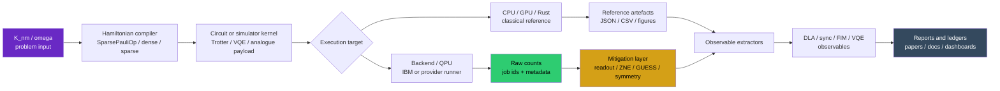
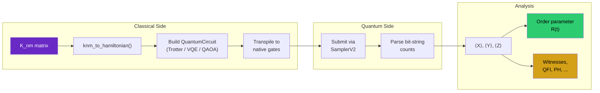
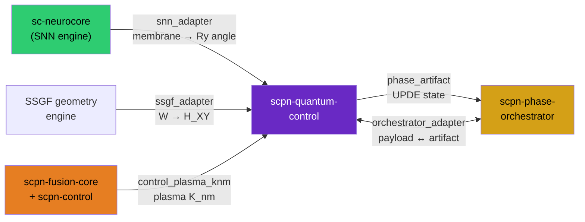

# Architecture

## Purpose and boundaries

This page documents the software architecture in a way that supports technical due
diligence and long-lived integration. The design objective is to keep
problem-to-experiment flow deterministic while allowing each subsystem to evolve
with clear contracts.

The architecture intentionally separates:

- **core transforms** (`bridge`, `phase`, `analysis`) from
- **execution substrates** (`hardware`, `benchmarks`) and
- **evidence/control surfaces** (`release`, `hardware status`, campaign artefacts).

The coupled-phase-oscillator (Kuramoto) acceleration substrate that formerly lived
under `accel/` now ships as the standalone `oscillatools` distribution;
`scpn_quantum_control.accel` remains a deprecation shim that re-exports it (see
`DEPRECATIONS.md`).

This split is why the same repository can support both reproducible research
workflows and integration-oriented development.

## Module size and single-responsibility policy

Module boundaries in this codebase are governed by **single responsibility, not line
count**. A file is split when it holds two or more *independent* responsibility clusters;
a file whose definitions form a single connected, mutually-coupled dependency cluster is
kept whole, because splitting it would introduce artificial seams or import cycles without
improving cohesion. Line-count thresholds are treated as a prompt to ask "is this still one
thing?", not as an automatic limit.

The test is structural. Each module's internal call graph (top-level definition to
referenced top-level definition) is decomposed into connected components; a second pass
removes the most-referenced shared symbols to confirm the remaining definitions are still
one cluster rather than independent groups joined by a single shared helper. The
`compiler` package was decomposed on exactly this basis: the former `mlir` module mixed
records, lowering logic, text builders, validation, native lowering, evidence adapters and
the public facade — seven independent concerns — and was split into a thin facade plus
cohesive leaves (`mlir_records`, `mlir_executable_kernel`, `mlir_native_primitives`, the
`mlir_*_native_compilation` operand-class leaves, `mlir_whole_program_native` and its
`mlir_whole_program_emitter` engine, `mlir_enzyme_evidence`).

The following modules are **intentionally retained at their current size** because each is
a single connected responsibility cluster. They are deliberate architecture, not pending
refactors:

The JAX bridge completed staged decomposition under the extraction gate. Immutable result records
live in the dependency-free `phase/jax_bridge_contracts.py` leaf, and bounded
parameter-shift/native/custom-VJP QNN implementations live in the one-way
`phase/jax_gradients.py` leaf. Registered-QNode statevector, flat/PyTree transform, PMAP-sharding,
and AOT/export execution lives in the one-way `phase/jax_qnode_transforms.py` leaf. Bounded-QNN
JIT/VMAP/PMAP/PyTree compatibility and nested-transform algebra live in the one-way
`phase/jax_compatibility.py` leaf. Lowering declarations, cloud planning, and maturity aggregation
live in `phase/jax_maturity.py`; the remaining 575-line facade contains signature-stable public
wrappers and result re-exports rather than mixed execution concerns.

The Torch bridge is undergoing the same bounded decomposition. Its 19 immutable result, route,
evidence, matrix, and cloud-plan records live in the dependency-free
`phase/torch_bridge_contracts.py` leaf. Optional Torch loading, numeric/tensor validation, and the
parameter-shift, analytic tensor, and custom-autograd bounded gradient routes live in the one-way
`phase/torch_gradients.py` leaf. Deterministic registered Phase-QNode statevector execution,
`torch.func` transforms, `torch.compile` diagnostics, and compiler-boundary routes live in the
one-way `phase/torch_qnode_transforms.py` leaf. `phase/torch_bridge.py` and the phase package retain
the established public surfaces while later executable concerns are assessed one cluster at a time.

| Module | Single responsibility | Why it stays whole |
|--------|-----------------------|--------------------|
| `whole_program_trace_values.py` | Operator-intercepted forward-AD trace value runtime (`TraceADScalar`/`TraceADArray` and helpers) | Mutually recursive; splitting creates import cycles |
| `benchmarks/differentiable_programming.py` | Differentiable-programming benchmark suite | Cases share one case/result-record framework |
| `program_ad_linalg_primitives.py` | Program-AD linear-algebra primitive rules and conditioning diagnostics | One dominant cluster; satellites are registry-dispatched rules |
| `hardware/provider_capability_discovery.py` | Per-provider capability snapshot extraction | One discovery framework shared across providers |
| `phase/qnode_circuit.py` | Phase QNode circuit support, gate matrices and parameter-shift planning | One dominant cluster plus registry accessors |
| `whole_program_frontend.py` | Whole-program compiler frontend report and assembly | One connected cluster |
| `program_ad_assembly_primitives.py` | Program-AD assembly primitive rules (stack/concat/triu/tril) | One dominant cluster |

A reviewer encountering one of these files will find the same statement in its module
docstring. An entry is re-opened only if a future change makes the module mix an
additional, independent responsibility.

## Package Statistics (v0.10.0)

These counts mirror the generated capability inventory in the README; that
auto-generated block is the source of truth if the two ever drift.

| Metric | Count |
|--------|-------|
| Python modules | 471 (excluding package initialisers) |
| Rust crate | 1 (PyO3 0.29, **177 bindings**, 65 Rust source files including `validation.rs`, `symmetry_decay.rs`, `community.rs`, `pulse_shaping.rs`) |
| Julia tier | 1 (now in the `oscillatools` distribution: `oscillatools/accel/julia/order_parameter.jl`; juliacall-bridged, opt-in via `oscillatools[julia]`) |
| Tests | CI-gated suite (90% aggregate coverage gate; non-refactor tree at 100%) |
| Subpackages | domain package families (see the package map below) |
| Research gems | See generated capability inventory and module-level docs |
| Examples | 29 |
| Notebooks | 98 tracked notebooks |
| Doc pages | See the generated capability inventory |

## Subpackage Dependency Graph

The subpackages form a directed acyclic graph. `bridge/` is the foundation —
every other subpackage depends on it for Hamiltonian construction and data
conversion. `analysis/` is the largest consumer, using `phase/` for state
preparation and `bridge/` for Hamiltonian access.


## Hardware Execution Pipeline

The stable data flow is deliberately artefact-first. Each stage either emits a
typed object inside the Python process or a committed/retrievable artefact with
provenance. This is the public pipeline boundary used by the hardware ledger,
methods benchmark dashboard, and paper reproduction scripts.



| Stage | Primary modules | Contract |
|---|---|---|
| Problem input | `kuramoto_core`, `bridge/phase_artifact.py`, `applications/*` | Validate `K_nm`, `omega`, labels, units, and provenance before compilation. |
| Hamiltonian compiler | `bridge/knm_hamiltonian.py`, `bridge/sparse_hamiltonian.py` | Emit Pauli, dense, sparse, or analogue design representations without changing claim class. |
| Circuit or simulator kernel | `phase/*`, `hardware/analog_kuramoto.py`, `control/*` | Build the executable circuit/kernel and record depth, shots, seeds, and parameterisation. |
| Execution target | `hardware/*`, `benchmarks/*`, `scpn_quantum_engine` | Route to CPU/GPU/Rust references or a QPU runner; QPU submission needs explicit budget and promotion gates. |
| Raw counts and references | `data/*`, `results/*`, `scripts/*` | Store raw counts or generated summaries with job IDs, commands, hashes, and no hand-authored numerical tables. |
| Mitigation layer | `mitigation/*`, readout-analysis scripts | Apply readout correction, ZNE, symmetry verification, GUESS, or document why mitigation is unavailable. |
| Observable extractors | `analysis/*`, `scripts/analyse_*` | Convert counts/statevectors into DLA, synchronisation, FIM, VQE, and scaling observables. |
| Reports and ledgers | `docs/hardware_status_ledger.md`, `docs/methods_benchmark_dashboard.md`, `paper/*` | Publish only artefact-backed claims with explicit simulator/hardware/falsification class. |

Circuit depth after transpilation determines which decoherence regime applies.
The pipeline is the same for all experiments — only the circuit construction
step differs.



**Decoherence regimes on Heron r2:**

| Transpiled depth | Regime | Accuracy | Strategy |
|:----------------:|--------|----------|----------|
| < 150 | Near-ideal | < 10% error | Publish directly |
| 150–400 | Mitigable | 10–30% error | ZNE + Z₂ post-selection |
| > 400 | Noise-dominated | > 30% error | Qualitative only |

## Module Dependency Graph (Full Detail)

```
bridge/                                    ← Foundation: K_nm → quantum objects
├── knm_hamiltonian.py                       Canonical K_nm data, XY + XXZ Hamiltonians, ansatz
├── snn_adapter.py                           sc-neurocore ArcaneNeuron bridge (optional)
├── snn_backward.py                          Ry angle parameter-shift gradient through quantum layer
├── ssgf_adapter.py                          SSGF geometry engine bridge (optional)
├── ssgf_w_adapter.py                        Correlator-weighted geometry W update
├── control_plasma_knm.py                    scpn-control plasma K_nm bridge (optional)
├── phase_artifact.py                        Shared UPDE phase artifact schema
├── orchestrator_adapter.py                  Phase-orchestrator payload adapter
├── orchestrator_feedback.py                 Advance/hold/rollback from quantum state
├── sc_to_quantum.py                         Angle/probability conversion
└── spn_to_qcircuit.py                       SPN token → circuit amplitude

analysis/                                  ← 60 modules: probes of the sync transition
├── sync_witness.py                          ★ Synchronization witnesses (Gem 1)
├── sync_entanglement_witness.py             ★ R as entanglement witness (Gem 12)
├── quantum_persistent_homology.py           ★ Full PH pipeline from counts (Gem 5)
├── persistent_homology.py                     Classical PH utilities
├── h1_persistence.py                          Vortex density at BKT
├── entanglement_enhanced_sync.py            ★ Entanglement lowers K_c (Gem 7)
├── hamiltonian_self_consistency.py           ★ K_nm round-trip verification (Gem 10)
├── hamiltonian_learning.py                    Recover K_nm from measurements
├── dynamical_lie_algebra.py                 ★ DLA dimension = 2^(2N-1)-2 (Gem 11)
├── dla_parity_theorem.py                    ★ Z₂ parity proof (Gem 14)
├── qfi_criticality.py                       ★ QFI metrological sweet spot (Gem 15)
├── qfi.py                                     Full QFI matrix computation
├── entanglement_percolation.py              ★ Percolation = sync threshold (Gem 16)
├── qrc_phase_detector.py                    ★ Self-probing reservoir (Gem 17)
├── critical_concordance.py                  ★ Multi-probe K_c agreement (Gem 19)
├── berry_phase.py                           ★ Berry phase / χ_F at BKT (Gem 20)
├── quantum_mpemba.py                        ★ Quantum Mpemba effect (Gem 21)
├── lindblad_ness.py                         ★ Lindblad NESS (Gem 22)
├── adiabatic_gap.py                         ★ Adiabatic preparation hardness (Gem 23)
├── pairing_correlator.py                    ★ Richardson pairing (Gem 25)
├── xxz_phase_diagram.py                     ★ K_c vs Δ crossover (Gem 26)
├── spectral_form_factor.py                  ★ SFF + level statistics (Gem 27)
├── loschmidt_echo.py                        ★ Loschmidt echo / DQPT (Gem 28)
├── entanglement_entropy.py                  ★ Half-chain entropy + Schmidt gap (Gem 29-30)
├── entanglement_spectrum.py                   Full entanglement spectrum + CFT c
├── krylov_complexity.py                     ★ Krylov complexity (Gem 31, highest novelty)
├── magic_nonstabilizerness.py               ★ Stabilizer Rényi entropy (Gem 32)
├── finite_size_scaling.py                   ★ BKT logarithmic corrections (Gem 33)
├── otoc.py                                    Core OTOC computation
├── otoc_sync_probe.py                       ★ OTOC as sync probe (Gem 9)
├── quantum_speed_limit.py                   ★ QSL for BKT sync (Gem 13)
├── quantum_phi.py                             IIT Φ from density matrix
├── shadow_tomography.py                       Classical shadow estimation
├── bkt_analysis.py                            Core BKT diagnostics
├── bkt_universals.py                          10 candidate expressions for p_H1
├── p_h1_derivation.py                         p_H1 derivation audit / open question
├── phase_diagram.py                           K_c vs T_eff boundary
├── graph_topology_scan.py                     Coupling graph metrics
├── koopman.py                                 Koopman linearisation (BQP argument)
├── monte_carlo_xy.py                          Classical XY MC (Rust-accelerated)
├── vortex_binding.py                          Kosterlitz RG flow
└── enaqt.py                                   Environment-assisted quantum transport

phase/                                     ← 92 modules: time evolution + variational
├── xy_kuramoto.py                             Trotterised XY solver
├── trotter_upde.py                            Full 16-layer UPDE solver
├── trotter_error.py                           Trotter error analysis
├── phase_vqe.py                               Variational eigensolver
├── adapt_vqe.py                             ★ Adaptive layered VQE (exact-GS)
├── varqite.py                                 Imaginary time evolution
├── avqds.py                                   Fixed-ansatz McLachlan variational dynamics
├── variational_metric.py                      Analytic quantum geometric tensor (π-shift)
├── qsvt_evolution.py                          QSVT resource estimation (260× speedup)
├── adiabatic_preparation.py                   Adiabatic ground state prep
├── cross_domain_transfer.py                 ★ VQE parameter warm-starting (Gem 8)
├── floquet_kuramoto.py                      ★ Discrete time crystal (Gem 18)
├── coupling_topology_ansatz.py              ★ K_nm-informed ansatz (Gem 4)
├── ansatz_methodology.py                      Ansatz strategy analysis
└── ansatz_bench.py                            Ansatz benchmarking

control/                                   ← Quantum control + classification
├── qaoa_mpc.py                                QAOA model-predictive control
├── vqls_gs.py                                 Residual-certified VQLS Grad-Shafranov solver
├── qpetri.py                                  Quantum Petri nets
├── q_disruption.py                            Disruption classifier
└── q_disruption_iter.py                       ITER 11-feature + fusion-core adapter

qsnn/                                      ← Quantum spiking neural networks
├── qlif.py                                    Quantum LIF neuron
├── qsynapse.py                                Quantum synapse (CRy)
├── qstdp.py                                   Quantum STDP learning
├── qlayer.py                                  Dense quantum layer
└── training.py                                Parameter-shift trainer

identity/                                  ← Identity continuity analysis
├── ground_state.py                            VQE attractor basin
├── coherence_budget.py                        Heron r2 decoherence budget
├── entanglement_witness.py                    CHSH S-parameter
├── identity_key.py                            Spectral fingerprint + HMAC
├── robustness.py                              Adiabatic robustness certificate
└── binding_spec.py                            6-layer topology + orchestrator mapping

mitigation/                                ← Error mitigation
├── zne.py                                     Zero-noise extrapolation
├── pec.py                                     Probabilistic error cancellation
├── dd.py                                      Dynamical decoupling
└── symmetry_verification.py                 ★ Z₂ parity post-selection (Gem 2)

gauge/                                     ← U(1) gauge theory probes
├── wilson_loop.py                             Wilson loop measurement
├── vortex_detector.py                         BKT vortex density
├── cft_analysis.py                            CFT central charge extraction
├── universality.py                            BKT universality class check
└── confinement.py                             String tension + confinement

ssgf/                                      ← SSGF quantum integration
├── quantum_gradient.py                        dC_quantum/dz via finite differences
├── quantum_costs.py                           C_micro, C4_tcbo, C_pgbo
├── quantum_outer_cycle.py                     Variational z descent
└── quantum_spectral.py                        Fiedler via QPE resource estimation

applications/                              ← Physical system benchmarks
├── fmo_benchmark.py                           FMO photosynthetic complex (7 chromophores)
├── power_grid.py                              IEEE 5-bus power grid
├── josephson_array.py                         JJA/transmon self-simulation
├── eeg_benchmark.py                           8-channel alpha-band PLV
├── iter_benchmark.py                          8 MHD mode coupling
├── cross_domain.py                            5-system benchmark summary
├── quantum_kernel.py                          K_nm-informed classification
├── qrc_baseline.py                            Matched classical ESN baseline
├── quantum_reservoir.py                       Pauli feature extraction
├── disruption_classifier.py                   Plasma stability classification
└── quantum_evs.py                             Quantum-enhanced EVS for CCW

benchmarks/                                ← 23 modules: performance baselines
├── quantum_advantage.py                       Classical vs quantum scaling
├── mps_baseline.py                            MPS bond dimension + advantage threshold
├── gpu_baseline.py                            A100 FLOPS + GPU vs QPU crossover
└── appqsim_protocol.py                        Application-oriented fidelity metrics

qec/                                       ← Quantum error correction
├── control_qec.py                             Toric code + MWPM decoder
├── fault_tolerant.py                          RepetitionCodeUPDE
├── surface_code_upde.py                       Surface code resource estimation
└── error_budget.py                            3-channel Trotter+gate+logical allocation

hardware/                                  ← Backend + experiments
├── runner.py                                  IBM Quantum job submission
├── experiments.py                             20 pre-built experiments
├── trapped_ion.py                             Trapped-ion noise model
├── classical.py                               Rust-accelerated Kuramoto reference
├── gpu_accel.py                               CuPy GPU offload (opt-in)
├── circuit_cutting.py                         Partition optimiser for 32-64 oscillators
├── qasm_export.py                             OpenQASM 3.0 export
├── qcvv.py                                    State fidelity + mirror circuits + XEB
└── cirq_adapter.py                            Cirq backend adapter (optional)

crypto/                                    ← Quantum-safe crypto (QKD + PQC signatures)
├── entanglement_qkd.py                        Topology-authenticated quantum key distribution
├── hierarchical_keys.py                       SCPN layer hierarchy → key-derivation tree
├── knm_key.py                                 K_nm coupling matrix → key-material pipeline
├── ml_dsa.py                                  ML-DSA-65 module-lattice digital signatures
├── ml_dsa_seal.py                             Post-quantum signing back-end for the studio honesty seal
├── noise_analysis.py                          Security analysis under noise and eavesdropping
├── percolation.py                             Entanglement percolation on the K_nm coupling graph
├── pqc_trigger.py                             FIPS 204 ML-DSA-65 signer for high-voltage triggers
└── topology_auth.py                           Spectral-fingerprint authentication for K_nm topology

tcbo/                                      ← TCBO quantum observer
└── quantum_observer.py                        p_h1, TEE, string order, Betti proxies

pgbo/                                      ← PGBO quantum bridge
└── quantum_bridge.py                          Quantum geometric tensor, Berry curvature

l16/                                       ← Layer 16 quantum director
└── quantum_director.py                        Loschmidt echo, stability score

scpn_quantum_engine/                       ← Rust crate (PyO3 0.29, rayon parallel)
└── src/lib.rs                                 177 PyO3 bindings across 65 source files, including: kuramoto_euler, kuramoto_trajectory,
                                               order_parameter, build_knm, pec_coefficients,
                                               pec_sample_parallel, dla_dimension, mc_xy_simulate,
                                               state_order_param_sparse, expectation_pauli_fast,
                                               brute_mpc, lanczos_b_coefficients,
                                               otoc_from_eigendecomp,
                                               build_xy_hamiltonian_dense,
                                               all_xy_expectations
```

★ marks modules from the 33 Research Gems (Rounds 1-8, March 2026).

## Classical-to-Quantum Mapping

Each module maps a classical SCPN computation to its quantum analog:

| Classical (SCPN) | Quantum (this repo) | Mapping |
|-------------------|---------------------|---------|
| Stochastic LIF membrane potential | Ry(theta) rotation angle | theta = pi * (v - v_rest) / (v_threshold - v_rest) |
| Bitstream AND-gate synapse | CRy(theta_w) controlled rotation | P(out) = P(pre) * sin^2(theta_w/2) |
| STDP correlation learning | Parameter-shift gradient rule | dw = lr * pre * d<Z>/d(theta) |
| Kuramoto ODE (dtheta/dt) | XY Hamiltonian Trotter evolution | H = -K_ij(XX + YY) - omega_i Z_i |
| 16-layer UPDE coupling | 16-qubit spin chain | Knm -> J_ij entangling gates |
| MPC quadratic cost | QAOA Ising Hamiltonian | ||state - target||^2 -> ZZ + Z terms |
| Grad-Shafranov PDE | VQLS linear system | Laplacian A, source b -> A|x> ~ |b> |
| SPN token probability | Qubit amplitude | p -> amplitude encoding |
| Disruption feature vector | Amplitude-encoded state | 11-D -> 16-D zero-padded |

## Cross-Repository Integration

This package is one node in a five-repository ecosystem. Each bridge adapter
converts between the data representations of the two repositories it connects.



| Bridge | Source repo | Data in | Data out |
|--------|-----------|---------|----------|
| `snn_adapter` | sc-neurocore | ArcaneNeuron membrane $v$ | $R_y(\theta)$ angle |
| `ssgf_adapter` | SSGF engine | Geometry matrix $W$ | XY Hamiltonian |
| `orchestrator_adapter` | scpn-phase-orchestrator | State payload (regime, phases) | UPDEPhaseArtifact |
| `orchestrator_feedback` | scpn-phase-orchestrator | Quantum $R$, fidelity | Advance/hold/rollback |
| `control_plasma_knm` | scpn-control | Plasma-native $K_{nm}$ | Standard $K_{nm}$ array |
| `snn_backward` | sc-neurocore | Loss gradient | Ry angle parameter-shift $\nabla\theta$ |

## Data Flow: Knm → Hamiltonian → Circuit → Measurement → R

```python
from scpn_quantum_control.bridge.knm_hamiltonian import (
    OMEGA_N_16, build_knm_paper27, knm_to_hamiltonian,
)
from scpn_quantum_control.phase.xy_kuramoto import QuantumKuramotoSolver

K = build_knm_paper27()
omega = OMEGA_N_16[:4]
solver = QuantumKuramotoSolver(4, K[:4, :4], omega)
result = solver.run(t_max=0.4, dt=0.1)
# result["R_trajectory"] -> [0.80, 0.78, 0.76, 0.73]
```
