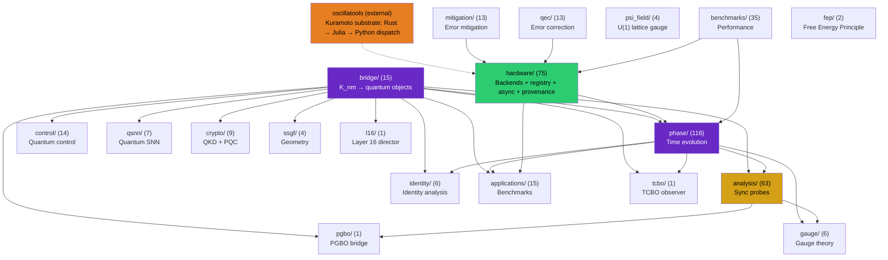
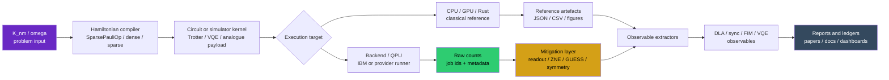
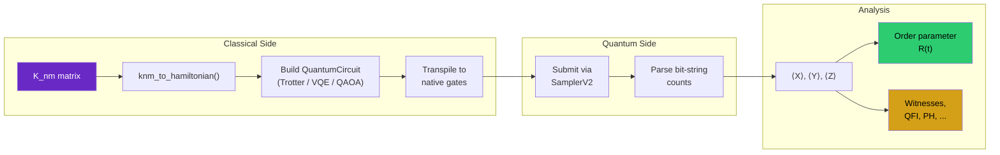
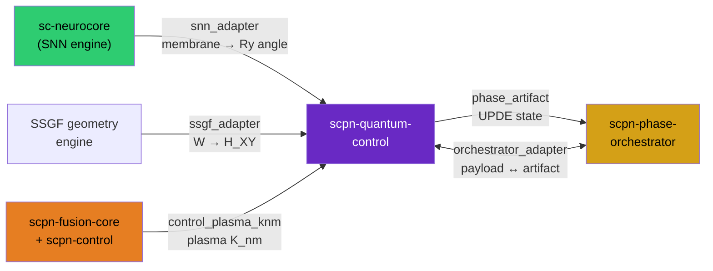

# Architecture

## Purpose and boundaries

This page documents the software architecture in a way that supports technical due
diligence and long-lived integration. The design objective is to keep
problem-to-experiment flow deterministic while allowing each subsystem to evolve
with clear contracts.

The architecture intentionally separates:

- **core transforms** (`bridge`, `phase`, `analysis`) from
- **execution substrates** (`hardware`, `benchmarks`) and
- **evidence/control surfaces** (`release`, `hardware status`, campaign artefacts).

The coupled-phase-oscillator (Kuramoto) acceleration substrate that formerly lived
under `accel/` now ships as the standalone `oscillatools` distribution;
`scpn_quantum_control.accel` remains a deprecation shim that re-exports it (see
`DEPRECATIONS.md`).

This split is why the same repository can support both reproducible research
workflows and integration-oriented development.

## Studio Program-AD replay trust chain

The Studio ST-12 card is an end-to-end verification chain, not a JavaScript
reimplementation of automatic differentiation. The v2 committed unit at
`data/studio/program_ad_replay_rational_20260714.json` freezes a rational
effect-IR program, finite scalar inputs, the Rust engine's exact value and
gradient, and a SHA-256 digest over the packed bytes consumed by the browser
kernel. The Python emitter rejects duplicate-key or non-standard JSON, malformed
engine responses, non-finite numbers, oversized IR, and oversized input arity;
its check mode distinguishes drift from an unreadable or unverifiable artifact.

The browser accepts only the exact v2 schema, artifact identity, claim boundary,
parameter targets, and declared digest. It recomputes the input SHA-256 with Web
Crypto before invoking the standalone Rust WASM replay. Changing the frozen
program and the expected result together therefore remains `unverifiable`, not
`match`. A canonical input whose recomputed value or gradient differs remains a
`mismatch`. The Rust parser shares the Python limits of 1,048,576 UTF-8 IR bytes
and 4,096 scalar inputs and rejects non-finite bindings before the bounded replay.

The wire layout and canonical replay bytes are unchanged from v1; v2 adds the
cryptographic binding and strict metadata contract. The numerical Program-AD
algorithm, rational fixture, and expected `[19; 6, 2]` result are unchanged, so
no comparison benchmark artifact is invalidated. Focused native Rust tests, a
release WASM build, real-WASM browser/component tests, and exact Python plus
TypeScript owner coverage are the applicable cross-language evidence.

## Module size and single-responsibility policy

Module boundaries in this codebase are governed by **single responsibility, not line
count**. A file is split when it holds two or more *independent* responsibility clusters;
a file whose definitions form a single connected, mutually-coupled dependency cluster is
kept whole, because splitting it would introduce artificial seams or import cycles without
improving cohesion. Line-count thresholds are treated as a prompt to ask "is this still one
thing?", not as an automatic limit.

The exhaustive policy is machine-readable in `tools/module_size_policy.json`. It covers every
Git-tracked Python, Rust, Julia, JavaScript/TypeScript, Go, C/C++, Verilog, and SystemVerilog file
above 1,000 physical lines, including tests and entry points. Every row records the exact current
size, file kind, disposition, single responsibility (or current mixed responsibilities), direct
dependency boundary, and the condition that re-opens review. `tools/audit_module_size_policy.py`
rejects missing rows, stale rows, line-count drift, malformed decisions, and growth in the explicit
refactor-debt ratchet. The local no-test preflight and CI run that inventory gate. The stricter
command below is the certification check; it remains red while any reviewed refactor is open:

```bash
python tools/audit_module_size_policy.py --strict
```

The test is structural. Each module's internal call graph (top-level definition to
referenced top-level definition) is decomposed into connected components; a second pass
removes the most-referenced shared symbols to confirm the remaining definitions are still
one cluster rather than independent groups joined by a single shared helper. The initial
`compiler` decomposition applied this test to records, executable kernels, native primitives,
operand-class compilation, whole-program lowering/emission, and Enzyme evidence. The later
cross-language rescan found four residual `compiler/mlir.py` implementation clusters; the
2026-07-13 extraction below closes them behind the stable facade.

After all five reopened refactors, the exhaustive scan contains 47 oversized tracked code files:
all 47 have an approved cohesive, facade, test-owner, or entry-point decision, and 0 remain open.
The strict module-size certification is therefore green. This is a structural ownership claim over
tracked code files above 1,000 physical lines, not a substitute for runtime or scientific validation.

The retained modules described next are intentionally kept at their current size because each is
a single connected responsibility cluster or an explicit compatibility boundary. They are
deliberate architecture, not pending refactors:

The former 3,382-line MLIR native-compilation integration bucket is now source-owned: the public
compiler facade/custom executable, scalar, vector, dimension-generic matrix, fixed 2x2,
symmetric 2x2, and executable-batching lifecycles have separate test modules plus one 32-line
typed batching helper. The 1,046-line fixed-2x2 test stays whole because its five parity tests
mirror the single closed-form dense-2x2 production family and share the same registry, plan,
Python-native, and Rust-native lifecycle. All 26 original definitions remain exactly once with
AST-equivalent bodies.

The MLIR compiler facade is now 504 lines of exact records, kernel, evidence, and implementation
re-exports. Transform-plan assembly lives in `mlir_transform_plan_assembly.py`;
Kuramoto/custom executable compilation in `mlir_workload_compilation.py`; toolchain probing and
maturity aggregation in `mlir_enzyme_audit.py`; and registered Phase-QNode lowering/runtime
execution in `mlir_phase_qnode_runtime.py`. All 22 former facade definitions have one
AST-equivalent leaf owner, every leaf has a one-way dependency on existing lower-level contracts,
and focused boundary tests prevent a facade back-edge.

Those four implementation leaves are 653, 291, 229, and 296 physical lines respectively, so the
stable facade and every extracted owner remain below the 1,000-line GodFile threshold. Their
permanent focused quality lane executes public compiler/runtime paths across 14 test owners and
requires exact coverage of all 414 statements and 138 branches in the four leaves. The same lane
strict-types and NumPy-docstring-checks the four sources, the shared native-compilation test helper,
and those 14 test owners. The larger 1,556-line transform-plan test owner is an already-registered,
cohesive test file and shrank during this quality pass; it is not a new size-policy exception.

The Rust Program-AD replay surface is now a 98-line stable module owner that includes focused
schema/parser, scalar-forward, numeric-state, numeric-dispatch, reverse-dispatch, reduction,
structural, linalg, opcode, and PyO3 binding leaves. The former 1,895-line integration test is a
20-line owner over parser/registry, scalar-forward, scalar-reverse, structural, reduction, and
linalg test leaves plus one shared fixture owner. All former source bodies remain in their original
order after whitespace normalization, and all 44 tests remain exact and single-owned.

The 1,277-line `compiler/mlir_enzyme_evidence.py` leaf is one Enzyme/MLIR evidence-schema
cluster rather than a mixed execution module. Its nine immutable records and seven
construction/render/write definitions form one 23-edge component: the breadth artifact links
case and benchmark records to derived promotion evidence, the maturity result aggregates every
evidence subtype, and the writer consumes the artifact, renderer, filename helper, and output
record. `compiler/mlir_enzyme_audit.py` consumes the maturity records and `compiler/mlir.py`
re-exports the complete public family. The evidence module stays intact until a genuinely independent evidence schema or persistence API
emerges.

The 2,128-line `differentiable_result_contracts.py` module is intentionally retained as the
canonical derivative-result schema registry. It contains 32 frozen result records, seven private
normalization/consistency helpers, and no public functions or I/O. Its static definition graph has
one 29-definition shared gradient/provenance component plus nine leaf records; those components
are immutable schema families consumed by already-separated algorithm modules, not competing
execution responsibilities. Keeping one canonical registry preserves a stable import and facade
identity boundary across parameter shift, stochastic estimators, sparse derivatives, natural
gradient, Levenberg–Marquardt, Fisher, and sensitivity code. Reassess only if a domain requires
independent schema versioning or a distinct lifecycle.

The JAX bridge completed staged decomposition under the extraction gate. Immutable result records
live in the dependency-free `phase/jax_bridge_contracts.py` leaf, and bounded
parameter-shift/native/custom-VJP QNN implementations live in the one-way
`phase/jax_gradients.py` leaf. Registered-QNode statevector, flat/PyTree transform, PMAP-sharding,
and AOT/export execution lives in the one-way `phase/jax_qnode_transforms.py` leaf. Bounded-QNN
JIT/VMAP/PMAP/PyTree compatibility and nested-transform algebra live in the one-way
`phase/jax_compatibility.py` leaf. Lowering declarations, cloud planning, and maturity aggregation
live in `phase/jax_maturity.py`; the remaining 575-line facade contains signature-stable public
wrappers and result re-exports rather than mixed execution concerns.
Its paired tests mirror those boundaries: the bridge test retains optional-dependency availability,
while gradient, compatibility, registered-QNode transform, and maturity integration behavior lives
in four module-named surfaces backed by one shared strictly typed fake JAX runtime.

The registered-QNode leaf remains one cohesive execution owner at 1,322 physical lines. Its public
routes share one finite PyTree normalisation boundary with `jax_compatibility.py`, while the
compatibility leaf retains its own expected-width check; neither leaf imports the JAX facade or
creates a dependency back-edge. Seven responsibility-specific public-path test modules separate
flat/native integration, input validation, PyTree validation, AOT failure diagnostics, and
statevector refusal behaviour. The permanent gate covers all 546 statements and 198 branches in
the registered-QNode leaf. This split keeps test and quality-policy responsibilities outside the
execution owner without moving a second runtime lifecycle into it.

The Torch bridge completed the same bounded decomposition. Its 19 immutable result, route,
evidence, matrix, and cloud-plan records live in the dependency-free
`phase/torch_bridge_contracts.py` leaf. Optional Torch loading, numeric/tensor validation, and the
parameter-shift, analytic tensor, and custom-autograd bounded gradient routes live in the one-way
`phase/torch_gradients.py` leaf. Deterministic registered Phase-QNode statevector execution,
`torch.func` transforms, `torch.compile` diagnostics, and compiler-boundary routes live in the
one-way `phase/torch_qnode_transforms.py` leaf. Bounded phase-QNN `torch.func`/`torch.compile`
compatibility, module/layer wrappers, and deterministic compiled training live in the one-way
`phase/torch_compatibility.py` leaf. Lowering declarations, CUDA/ecosystem diagnostics, cloud
planning, live-overlay validation, and maturity aggregation live in `phase/torch_maturity.py`;
the remaining 681-line facade contains signature-stable public wrappers and result/helper
re-exports rather than mixed execution concerns.
Its paired tests now mirror those boundaries: the 85-line bridge test retains optional-dependency
availability and fail-closed facade checks; gradient, compatibility/training, registered-QNode
transform, and maturity/cloud behavior lives in four module-named integration surfaces backed by
one 286-line strictly typed fake Torch runtime. All 40 original top-level definitions are preserved
exactly once with AST-equivalent bodies.

The Qiskit bridge decomposition begins with the record/validation graph. All nine shifted-circuit,
gradient, Runtime, provider-workflow, evidence-bundle, and maturity records plus provider-method
registries, constructor validation, and JSON-ready serialization live in the one-way
`phase/qiskit_bridge_contracts.py` leaf. `phase/qiskit_bridge.py` re-exports those exact objects and
local shifted-circuit generation plus deterministic Statevector and finite-shot surrogate
gradients live in the one-way `phase/qiskit_gradients.py` leaf. No-submit Runtime capture builders,
provider-gradient workflow evidence, freshness-bounded evidence bundles, and maturity aggregation
live in the one-way `phase/qiskit_runtime.py` leaf. `phase/qiskit_bridge.py` is now a shallow
compatibility facade with exact contract, gradient, and Runtime re-exports.

The TensorFlow bridge decomposition uses dependency-free contracts and two one-way execution
leaves. All nine gradient, compatibility, lowering, Keras, and maturity result records plus the
shared float-array alias and serializer live in `phase/tensorflow_bridge_contracts.py`.
Host-boundary parameter-shift execution, bounded phase-QNN analytic gradients, and their direct
validation helpers live in `phase/tensorflow_gradients.py`. GradientTape, `tf.function`, XLA,
Keras-layer, Phase-QNode lowering-matrix, and maturity evidence live in
`phase/tensorflow_compatibility.py`. `phase/tensorflow_bridge.py` is a shallow facade that re-exports
the exact contracts and helpers, keeps optional loading, and injects that active loader through
signature-stable wrappers.

The PennyLane surface separates local gradient/QNode conversion and maturity aggregation in
`phase/pennylane_bridge.py`, tape import in `phase/pennylane_import.py`, and provider-plugin
artifacts plus matrix validation in `phase/pennylane_provider_plugin.py`. Its paired tests mirror
those boundaries: local bridge behavior stays in the bridge test, import behavior owns its direct
surface, and provider evidence/maturity integration has a provider-named test with one shared typed
fake module.

The differentiable audit decomposition separates immutable evidence contracts from audit
execution. The shared float-array alias, four closed validation/serialization helpers, and seven
analytic-agreement, workflow, finite-shot, benchmark, and ML-framework report records live in the
one-way `phase/differentiable_audit_contracts.py` leaf. The remaining
`phase/differentiable_audit.py` executable facade re-exports those exact records and retains the
adapter protocol, objective aliases, execution helpers, and bounded audit runners.

The Phase-QNode circuit decomposition starts from a dependency-free declaration layer. All 21
circuit, observable, support, execution, gradient, metric, and Fisher record classes plus their
registry constants and constructor validators live in `phase/qnode_circuit_contracts.py`.
Registered vocabulary accessors, sparse Ising construction, controlled-gate decomposition, and
multi-qubit template construction live in the one-way `phase/qnode_circuit_builders.py` leaf.
Arbitrary-depth registration, deterministic depth/resource profiling, statevector/density support
analysis, and gate-aware parameter-shift planning live in the one-way
`phase/qnode_circuit_support.py` leaf. Deterministic statevector and density-matrix execution,
registered gate and Kraus kernels, and observable evaluation live in the one-way
`phase/qnode_circuit_execution.py` leaf. Analytic parameter-shift gradients, derivative
propagation, exact/finite-shot Fisher information, QFI/Fubini-Study, and natural-gradient metrics
live in the one-way `phase/qnode_circuit_differentiation.py` leaf. `phase/qnode_circuit.py` is now
a shallow compatibility facade that re-exports the exact contract, builder, support, execution,
and differentiation objects without defining executable functions.
Its paired tests follow the same ownership boundary: the facade file retains only export checks,
while builder, support, execution, and differentiation integration behavior lives in separate
module-named test surfaces.

The vector-transform owner stays cohesive and below the extraction threshold: the 700-line
`phase/qnode_vector_transforms.py` module owns one immutable result family, fail-closed planning,
one shared typed vector-Jacobian computation, directional contractions, component Hessians, manual
`vmap(grad)`, and its readiness record. JVP/VJP no longer re-enter the public Jacobian planner after
an equivalent outer decision; a public declared-capability matrix regression locks the
`jvp`/`jacfwd` and `vjp`/`jacrev` support invariant. Its 468-line direct test owner remains a separate
responsibility surface under exact statement/branch coverage, strict typing, and NumPy-docstring
gates. The 282-line Rust parity owner shares the static quality cohort and exercises installed
native directional and vector-Hessian exports. Rust counterparts consume already-materialised
Jacobians or Hessian tensors, so this Python control-flow consolidation does not change the native
ABI or numerical kernel boundary.

Provider capability discovery now separates provider-neutral governance from vendor metadata
normalization. `hardware/provider_capability_core.py` owns no-submit snapshots and decisions,
route-bound assessment/probing, and OpenPulse readiness.
`hardware/provider_capability_normalization.py` owns provider-independent attribute access, scalar
selection, online-state vocabulary, and IR/program-spec tuple normalization.
`hardware/provider_capability_gate_adapters.py` owns the complete direct IonQ, IQM, OQC,
Quantinuum, and Rigetti adapter closures.
`hardware/provider_capability_specialized_adapters.py` owns D-Wave annealing, QuEra/Pasqal
neutral-atom, and Quandela photonic adapter closures.
`hardware/provider_capability_cloud_adapters.py` owns the complete Azure, Braket, Qiskit Runtime,
qBraid, and Strangeworks cloud/broker adapter closures, including shared calibration-timestamp
normalization. `hardware/provider_capability_discovery.py` is now a definition-free compatibility
facade that re-exports the exact core, normalization, and provider-adapter objects.

The Rust compiler-AD surface separates numerical kernels from language bindings.
`scpn_quantum_engine/src/compiler_ad/kernels.rs` owns the shared fixed-vector validator and exact
kernel re-exports. `compiler_ad/kernels/generic.rs` owns the 28 dimension-generic matrix/vector
kernels; `compiler_ad/kernels/specialized_2x2.rs` owns the 28 fixed-size determinant/inverse/solve/
Cholesky/eigen kernels and their private geometry helpers. `compiler_ad.rs` owns NumPy/PyO3
validation, Python exception conversion, Python-array construction, and the 56 binding functions;
both facades explicitly re-export inner kernels so existing Rust paths remain stable.
The Python bridge tests follow the execution boundary without recreating a mixed bucket: facade
and registry behavior stays in `test_program_ad_rust_bridge.py`, serialized effect-IR fixtures live
in one private typed helper, and scalar/structural replay, reduction replay, validation contracts,
and real-engine linear algebra each have a dedicated module-named test surface.

Program-AD alias analysis separates immutable evidence contracts from analysis execution.
`program_ad_alias_contracts.py` owns the ten alias-set, lattice, unknown-edge, and typed provenance
records plus their fail-closed validation and serialization. `program_ad_alias_analysis.py` owns
the metadata union-find summaries, static-lattice assembly, and provenance parsers, and re-exports
the exact contract objects so package and differentiable-facade identities remain stable.

The whole-program frontend uses the same contract-first dependency direction.
`whole_program_frontend_contracts.py` owns the nine immutable bytecode, source-region, semantic,
diagnostic, and aggregate report records. `whole_program_frontend.py` retains private source
metadata, source/bytecode inspection, semantic classification, digest construction, and report
assembly, and re-exports the exact public records for compatibility.

The unified differentiable API also isolates its dependency-free public envelopes.
`differentiable_api_contracts.py` owns the operation and dashboard-state aliases, shared claim
boundary, and four immutable result, diagnostic, capability-row, and dashboard-status records.
`differentiable_dashboard.py` owns the claim-bounded capability catalog and its optional
conformance overlay. `differentiable_api.py` re-exports the exact contracts and dashboard entry
point while retaining route execution, report wrappers, diagnostics, and public dispatch.

Differentiable benchmark result validation is isolated from benchmark execution.
`benchmarks/differentiable_programming_contracts.py` owns the three immutable result records and
shared gradient/error normalization helpers. `differentiable_programming.py` re-exports those exact
objects and retains suite ordering plus monkeypatchable availability seams.
`differentiable_programming_quantum.py` owns all 12 analytic, Torch, and JAX quantum-gradient case
builders; the exact public quantum-suite orchestrator remains in the facade.
Benchmark alias-edge tests are partitioned into metadata, static-lattice completeness, and
branch-IR completeness modules backed by one shared real-IR fixture.

External differentiable comparison evidence separates immutable contracts from runner execution.
`benchmarks/differentiable_external_contracts.py` owns the four framework/identical-circuit row and
artifact records, closure vocabulary, required-field set, and operation JSON normalization.
`differentiable_external_comparison.py` re-exports those exact objects and retains suite/writer,
framework, identical-circuit, runner, dependency, and fail-closed classification logic.

| Selected module | Single responsibility | Why it stays whole |
|--------|-----------------------|--------------------|
| `whole_program_trace_values.py` | Operator-intercepted forward-AD trace value runtime (`TraceADScalar`/`TraceADArray` and helpers) | Cohesion rescan: 101/115 top-level definitions form one strongly connected component; class dispatch and value construction make primitive-family splits cyclic |
| `compiler/mlir_whole_program_emitter.py` | Native LLVM text emission for recorded whole-program AD operations and their derivatives | Cohesion audit: 45/46 top-level definitions form one 114-edge component spanning dispatch, linalg helpers, batch scaffolds, operands and formatting; the native driver is the sole production importer |
| `benchmarks/differentiable_programming.py` | Differentiable-programming execution facade after contract/quantum leaf extraction | Program/external cases are tested facade monkeypatch seams for ten runtime/compiler/JAX dependencies; alias moves would break diagnostic substitution |
| `benchmarks/differentiable_external_comparison.py` | External framework, runner, and identical-circuit comparison facade after contract extraction | The 40-function residual is one 65-edge component; focused tests make 43 monkeypatch calls across 16 facade globals, so alias moves would bypass substitutions |
| `program_ad_linalg_primitives.py` | Program-AD linear-algebra primitive rules and conditioning diagnostics | One dominant cluster; satellites are registry-dispatched rules |
| `whole_program_frontend.py` | Static source/bytecode introspection and report assembly after contract extraction | The residual private metadata record and 45 functions form one connected pipeline; public records live in the one-way contracts leaf |
| `program_ad_assembly_primitives.py` | Program-AD assembly primitive rules (stack/concat/triu/tril) | One dominant cluster |

The 2026-07-14 trace-value rescan reduced the runtime from 4,994 to 4,562
physical lines and from 122 to 115 top-level definitions by deleting dead
helpers and duplicate post-registry validation. The remaining 14 definitions
outside the 101-definition component are static boundary normalisers, label
formatters, and fail-closed selection validators; none owns an independent
execution lifecycle. Dependencies remain one-way from the value runtime into
the parameter/registry, trace metadata/predicate/context, and focused primitive
rule leaves recorded in `tools/module_size_policy.json`. Tests are split by
protocol, operator, selection, signal, linear-algebra, and shape responsibility;
all six owners remain below the 1,000-line threshold.

The remaining large paired tests deliberately follow those source ownership decisions:

| Test surface | Source owner | Why it stays whole |
|--------------|--------------|--------------------|
| `test_differentiable_result_contracts.py` | `differentiable_result_contracts.py` | One canonical derivative-result schema lifecycle; facade identity, normalization, and fail-closed invariants must move together |
| `test_program_ad_registry.py` | `program_ad_registry.py` | One resolved primitive-registry lifecycle spanning identity, rules, transforms, registration, dispatch reports, and facade exports |
| `test_program_ad_adjoint_generation.py` | `program_ad_adjoint_generation.py` | One reverse-adjoint contribution/dispatch pipeline; primitive-family cases exercise the same dispatcher and result assembly |
| `test_program_ad_shape_transforms.py` | `program_ad_shape_transforms.py` | One static shape-transform primitive family with shared registry policy, normalization, direct rules, and failure boundaries |

The selected table is explanatory; `tools/module_size_policy.json` is the exhaustive inventory,
including Rust, oscillatools, tests, facades, and entry points. An approved entry is re-opened if a
future change adds an independent responsibility or crosses its recorded dependency boundary.

## Package Statistics (v0.10.0)

These counts mirror the generated capability inventory in the README; that
auto-generated block is the source of truth if the two ever drift.

| Metric | Count |
|--------|-------|
| Python modules | 590 (excluding package initialisers) |
| Rust crate | 1 (PyO3 0.29, **177 bindings**, 81 Rust source files including `validation.rs`, `symmetry_decay.rs`, `community.rs`, `pulse_shaping.rs`) |
| Julia tier | 1 (now in the `oscillatools` distribution: `oscillatools/accel/julia/order_parameter.jl`; juliacall-bridged, opt-in via `oscillatools[julia]`) |
| Tests | CI-gated suite (90% line gate; branch telemetry required and currently observational) |
| Subpackages | domain package families (see the package map below) |
| Research gems | See generated capability inventory and module-level docs |
| Examples | 29 |
| Notebooks | 98 tracked notebooks |
| Doc pages | See the generated capability inventory |

## Subpackage Dependency Graph

The subpackages form a directed acyclic graph. `bridge/` is the foundation —
every other subpackage depends on it for Hamiltonian construction and data
conversion. `analysis/` is the largest consumer, using `phase/` for state
preparation and `bridge/` for Hamiltonian access.



## Hardware Execution Pipeline

The stable data flow is deliberately artefact-first. Each stage either emits a
typed object inside the Python process or a committed/retrievable artefact with
provenance. This is the public pipeline boundary used by the hardware ledger,
methods benchmark dashboard, and paper reproduction scripts.



| Stage | Primary modules | Contract |
|---|---|---|
| Problem input | `kuramoto_core`, `bridge/phase_artifact.py`, `applications/*` | Validate `K_nm`, `omega`, labels, units, and provenance before compilation. |
| Hamiltonian compiler | `bridge/knm_hamiltonian.py`, `bridge/sparse_hamiltonian.py` | Emit Pauli, dense, sparse, or analogue design representations without changing claim class. |
| Circuit or simulator kernel | `phase/*`, `hardware/analog_kuramoto.py`, `control/*` | Build the executable circuit/kernel and record depth, shots, seeds, and parameterisation. |
| Execution target | `hardware/*`, `benchmarks/*`, `scpn_quantum_engine` | Route to CPU/GPU/Rust references or a QPU runner; QPU submission needs explicit budget and promotion gates. |
| Raw counts and references | `data/*`, `results/*`, `scripts/*` | Store raw counts or generated summaries with job IDs, commands, hashes, and no hand-authored numerical tables. |
| Mitigation layer | `mitigation/*`, readout-analysis scripts | Apply readout correction, ZNE, symmetry verification, GUESS, or document why mitigation is unavailable. |
| Observable extractors | `analysis/*`, `scripts/analyse_*` | Convert counts/statevectors into DLA, synchronisation, FIM, VQE, and scaling observables. |
| Reports and ledgers | `docs/hardware_status_ledger.md`, `docs/methods_benchmark_dashboard.md`, `paper/*` | Publish only artefact-backed claims with explicit simulator/hardware/falsification class. |

Circuit depth after transpilation determines which decoherence regime applies.
The pipeline is the same for all experiments — only the circuit construction
step differs.



**Decoherence regimes on Heron r2:**

| Transpiled depth | Regime | Accuracy | Strategy |
|:----------------:|--------|----------|----------|
| < 150 | Near-ideal | < 10% error | Publish directly |
| 150–400 | Mitigable | 10–30% error | ZNE + Z₂ post-selection |
| > 400 | Noise-dominated | > 30% error | Qualitative only |

## Module Dependency Graph (Full Detail)

```
bridge/                                    ← Foundation: K_nm → quantum objects
├── knm_hamiltonian.py                       Canonical K_nm data, XY + XXZ Hamiltonians, ansatz
├── snn_adapter.py                           sc-neurocore ArcaneNeuron bridge (optional)
├── snn_backward.py                          Ry angle parameter-shift gradient through quantum layer
├── ssgf_adapter.py                          SSGF geometry engine bridge (optional)
├── ssgf_w_adapter.py                        Correlator-weighted geometry W update
├── control_plasma_knm.py                    scpn-control plasma K_nm bridge (optional)
├── phase_artifact.py                        Shared UPDE phase artifact schema
├── orchestrator_adapter.py                  Phase-orchestrator payload adapter
├── orchestrator_feedback.py                 Advance/hold/rollback from quantum state
├── sc_to_quantum.py                         Angle/probability conversion
└── spn_to_qcircuit.py                       SPN token → circuit amplitude

analysis/                                  ← 60 modules: probes of the sync transition
├── sync_witness.py                          ★ Synchronization witnesses (Gem 1)
├── sync_entanglement_witness.py             ★ R as entanglement witness (Gem 12)
├── quantum_persistent_homology.py           ★ Full PH pipeline from counts (Gem 5)
├── persistent_homology.py                     Classical PH utilities
├── h1_persistence.py                          Vortex density at BKT
├── entanglement_enhanced_sync.py            ★ Entanglement lowers K_c (Gem 7)
├── hamiltonian_self_consistency.py           ★ K_nm round-trip verification (Gem 10)
├── hamiltonian_learning.py                    Recover K_nm from measurements
├── dynamical_lie_algebra.py                 ★ DLA dimension = 2^(2N-1)-2 (Gem 11)
├── dla_parity_theorem.py                    ★ Z₂ parity proof (Gem 14)
├── qfi_criticality.py                       ★ QFI metrological sweet spot (Gem 15)
├── qfi.py                                     Full QFI matrix computation
├── entanglement_percolation.py              ★ Percolation = sync threshold (Gem 16)
├── qrc_phase_detector.py                    ★ Self-probing reservoir (Gem 17)
├── critical_concordance.py                  ★ Multi-probe K_c agreement (Gem 19)
├── berry_phase.py                           ★ Berry phase / χ_F at BKT (Gem 20)
├── quantum_mpemba.py                        ★ Quantum Mpemba effect (Gem 21)
├── lindblad_ness.py                         ★ Lindblad NESS (Gem 22)
├── adiabatic_gap.py                         ★ Adiabatic preparation hardness (Gem 23)
├── pairing_correlator.py                    ★ Richardson pairing (Gem 25)
├── xxz_phase_diagram.py                     ★ K_c vs Δ crossover (Gem 26)
├── spectral_form_factor.py                  ★ SFF + level statistics (Gem 27)
├── loschmidt_echo.py                        ★ Loschmidt echo / DQPT (Gem 28)
├── entanglement_entropy.py                  ★ Half-chain entropy + Schmidt gap (Gem 29-30)
├── entanglement_spectrum.py                   Full entanglement spectrum + CFT c
├── krylov_complexity.py                     ★ Krylov complexity (Gem 31, highest novelty)
├── magic_nonstabilizerness.py               ★ Stabilizer Rényi entropy (Gem 32)
├── finite_size_scaling.py                   ★ BKT logarithmic corrections (Gem 33)
├── otoc.py                                    Core OTOC computation
├── otoc_sync_probe.py                       ★ OTOC as sync probe (Gem 9)
├── quantum_speed_limit.py                   ★ QSL for BKT sync (Gem 13)
├── quantum_phi.py                             IIT Φ from density matrix
├── shadow_tomography.py                       Classical shadow estimation
├── bkt_analysis.py                            Core BKT diagnostics
├── bkt_universals.py                          10 candidate expressions for p_H1
├── p_h1_derivation.py                         p_H1 derivation audit / open question
├── phase_diagram.py                           K_c vs T_eff boundary
├── graph_topology_scan.py                     Coupling graph metrics
├── koopman.py                                 Koopman linearisation (BQP argument)
├── monte_carlo_xy.py                          Classical XY MC (Rust-accelerated)
├── vortex_binding.py                          Kosterlitz RG flow
└── enaqt.py                                   Environment-assisted quantum transport

phase/                                     ← 92 modules: time evolution + variational
├── xy_kuramoto.py                             Trotterised XY solver
├── trotter_upde.py                            Full 16-layer UPDE solver
├── trotter_error.py                           Trotter error analysis
├── phase_vqe.py                               Variational eigensolver
├── adapt_vqe.py                             ★ Adaptive layered VQE (exact-GS)
├── varqite.py                                 Imaginary time evolution
├── avqds.py                                   Fixed-ansatz McLachlan variational dynamics
├── variational_metric.py                      Analytic quantum geometric tensor (π-shift)
├── qsvt_evolution.py                          QSVT resource estimation (260× speedup)
├── adiabatic_preparation.py                   Adiabatic ground state prep
├── cross_domain_transfer.py                 ★ VQE parameter warm-starting (Gem 8)
├── floquet_kuramoto.py                      ★ Discrete time crystal (Gem 18)
├── coupling_topology_ansatz.py              ★ K_nm-informed ansatz (Gem 4)
├── ansatz_methodology.py                      Ansatz strategy analysis
└── ansatz_bench.py                            Ansatz benchmarking

control/                                   ← Quantum control + classification
├── qaoa_mpc.py                                QAOA model-predictive control
├── vqls_gs.py                                 Residual-certified VQLS Grad-Shafranov solver
├── qpetri.py                                  Quantum Petri nets
├── q_disruption.py                            Disruption classifier
└── q_disruption_iter.py                       ITER 11-feature + fusion-core adapter

qsnn/                                      ← Quantum spiking neural networks
├── qlif.py                                    Quantum LIF neuron
├── qsynapse.py                                Quantum synapse (CRy)
├── qstdp.py                                   Quantum STDP learning
├── qlayer.py                                  Dense quantum layer
└── training.py                                Parameter-shift trainer

identity/                                  ← Identity continuity analysis
├── ground_state.py                            VQE attractor basin
├── coherence_budget.py                        Heron r2 decoherence budget
├── entanglement_witness.py                    CHSH S-parameter
├── identity_key.py                            Spectral fingerprint + HMAC
├── robustness.py                              Adiabatic robustness certificate
└── binding_spec.py                            6-layer topology + orchestrator mapping

mitigation/                                ← Error mitigation
├── zne.py                                     Zero-noise extrapolation
├── pec.py                                     Probabilistic error cancellation
├── dd.py                                      Dynamical decoupling
└── symmetry_verification.py                 ★ Z₂ parity post-selection (Gem 2)

gauge/                                     ← U(1) gauge theory probes
├── wilson_loop.py                             Wilson loop measurement
├── vortex_detector.py                         BKT vortex density
├── cft_analysis.py                            CFT central charge extraction
├── universality.py                            BKT universality class check
└── confinement.py                             String tension + confinement

ssgf/                                      ← SSGF quantum integration
├── quantum_gradient.py                        dC_quantum/dz via finite differences
├── quantum_costs.py                           C_micro, C4_tcbo, C_pgbo
├── quantum_outer_cycle.py                     Variational z descent
└── quantum_spectral.py                        Fiedler via QPE resource estimation

applications/                              ← Physical system benchmarks
├── fmo_benchmark.py                           FMO photosynthetic complex (7 chromophores)
├── power_grid.py                              IEEE 5-bus power grid
├── josephson_array.py                         JJA/transmon self-simulation
├── eeg_benchmark.py                           8-channel alpha-band PLV
├── iter_benchmark.py                          8 MHD mode coupling
├── cross_domain.py                            5-system benchmark summary
├── quantum_kernel.py                          K_nm-informed classification
├── qrc_baseline.py                            Matched classical ESN baseline
├── quantum_reservoir.py                       Pauli feature extraction
├── disruption_classifier.py                   Plasma stability classification
└── quantum_evs.py                             Quantum-enhanced EVS for CCW

benchmarks/                                ← 23 modules: performance baselines
├── quantum_advantage.py                       Classical vs quantum scaling
├── mps_baseline.py                            MPS bond dimension + advantage threshold
├── gpu_baseline.py                            A100 FLOPS + GPU vs QPU crossover
└── appqsim_protocol.py                        Application-oriented fidelity metrics

qec/                                       ← Quantum error correction
├── control_qec.py                             Toric code + MWPM decoder
├── fault_tolerant.py                          RepetitionCodeUPDE
├── surface_code_upde.py                       Surface code resource estimation
└── error_budget.py                            3-channel Trotter+gate+logical allocation

hardware/                                  ← Backend + experiments
├── runner.py                                  IBM Quantum job submission
├── experiments.py                             20 pre-built experiments
├── trapped_ion.py                             Trapped-ion noise model
├── classical.py                               Rust-accelerated Kuramoto reference
├── gpu_accel.py                               CuPy GPU offload (opt-in)
├── circuit_cutting.py                         Partition optimiser for 32-64 oscillators
├── qasm_export.py                             OpenQASM 3.0 export
├── qcvv.py                                    State fidelity + mirror circuits + XEB
└── cirq_adapter.py                            Cirq backend adapter (optional)

crypto/                                    ← Quantum-safe crypto (QKD + PQC signatures)
├── entanglement_qkd.py                        Topology-authenticated quantum key distribution
├── hierarchical_keys.py                       SCPN layer hierarchy → key-derivation tree
├── knm_key.py                                 K_nm coupling matrix → key-material pipeline
├── ml_dsa.py                                  ML-DSA-65 module-lattice digital signatures
├── ml_dsa_seal.py                             Post-quantum signing back-end for the studio honesty seal
├── noise_analysis.py                          Security analysis under noise and eavesdropping
├── percolation.py                             Entanglement percolation on the K_nm coupling graph
├── pqc_trigger.py                             FIPS 204 ML-DSA-65 signer for high-voltage triggers
└── topology_auth.py                           Spectral-fingerprint authentication for K_nm topology

tcbo/                                      ← TCBO quantum observer
└── quantum_observer.py                        p_h1, TEE, string order, Betti proxies

pgbo/                                      ← PGBO quantum bridge
└── quantum_bridge.py                          Quantum geometric tensor, Berry curvature

l16/                                       ← Layer 16 quantum director
└── quantum_director.py                        Loschmidt echo, stability score

scpn_quantum_engine/                       ← Rust crate (PyO3 0.29, rayon parallel)
└── src/lib.rs                                 177 PyO3 bindings across 81 source files, including: kuramoto_euler, kuramoto_trajectory,
                                               order_parameter, build_knm, pec_coefficients,
                                               pec_sample_parallel, dla_dimension, mc_xy_simulate,
                                               state_order_param_sparse, expectation_pauli_fast,
                                               brute_mpc, lanczos_b_coefficients,
                                               otoc_from_eigendecomp,
                                               build_xy_hamiltonian_dense,
                                               all_xy_expectations
```

★ marks modules from the 33 Research Gems (Rounds 1-8, March 2026).

## Classical-to-Quantum Mapping

Each module maps a classical SCPN computation to its quantum analog:

| Classical (SCPN) | Quantum (this repo) | Mapping |
|-------------------|---------------------|---------|
| Stochastic LIF membrane potential | Ry(theta) rotation angle | theta = pi * (v - v_rest) / (v_threshold - v_rest) |
| Bitstream AND-gate synapse | CRy(theta_w) controlled rotation | P(out) = P(pre) * sin^2(theta_w/2) |
| STDP correlation learning | Parameter-shift gradient rule | dw = lr * pre * d<Z>/d(theta) |
| Kuramoto ODE (dtheta/dt) | XY Hamiltonian Trotter evolution | H = -K_ij(XX + YY) - omega_i Z_i |
| 16-layer UPDE coupling | 16-qubit spin chain | Knm -> J_ij entangling gates |
| MPC quadratic cost | QAOA Ising Hamiltonian | ||state - target||^2 -> ZZ + Z terms |
| Grad-Shafranov PDE | VQLS linear system | Laplacian A, source b -> A|x> ~ |b> |
| SPN token probability | Qubit amplitude | p -> amplitude encoding |
| Disruption feature vector | Amplitude-encoded state | 11-D -> 16-D zero-padded |

## Cross-Repository Integration

This package is one node in a five-repository ecosystem. Each bridge adapter
converts between the data representations of the two repositories it connects.



| Bridge | Source repo | Data in | Data out |
|--------|-----------|---------|----------|
| `snn_adapter` | sc-neurocore | ArcaneNeuron membrane $v$ | $R_y(\theta)$ angle |
| `ssgf_adapter` | SSGF engine | Geometry matrix $W$ | XY Hamiltonian |
| `orchestrator_adapter` | scpn-phase-orchestrator | State payload (regime, phases) | UPDEPhaseArtifact |
| `orchestrator_feedback` | scpn-phase-orchestrator | Quantum $R$, fidelity | Advance/hold/rollback |
| `control_plasma_knm` | scpn-control | Plasma-native $K_{nm}$ | Standard $K_{nm}$ array |
| `snn_backward` | sc-neurocore | Loss gradient | Ry angle parameter-shift $\nabla\theta$ |

## Data Flow: Knm → Hamiltonian → Circuit → Measurement → R

```python
from scpn_quantum_control.bridge.knm_hamiltonian import (
    OMEGA_N_16, build_knm_paper27, knm_to_hamiltonian,
)
from scpn_quantum_control.phase.xy_kuramoto import QuantumKuramotoSolver

K = build_knm_paper27()
omega = OMEGA_N_16[:4]
solver = QuantumKuramotoSolver(4, K[:4, :4], omega)
result = solver.run(t_max=0.4, dt=0.1)
# result["R_trajectory"] -> [0.80, 0.78, 0.76, 0.73]
```
