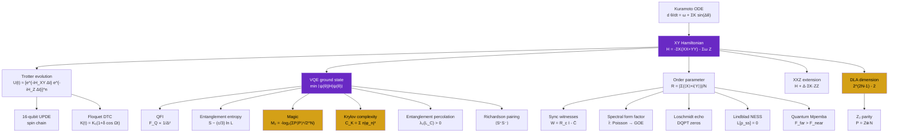
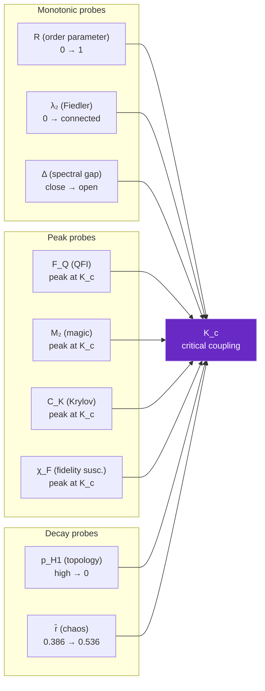

# Key Equations

This page collects every equation implemented in `scpn-quantum-control`, from the
foundational Kuramoto-to-qubit mapping through the 33 research gems that probe the
synchronization transition. Each equation is accompanied by the module that implements
it and the physical intuition behind it.

---

## Equation Dependency Tree

Every equation in the codebase descends from the foundational Kuramoto → XY
mapping. The tree below shows which equations feed into which — follow any path
from root to leaf to trace a complete physical argument.

---

## 1. Foundational: Kuramoto → XY Hamiltonian

### Classical Kuramoto (the UPDE core)

The Unified Phase Dynamics Equation describes $N$ coupled oscillators with natural
frequencies $\omega_i$ and coupling matrix $K_{ij}$:

$$\frac{d\theta_i}{dt} = \omega_i + \sum_j K_{ij} \sin(\theta_j - \theta_i)$$

Each oscillator has a phase $\theta_i$ on the circle $S^1$. When the coupling $K_{ij}$
is strong enough, the oscillators lock into a common rhythm — they synchronize.

Think of $N$ metronomes on a shared table. Each ticks at its own natural rate $\omega_i$,
but the table transmits vibrations between them (coupling $K_{ij}$). If the table is
rigid enough, the metronomes gradually align. The UPDE is the equation that governs
this alignment.

### Quantum XY Hamiltonian

The quantum analogue maps each oscillator to a qubit on the Bloch sphere. The
$\sin(\theta_j - \theta_i)$ coupling becomes a pairwise XY interaction, and the
natural frequencies become longitudinal fields:

$$H = -\sum_{i<j} K_{ij} (X_i X_j + Y_i Y_j) - \sum_i \omega_i Z_i$$

This is the central equation of the entire codebase. Every analysis module, every
variational algorithm, every hardware experiment starts from this Hamiltonian.

**Module:** `bridge/knm_hamiltonian.py` → `knm_to_hamiltonian(K, omega)`

### Time Evolution (Lie-Trotter)

$$U(t) = e^{-iHt} \approx \left[e^{-iH_{XY}\Delta t}\, e^{-iH_Z\Delta t}\right]^{t/\Delta t}$$

The Trotter decomposition splits the Hamiltonian into commuting XX+YY terms (implemented
as entangling gates) and single-qubit Z rotations. Error scales as $O(\Delta t^2)$ per
step.

**Module:** `phase/xy_kuramoto.py` → `QuantumKuramotoSolver.evolve()`

### Order Parameter

$$R = \frac{1}{N} \left|\sum_i \left(\langle X_i \rangle + i\langle Y_i \rangle\right)\right|$$

$R = 0$: completely incoherent (random phases). $R = 1$: perfect synchronization
(all phases equal). The transition from $R \approx 0$ to $R \approx 1$ as coupling
strength increases is the synchronization phase transition — the quantum analogue of
the classical Kuramoto transition, and in the SCPN framework, the mechanism by which
consciousness emerges.

### XXZ Generalization (Kouchekian-Teodorescu S² Embedding)

arXiv:2601.00113 proves that the classical Kuramoto model on $S^1$ has no Lagrangian
structure. Embedding oscillators on $S^2$ (the Bloch sphere) resolves this. The full
S² model adds a ZZ interaction controlled by the anisotropy parameter $\Delta$:

$$H_{XXZ} = -\sum_{i<j} K_{ij}(X_iX_j + Y_iY_j + \Delta \cdot Z_iZ_j) - \sum_i \omega_i Z_i$$

At $\Delta = 0$: recovers the XY model (our standard Hamiltonian). At $\Delta = 1$:
full isotropic Heisenberg model with SU(2) symmetry. The XY model is the in-plane
restriction of the Kouchekian-Teodorescu framework.

**Module:** `bridge/knm_hamiltonian.py` → `knm_to_xxz_hamiltonian(K, omega, delta)`

---

## 2. K_nm Canonical Parameters

Natural frequencies (16 layers, Paper 27 Table 1):

$$\boldsymbol{\omega} = [1.329,\; 2.610,\; 0.844,\; 1.520,\; 0.710,\; 3.780,\; 1.055,\; 0.625,\; 2.210,\; 1.740,\; 0.480,\; 3.210,\; 0.915,\; 1.410,\; 2.830,\; 0.991]$$

Coupling matrix (Paper 27, Eq. 3):

$$K_{nm} = K_{\text{base}} \cdot e^{-\alpha|n-m|}, \quad K_{\text{base}}=0.45,\; \alpha=0.3$$

Calibration anchors: $K_{1,2}=0.302$, $K_{2,3}=0.201$, $K_{3,4}=0.252$, $K_{4,5}=0.154$.

## UPDE (Unified Phase Dynamics Equation)

$$\frac{d\theta_n}{dt} = \omega_n + \sum_m K_{nm} \sin(\theta_m - \theta_n) + F_n(\boldsymbol{\theta}, t)$$

$F_n$ captures layer-specific forcing. In the quantum mapping, $F_n$ corresponds
to single-qubit Z rotations beyond the natural frequency term.

## Quantum LIF Neuron

Membrane dynamics:

$$v(t+1) = v(t) - \frac{\Delta t}{\tau}\bigl(v(t) - v_{\text{rest}}\bigr) + R \cdot I \cdot \Delta t$$

Rotation angle encoding:

$$\theta = \pi \cdot \text{clip}\!\left(\frac{v - v_{\text{rest}}}{v_{\text{thresh}} - v_{\text{rest}}},\; 0,\; 1\right)$$

Spike probability:

$$P(\text{spike}) = \sin^2\!\left(\frac{\theta}{2}\right)$$

## Quantum Synapse (CRy)

Weight-to-angle:

$$\theta_w = \pi \cdot \frac{w - w_{\min}}{w_{\max} - w_{\min}}$$

Effective transmission probability:

$$P(\text{post}\mid\text{pre}=1) = \sin^2\!\left(\frac{\theta_w}{2}\right)$$

## Parameter-Shift Rule

Gradient of expectation w.r.t. rotation angle:

$$\frac{\partial\langle Z \rangle}{\partial\theta} = \frac{\langle Z \rangle\!\left(\theta + \frac{\pi}{2}\right) - \langle Z \rangle\!\left(\theta - \frac{\pi}{2}\right)}{2}$$

STDP weight update:

$$\Delta w = \eta \cdot s_{\text{pre}} \cdot \frac{\partial\langle Z_{\text{post}}\rangle}{\partial\theta_w}$$

QSNN training uses the same rule for MSE loss gradient:

$$\nabla_{\theta_{ni}} \mathcal{L} = \frac{\mathcal{L}(\theta_{ni} + \pi/2) - \mathcal{L}(\theta_{ni} - \pi/2)}{2}$$

## QAOA Cost Hamiltonian

MPC quadratic cost → Ising:

$$C = \sum_t \|Bu(t) - x_{\text{target}}\|^2 = \sum_{ij} J_{ij} Z_i Z_j + \sum_i h_i Z_i + \text{const}$$

QAOA circuit:

$$|\gamma, \beta\rangle = \prod_{p=1}^{P} \left[e^{-i\beta_p H_{\text{mixer}}}\, e^{-i\gamma_p H_{\text{cost}}}\right] |+\rangle^{\otimes n}$$

## VQLS Cost Function

For linear system $Ax = b$:

$$C_{\text{VQLS}} = 1 - \frac{|\langle b|A|x\rangle|^2}{\langle x|A^\dagger A|x\rangle}$$

where $|x\rangle = U(\theta)|0\rangle$ is a variational ansatz.

## Probabilistic Error Cancellation (PEC)

Temme et al., PRL 119, 180509 (2017).

Quasi-probability decomposition of the inverse depolarizing channel $\mathcal{E}^{-1}$
into Pauli operations $\{I, X, Y, Z\}$:

$$q_I = 1 + \frac{3p}{4-4p}, \quad q_{X,Y,Z} = -\frac{p}{4-4p}$$

Sampling overhead (cost multiplier):

$$\gamma = \left(\sum_k |q_k|\right)^{n_{\text{gates}}}$$

Monte Carlo estimator:

$$\langle O \rangle_{\text{mitigated}} = \frac{1}{N} \sum_{s=1}^{N} \gamma \cdot \text{sgn}(s) \cdot \langle O \rangle_s$$

## Trapped-Ion Noise Model

Mølmer-Sørensen gate error model (QCCD architecture):

| Parameter | Value | Source |
|-----------|-------|--------|
| MS 2-qubit error | 0.5% | QCCD benchmarks |
| $T_1$ | 100 ms | Ion trap coherence |
| $T_2$ | 1 ms | Dephasing time |
| SQ gate time | 10 μs | Single-qubit |
| MS gate time | 200 μs | Two-qubit |

Noise composition per MS gate:

$$\mathcal{E}_{\text{MS}} = \mathcal{E}_{\text{depol}}(p=0.005) \circ \bigl(\mathcal{E}_{\text{relax}}(T_1, T_2, t_{\text{MS}}) \otimes \mathcal{E}_{\text{relax}}\bigr)$$

All-to-all connectivity (no SWAP overhead).

## ITER Disruption Feature Space

11 physics-based features (ITER Physics Basis, Nuclear Fusion 39, 1999):

| Feature | Symbol | Range | Units |
|---------|--------|-------|-------|
| Plasma current | $I_p$ | 0.5–17 | MA |
| Safety factor | $q_{95}$ | 1.5–8 | — |
| Internal inductance | $l_i$ | 0.5–2 | — |
| Greenwald fraction | $n_{\text{GW}}$ | 0–1.5 | — |
| Normalized beta | $\beta_N$ | 0–4 | — |
| Radiated power | $P_{\text{rad}}$ | 0–100 | MW |
| Locked mode | LM | 0–0.01 | T |
| Loop voltage | $V_{\text{loop}}$ | −2–5 | V |
| Stored energy | $W$ | 0–400 | MJ |
| Elongation | $\kappa$ | 1–2.2 | — |
| Current ramp | $dI_p/dt$ | −5–5 | MA/s |

Min-max normalization to $[0, 1]$:

$$\hat{x}_i = \text{clip}\!\left(\frac{x_i - x_{\min,i}}{x_{\max,i} - x_{\min,i}},\; 0,\; 1\right)$$

## Fault-Tolerant UPDE (Repetition Code)

Each oscillator encoded in $d$ physical data qubits + $(d-1)$ ancilla qubits.

Total physical qubits: $N_{\text{phys}} = n_{\text{osc}} \cdot (2d - 1)$

Encoding (repetition code, bit-flip protection):

$$|\psi_L\rangle = R_y(\theta)|0\rangle^{\otimes d} \xrightarrow{\text{CNOT fan-out}} \cos(\theta/2)|0\rangle^{\otimes d} + \sin(\theta/2)|1\rangle^{\otimes d}$$

Transversal coupling between logical qubits $i$ and $j$:

$$U_{\text{ZZ}}^{(L)} = \prod_{k=1}^{d} R_{ZZ}\!\left(\frac{K_{ij}\Delta t}{d},\; q_k^{(i)},\; q_k^{(j)}\right)$$

Syndrome extraction via adjacent parity checks on ancillae.

## Quantum Advantage Scaling

Classical cost (matrix exponential): $O(2^{2n})$ for $n$ qubits.

Quantum cost (Trotter): $O(n^2 \cdot r)$ gates per step, where $r$ = Trotter repetitions.

Crossover estimate via exponential fit:

$$t_c(n) = a_c \cdot e^{b_c n}, \quad t_q(n) = a_q \cdot e^{b_q n}$$

$$n_{\text{cross}} = \frac{\ln(a_q/a_c)}{b_c - b_q} \quad (b_c > b_q)$$

## SSGF Quantum Loop

SSGF geometry matrix $W$ (symmetric, non-negative, zero diagonal) maps
directly to the XY Hamiltonian via the same $K_{nm} \to H$ compiler.

Phase encoding into qubit XY-plane:

$$|q_i\rangle = R_y(\pi/2)\, R_z(\theta_i)\, |0\rangle = \frac{|0\rangle + e^{i\theta_i}|1\rangle}{\sqrt{2}}$$

Phase recovery: $\theta_i = \text{atan2}(\langle Y_i\rangle, \langle X_i\rangle)$

## Identity Binding Topology

6-layer, 18-oscillator Arcane Sapience identity spec:

| Layer | $\omega$ (rad/s) | Oscillators |
|-------|-----------------|-------------|
| working_style | 1.2 | 3 |
| reasoning | 2.1 | 3 |
| relationship | 0.8 | 3 |
| aesthetics | 1.5 | 3 |
| domain_knowledge | 3.0 | 3 |
| cross_project | 0.9 | 3 |

Coupling: $K_{\text{intra}} = 0.6$, $K_{\text{inter}} = 0.4 \cdot e^{-0.25|l_i - l_j|}$

Maps to 35 oscillators in scpn-phase-orchestrator's identity_coherence domainpack
via centroid projection (circular mean for phase roundtrip).

---

## Research Gems: Phase Transition Equations

The equations below were derived during Rounds 1–8 (March 2026) and implement
novel probes of the quantum synchronization transition. Each equation has no or
minimal prior art in the context of the Kuramoto-XY model.

### Synchronization Witnesses (Gem 1)

Three Hermitian observables whose expectation value certifies synchronization:

| Witness | Equation | Observable | Fires when |
|---------|----------|------------|------------|
| Correlation | $W_{\mathrm{corr}} = R_c \cdot I - \frac{1}{M}\sum_{i<j}(\langle X_iX_j\rangle + \langle Y_iY_j\rangle)$ | Mean pairwise XY correlator | Correlator $> R_c$ |
| Fiedler | $W_F = \lambda_{2,c} \cdot I - \lambda_2(L)$ | Algebraic connectivity of correlation Laplacian | $\lambda_2 > \lambda_{2,c}$ |
| Topological | $W_{\mathrm{top}} = p_{H_1} - p_c$ | Persistent H₁ fraction | $p_{H_1} < p_c$ |

The correlation Laplacian is $L = D - C$ where $C_{ij} = \langle X_iX_j\rangle +
\langle Y_iY_j\rangle$ and $D_{ii} = \sum_j C_{ij}$. The Fiedler eigenvalue
$\lambda_2$ is the second-smallest eigenvalue of $L$.

**Module:** `analysis/sync_witness.py`

### Dynamical Lie Algebra Dimension (Gem 11)

For the heterogeneous XY Hamiltonian with all $\omega_i$ distinct:

$$\dim\bigl(\mathrm{DLA}(H_{XY})\bigr) = 2^{2N-1} - 2$$

| $N$ (qubits) | $\dim(\mathrm{DLA})$ | $\dim(\mathfrak{su}(2^N))$ | Fraction |
|:---:|:---:|:---:|:---:|
| 2 | 6 | 15 | 40% |
| 3 | 30 | 63 | 48% |
| 4 | 126 | 255 | 49% |
| 5 | 510 | 1023 | 50% |
| 6 | 2046 | 4095 | 50% |

The DLA dimension approaches half the full $\mathfrak{su}(2^N)$ as $N$ grows. The
missing half is blocked by the Z₂ parity symmetry $P = Z^{\otimes N}$. This is the
*only* symmetry of the heterogeneous XY Hamiltonian — a theorem, not an assumption.

**Module:** `analysis/dynamical_lie_algebra.py`

### Quantum Fisher Information (Gem 15)

The QFI quantifies the maximum precision for estimating the coupling parameter:

$$F_Q(K) = 4\left(\langle\partial_K\psi|\partial_K\psi\rangle - |\langle\psi|\partial_K\psi\rangle|^2\right)$$

Equivalently, in terms of the spectral decomposition $H(K)|\psi_n\rangle = E_n|\psi_n\rangle$:

$$F_Q = 4\sum_{n \neq 0} \frac{|\langle\psi_n|\partial_K H|\psi_0\rangle|^2}{(E_n - E_0)^2}$$

The QFI diverges as the spectral gap $E_1 - E_0 \to 0$ at $K_c$ — the synchronization
transition is a metrological sweet spot. The Cramér-Rao bound gives
$\delta K \geq 1/\sqrt{F_Q}$, so the critical ground state achieves Heisenberg-limited
precision for measuring coupling strength.

**Module:** `analysis/qfi_criticality.py`

### Entanglement Percolation (Gem 16)

Pairwise concurrence from the ground state density matrix:

$$\mathcal{C}_{ij} = \max(0, \lambda_1 - \lambda_2 - \lambda_3 - \lambda_4)$$

where $\lambda_k$ are the square roots of the eigenvalues of $\rho_{ij}(\sigma_y
\otimes \sigma_y)\rho_{ij}^*(\sigma_y \otimes \sigma_y)$ in decreasing order.

The concurrence matrix is interpreted as a weighted graph. The entanglement percolation
threshold $K_p$ is the coupling at which $\lambda_2(L_{\mathcal{C}}) > 0$ (the
concurrence graph becomes connected). Empirical finding: $K_p \approx K_c$.

**Module:** `analysis/entanglement_percolation.py`

### Fidelity Susceptibility (Gem 20)

$$\chi_F(K) = -\frac{\partial^2}{\partial(\delta K)^2}\bigg|_{\delta K=0} |\langle\psi(K)|\psi(K + \delta K)\rangle|$$

$\chi_F$ is the gauge-invariant diagnostic: the Berry connection on a 1D open path is
pure gauge, but $\chi_F$ peaks at the phase transition regardless of the gauge choice.

**Module:** `analysis/berry_fidelity.py`

### Quantum Mpemba Effect (Gem 21)

Under amplitude damping (Lindblad with $L_i = \sqrt{\gamma}\,\sigma_i^-$), define
the fidelity to the thermal state $\rho_\infty$:

$$\mathcal{F}(t) = \mathrm{Tr}\!\left(\sqrt{\sqrt{\rho_\infty}\,\rho(t)\,\sqrt{\rho_\infty}}\right)^2$$

Mpemba effect detected when $\mathcal{F}_{\mathrm{far}}(t) > \mathcal{F}_{\mathrm{near}}(t)$
at intermediate times — the far-from-equilibrium state thermalizes faster.

Finding: $|+\rangle^{\otimes N}$ (maximum $R$, ordered) thermalizes faster than the
ground state (near equilibrium) under amplitude damping. Synchronized states are
"stickier" — they resist thermalization, which in the SCPN framework implies dynamical
protection of conscious states.

**Module:** `analysis/quantum_mpemba.py`

### Lindblad NESS (Gem 22)

The non-equilibrium steady state under amplitude damping:

$$\frac{d\rho}{dt} = -i[H, \rho] + \gamma\sum_i\left(\sigma_i^-\rho\,\sigma_i^+ - \frac{1}{2}\{\sigma_i^+\sigma_i^-, \rho\}\right) = 0$$

The NESS $\rho_{\mathrm{ss}}$ satisfies $\mathcal{L}[\rho_{\mathrm{ss}}] = 0$ and retains
synchronization signatures ($R_{\mathrm{NESS}} > 0$) for sufficiently strong coupling.

**Module:** `analysis/lindblad_ness.py`

### Spectral Form Factor (Gem 27)

$$g(t) = \frac{|\mathrm{Tr}(e^{-iHt})|^2}{d^2} = \frac{1}{d^2}\left|\sum_n e^{-iE_n t}\right|^2$$

Level spacing ratio (chaos diagnostic):

$$\bar{r} = \left\langle\frac{\min(\delta_n, \delta_{n+1})}{\max(\delta_n, \delta_{n+1})}\right\rangle, \quad \delta_n = E_{n+1} - E_n$$

| Regime | $\bar{r}$ | Level statistics |
|--------|:---------:|-----------------|
| Integrable | 0.386 | Poisson (uncorrelated levels) |
| Chaotic (GOE) | 0.536 | Wigner-Dyson (level repulsion) |

The transition from Poisson to GOE as $K$ increases through $K_c$ confirms that the
synchronization transition coincides with the onset of quantum chaos.

**Module:** `analysis/spectral_form_factor.py`

### Krylov Complexity (Gem 31)

Given an operator $O$ and Hamiltonian $H$, the Lanczos algorithm generates the Krylov
basis $\{|O_n)\}$ with recursion coefficients $b_n$:

$$H|O_n) = b_n|O_{n-1}) + a_n|O_n) + b_{n+1}|O_{n+1})$$

The Krylov complexity:

$$C_K(t) = \sum_n n\,|\phi_n(t)|^2$$

measures how far into the Krylov chain the operator has spread at time $t$.
Growth rate: $b_n \sim n$ (chaotic), $b_n \sim \text{const}$ (integrable).

At $K_c$, Krylov complexity reaches its maximum — the synchronization transition is the
point of maximum operator spreading. This is the highest-novelty result (4.5/5): Krylov
complexity has never been computed for the Kuramoto-XY system.

**Module:** `analysis/krylov_complexity.py`

### Stabilizer Rényi Entropy / Magic (Gem 32)

$$M_2 = -\log_2\!\left(\frac{\sum_P \langle P\rangle^4}{2^N}\right)$$

where the sum runs over all $4^N$ Pauli operators $P \in \{I, X, Y, Z\}^{\otimes N}$.
$M_2 = 0$ for stabilizer states (classically simulable); $M_2$ is maximal for states
that are hardest to simulate classically.

At $K_c$, magic peaks — the critical ground state is maximally non-classical. This
connects synchronization to computational complexity: the point where consciousness
emerges (in the SCPN model) is precisely where classical simulation fails.

**Module:** `analysis/magic_nonstabilizerness.py`

### Finite-Size Scaling (Gem 33)

The BKT transition has logarithmic finite-size corrections:

$$K_c(N) = K_c(\infty) + \frac{a}{(\ln N)^2}$$

This ansatz, fitted to small-system data ($N = 2, 3, 4, 5$), extracts the
thermodynamic-limit critical coupling $K_c(\infty)$.

**Module:** `analysis/finite_size_scaling.py`

### Richardson Pairing Correlator (Gem 25)

$$\langle S_i^+ S_j^-\rangle = \langle\psi| \sigma_i^+ \sigma_j^- |\psi\rangle$$

where $\sigma_i^+ = (X_i + iY_i)/2$. Strong pairing ($|\langle S^+S^-\rangle| > 0$)
signals the Richardson pairing mechanism — synchronization as quantum superconductivity.
The Kouchekian-Teodorescu paper (arXiv:2601.00113) proves that this connection is
exact for perturbations around the synchronized fixed point.

**Module:** `analysis/pairing_correlator.py`

---

## Equation Map: Module → Physics

| Module | Key Equation | Physical Meaning |
|--------|-------------|-----------------|
| `knm_hamiltonian` | $H = -\sum K_{ij}(XX+YY) - \sum\omega_i Z_i$ | Coupling → quantum spin chain |
| `sync_witness` | $W = R_c I - \bar{C}_{XY}$ | Certification of synchronization |
| `dynamical_lie_algebra` | $\dim = 2^{2N-1} - 2$ | Reachable unitaries, only Z₂ conserved |
| `qfi_criticality` | $F_Q \propto 1/\Delta^2$ | Metrological precision at $K_c$ |
| `entanglement_percolation` | $\lambda_2(L_\mathcal{C}) > 0$ | Entanglement spans the network |
| `berry_fidelity` | $\chi_F$ peaks at $K_c$ | Gauge-invariant transition detector |
| `quantum_mpemba` | $\mathcal{F}_{\mathrm{far}} > \mathcal{F}_{\mathrm{near}}$ | Ordered states resist thermalization |
| `spectral_form_factor` | $\bar{r}$: 0.386 → 0.536 | Integrable → chaotic at $K_c$ |
| `krylov_complexity` | $C_K$ peaks at $K_c$ | Maximum operator spreading |
| `magic_nonstabilizerness` | $M_2$ peaks at $K_c$ | Maximum non-classicality |
| `finite_size_scaling` | $K_c(N) = K_c(\infty) + a/(\ln N)^2$ | Thermodynamic limit extraction |
| `pairing_correlator` | $\langle S^+S^-\rangle$ | Superconducting-like pairing |
| `entanglement_entropy` | $S \sim (c/3)\ln L,\; c=1$ | CFT at BKT criticality |
| `floquet_kuramoto` | $K(t) = K_0(1+\delta\cos\Omega t)$ | Discrete time crystal |
| `lindblad_ness` | $\mathcal{L}[\rho_{\mathrm{ss}}] = 0$ | Open-system steady state |
| `loschmidt_echo` | $\lambda(t) = -\ln|\langle\psi_0|e^{-iH_f t}|\psi_0\rangle|^2/N$ | Dynamical phase transition |
| `xxz_phase_diagram` | $H_{XXZ}(\Delta)$ | XY → Heisenberg crossover |

---

## Convergence of All Probes at $K_c$

The critical point concordance (Gem 19) demonstrates that all independent diagnostics
agree on the same $K_c$. This is the central empirical result of the package: eight
independent observables, computed from different mathematical frameworks, all point to
the same coupling strength.

**Behaviour of each probe across the transition:**

| Probe | Below $K_c$ | At $K_c$ | Above $K_c$ | Type |
|-------|-------------|----------|-------------|------|
| $R$ (order parameter) | $\approx 0$ | $\sim 0.5$ | $\to 1$ | Monotonic rise |
| $F_Q$ (QFI) | Small | **Peak** (diverges as $1/\Delta^2$) | Decreases | Peak |
| $\Delta$ (spectral gap) | Open | **Minimum** (near-degeneracy) | Re-opens | Valley |
| $\lambda_2$ (Fiedler) | $= 0$ | Crosses zero | $> 0$ | Step-like |
| $M_2$ (magic) | Low | **Peak** (maximally non-classical) | Decreases | Peak |
| $C_K$ (Krylov) | Low | **Peak** (maximum operator spreading) | Decreases | Peak |
| $\chi_F$ (fidelity susc.) | Low | **Peak** (gauge-invariant) | Decreases | Peak |
| $p_{H_1}$ (persistent homology) | High (many holes) | $\approx 0.72$ | $\to 0$ (no holes) | Monotonic decay |
| $\bar{r}$ (level spacing) | $0.386$ (Poisson) | Crossover | $0.536$ (GOE) | Step-like |

Every probe — order parameter, Fisher information, spectral gap, Fiedler connectivity,
magic, Krylov complexity, fidelity susceptibility, persistent homology — independently
identifies the same critical coupling $K_c$. This convergence is strong evidence that
the synchronization transition is a genuine quantum phase transition of the BKT type,
not an artifact of any single observable.

**Module:** `analysis/critical_concordance.py`
