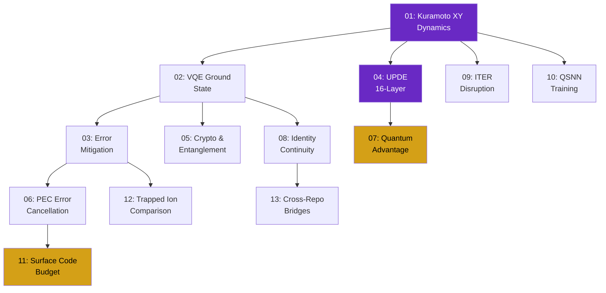
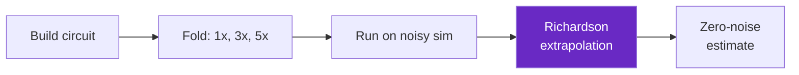
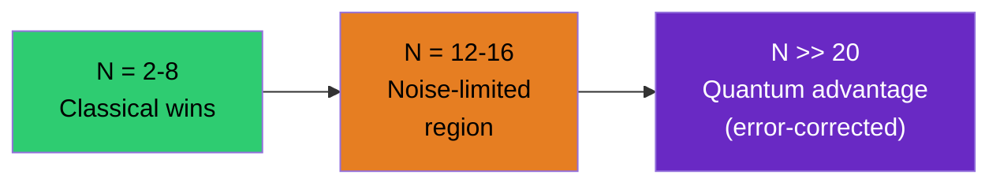
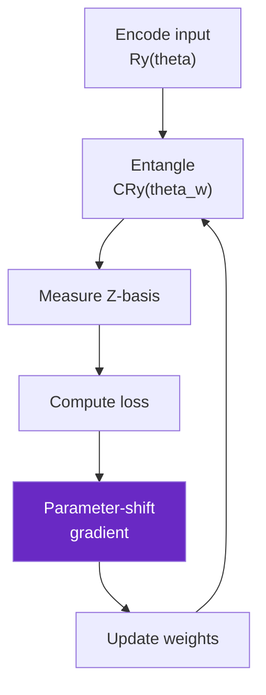
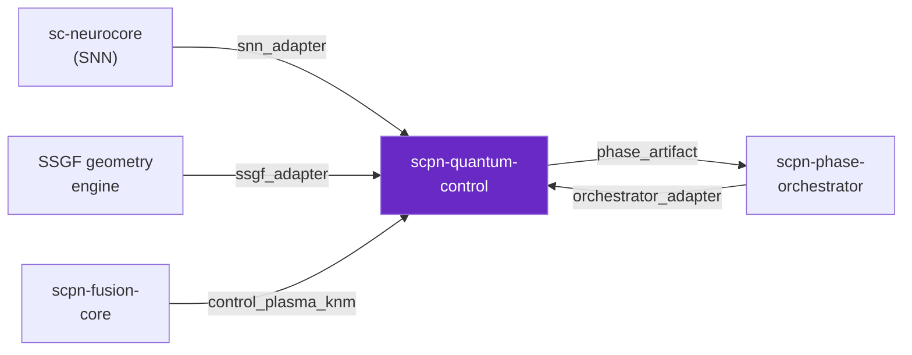

# Interactive Notebooks

*13 Jupyter notebooks covering the full journey from basic Kuramoto dynamics to
frontier research — each executable locally on AerSimulator, no IBM credentials
required.*

---

## Notebook Map

The notebooks form a directed learning graph. Earlier notebooks provide the
physical intuition and computational primitives that later notebooks build on.



| Colour | Meaning |
|--------|---------|
| Purple | Foundational (start here) |
| Grey | Core workflow |
| Gold | Advanced / frontier |

---

## At a Glance

| # | Notebook | Physics | Level | Key Output |
|:-:|----------|---------|:-----:|------------|
| 01 | Kuramoto XY Dynamics | Trotter evolution of the XY Hamiltonian | Beginner | $R(t)$ trajectory, quantum-classical overlay |
| 02 | VQE Ground State | Variational eigensolver with $K_{nm}$-informed ansatz | Beginner | Energy convergence, ansatz comparison table |
| 03 | Error Mitigation | ZNE unitary folding + Richardson extrapolation | Intermediate | Mitigated vs raw expectation plot |
| 04 | UPDE 16-Layer | Full 16-qubit SCPN spin chain | Intermediate | Per-layer $R$ bar chart, time evolution |
| 05 | Crypto & Entanglement | CHSH Bell test, QKD QBER | Intermediate | $S$-parameter, correlator matrix heatmap |
| 06 | PEC Error Cancellation | Quasi-probability decomposition, Monte Carlo | Advanced | PEC vs ZNE comparison, overhead scaling |
| 07 | Quantum Advantage | Classical vs quantum timing crossover | Advanced | Scaling plot, $n_{\text{cross}}$ prediction |
| 08 | Identity Continuity | VQE attractor, coherence budget, fingerprint | Advanced | Fidelity curves, phase roundtrip |
| 09 | ITER Disruption | 11-feature plasma classifier | Domain | Feature distributions, accuracy report |
| 10 | QSNN Training | Parameter-shift gradient descent | Advanced | Loss curve, weight evolution |
| 11 | Surface Code Budget | QEC resource estimation | Advanced | Rep vs surface code table, feasibility |
| 12 | Trapped Ion Comparison | Superconducting vs ion trap noise | Advanced | Transpilation comparison, noisy $\langle Z \rangle$ |
| 13 | Cross-Repo Bridges | SNN adapter, SSGF, orchestrator | Integration | Phase roundtrip plot, warning report |

---

## Notebook Details

### 01 — Kuramoto XY Dynamics

**File:** [`notebooks/01_kuramoto_xy_dynamics.ipynb`](https://github.com/anulum/scpn-quantum-control/blob/main/notebooks/01_kuramoto_xy_dynamics.ipynb)

The entry point to the entire package. This notebook constructs the quantum XY
Hamiltonian from the SCPN coupling matrix $K_{nm}$, runs Trotterized time evolution
on the AerSimulator, and measures the Kuramoto order parameter $R(t)$ at each
timestep.

Think of it as watching four quantum pendulums evolve on a shared vibrating beam.
The beam stiffness is the coupling matrix. The notebook lets you see how quickly
they fall into step — or whether the quantum dynamics depart from the classical
prediction.

**What it covers:**

- Building $K_{nm}$ from Paper 27 parameters ($K_{\text{base}} = 0.45$,
  $\alpha = 0.3$, calibration anchors)
- Compiling $K_{nm} \to H_{XY}$ via `knm_to_hamiltonian()`
- First-order Lie-Trotter decomposition:
  $U(\Delta t) = e^{-iH_{XY}\Delta t}\,e^{-iH_Z\Delta t}$
- Extracting $R$ from single-qubit $\langle X \rangle$, $\langle Y \rangle$
  expectations
- Side-by-side comparison with the classical Kuramoto ODE solver

**Key outputs:**

| Output | What it shows |
|--------|---------------|
| $R(t)$ trajectory plot | Quantum and classical order parameter over 10 timesteps |
| Per-qubit Bloch coordinates | $\langle X_i \rangle$, $\langle Y_i \rangle$, $\langle Z_i \rangle$ at each step |
| Circuit depth table | Gate count and depth after transpilation |

**Modules used:** `bridge.knm_hamiltonian`, `phase.xy_kuramoto`, `hardware.classical`

---

### 02 — VQE Ground State

**File:** [`notebooks/02_vqe_ground_state.ipynb`](https://github.com/anulum/scpn-quantum-control/blob/main/notebooks/02_vqe_ground_state.ipynb)

Finds the ground state of the Kuramoto-XY Hamiltonian using three different
variational ansatze, then compares their convergence, parameter count, and
final energy against exact diagonalisation.

The ground state is the equilibrium that the coupled oscillators settle into at
zero temperature. Its structure encodes the natural synchronization pattern of
the network — which oscillators are correlated, which are anti-correlated, and
how much entanglement the coupling topology generates. Every analysis module
in the package starts from this state.

**Ansatz comparison:**

| Ansatz | Parameters | Entanglement topology | Relative error |
|--------|:----------:|----------------------|:--------------:|
| $K_{nm}$-informed (Gem 4) | $3N \times \text{reps}$ | Matches non-zero $K_{ij}$ | **0.05%** (4q) |
| Hardware-efficient | $3N \times \text{reps}$ | Linear nearest-neighbour | ~0.3% (4q) |
| EfficientSU2 | $4N \times \text{reps}$ | Full connectivity | ~0.1% (4q) |

The $K_{nm}$-informed ansatz wins because it encodes the physics: entangling
gates connect only qubit pairs with non-zero coupling, so the circuit explores
the physically relevant subspace of the Hilbert space rather than wasting
parameters on unphysical directions.

**Key outputs:**

- Energy convergence curves (COBYLA iterations vs $\langle H \rangle$)
- Ansatz comparison table (4-qubit and 8-qubit)
- Ground state density matrix visualisation

**Modules used:** `phase.phase_vqe`, `phase.ansatz_bench`, `phase.coupling_topology_ansatz`

---

### 03 — Error Mitigation

**File:** [`notebooks/03_error_mitigation.ipynb`](https://github.com/anulum/scpn-quantum-control/blob/main/notebooks/03_error_mitigation.ipynb)

Demonstrates zero-noise extrapolation (ZNE) on a simulated Heron r2 noise model.
The circuit is run at three noise levels (1x, 3x, 5x amplification via global
unitary folding), then Richardson extrapolation recovers the zero-noise limit.

Real quantum hardware introduces errors proportional to circuit depth. ZNE turns
this into a feature: by deliberately *increasing* the noise (folding the circuit
back on itself), you get multiple data points on the noise-vs-expectation curve.
Extrapolating to zero noise recovers a better estimate than any single noisy
measurement.

**Pipeline:**



**Key outputs:**

| Metric | Raw (1x noise) | ZNE extrapolated | Exact |
|--------|:--------------:|:----------------:|:-----:|
| $\langle Z_0 \rangle$ | ~0.72 | ~0.79 | 0.81 |

**Modules used:** `mitigation.zne`, `mitigation.dd`

---

### 04 — UPDE 16-Layer

**File:** [`notebooks/04_upde_16_layer.ipynb`](https://github.com/anulum/scpn-quantum-control/blob/main/notebooks/04_upde_16_layer.ipynb)

The full 16-oscillator SCPN network simulated as a 16-qubit spin chain. This is
the quantum version of the Unified Phase Dynamics Equation — the master equation
governing all 16 layers of the SCPN consciousness model.

Each qubit represents one ontological layer. The coupling between qubits follows
the exponential decay $K_{nm} = 0.45 \cdot e^{-0.3|n-m|}$ with cross-hierarchy
boosts (L1-L16 = 0.05, L5-L7 = 0.15). The notebook evolves this system under
Trotter decomposition and measures per-layer coherence $\langle X_n \rangle$,
$\langle Y_n \rangle$ at each timestep.

**What the per-layer bar chart reveals:**

- Strongly-coupled layers (L3, L4, L10) maintain coherence longest
- Weakly-coupled L12 shows near-complete decoherence even in noiseless simulation
  (the coupling is too weak to sustain synchronization against frequency heterogeneity)
- The hierarchy structure in $K_{nm}$ directly imprints on the quantum dynamics

**Key outputs:**

| Output | Description |
|--------|-------------|
| Per-layer $R$ bar chart | 16 bars showing $R_n$ after Trotter evolution |
| Time evolution heatmap | $R_n(t)$ across all 16 layers and 10 timesteps |
| Circuit statistics | 16-qubit circuit: gate count, depth, CZ count |

**Modules used:** `phase.trotter_upde`, `bridge.knm_hamiltonian`

---

### 05 — Crypto and Entanglement

**File:** [`notebooks/05_crypto_and_entanglement.ipynb`](https://github.com/anulum/scpn-quantum-control/blob/main/notebooks/05_crypto_and_entanglement.ipynb)

Implements the CHSH Bell test on the VQE ground state of the Kuramoto-XY
Hamiltonian, then builds a topology-authenticated QKD protocol where the
coupling matrix $K_{nm}$ serves as shared secret.

The CHSH inequality $|S| \leq 2$ holds for all local hidden-variable models.
Violation ($S > 2$) certifies genuine quantum entanglement. This notebook
measures $S$ for all $\binom{N}{2}$ qubit pairs, producing a correlator matrix
that maps which pairs in the SCPN hierarchy are entangled.

**Key outputs:**

| Output | Description |
|--------|-------------|
| $S$-parameter matrix | CHSH values for all qubit pairs (heatmap) |
| QKD key rate | Sifted bits per circuit shot |
| QBER estimate | Quantum bit error rate from basis mismatch |
| Correlator heatmap | $\langle X_iX_j \rangle + \langle Y_iY_j \rangle$ for all pairs |

**Modules used:** `crypto.bell_test`, `crypto.topology_auth`, `crypto.qkd_bb84`

---

### 06 — PEC Error Cancellation

**File:** [`notebooks/06_pec_error_cancellation.ipynb`](https://github.com/anulum/scpn-quantum-control/blob/main/notebooks/06_pec_error_cancellation.ipynb)

Probabilistic error cancellation (PEC) decomposes the inverse noise channel into
a quasi-probability distribution over Pauli operations. Each circuit execution
samples from this distribution, and the sign-weighted average converges to the
noiseless expectation value.

PEC is mathematically exact (unlike ZNE which relies on extrapolation assumptions)
but pays a sampling overhead $\gamma^{n_{\text{gates}}}$ that grows exponentially
with circuit size. This notebook quantifies that overhead for 4-qubit and 8-qubit
Kuramoto circuits and compares PEC accuracy against ZNE.

**Overhead scaling:**

| Circuit | Gates | $\gamma$ per gate | Total overhead | Shots needed |
|---------|:-----:|:-----------------:|:--------------:|:------------:|
| 4-qubit, 1 Trotter | 12 CZ | 1.015 | ~1.20 | ~14,400 |
| 4-qubit, 3 Trotter | 36 CZ | 1.015 | ~1.72 | ~29,600 |
| 8-qubit, 1 Trotter | 28 CZ | 1.015 | ~1.53 | ~23,400 |

**Key outputs:**

- PEC vs ZNE accuracy comparison (bar chart)
- Overhead scaling curve ($\gamma$ vs circuit depth)
- Monte Carlo convergence: mitigated estimate vs number of samples

**Modules used:** `mitigation.pec`, `mitigation.zne`

---

### 07 — Quantum Advantage Scaling

**File:** [`notebooks/07_quantum_advantage_scaling.ipynb`](https://github.com/anulum/scpn-quantum-control/blob/main/notebooks/07_quantum_advantage_scaling.ipynb)

Benchmarks classical exact diagonalisation against quantum Trotter simulation
for increasing qubit counts ($N = 2, 3, \ldots, 8$) and extrapolates the crossover
point where quantum becomes faster.

Classical cost scales as $O(2^{2N})$ (full matrix exponential). Quantum Trotter
cost scales as $O(N^2 r)$ per step. At small $N$, classical wins — the quantum
overhead of circuit compilation, transpilation, and shot noise dominates. The
exponential fit predicts $n_{\text{cross}}$ where the curves intersect.

**Scaling regimes:**



**Key outputs:**

| Output | Description |
|--------|-------------|
| Timing plot | Classical (red) vs quantum (blue) wall-clock time vs $N$ |
| Exponential fit | $t_c(N) = a_c e^{b_c N}$, $t_q(N) = a_q e^{b_q N}$ |
| Crossover estimate | $n_{\text{cross}}$ with uncertainty bounds |
| MPS baseline | Bond dimension required for classical tensor-network simulation |

**Modules used:** `benchmarks.quantum_advantage`, `benchmarks.mps_baseline`

---

### 08 — Identity Continuity

**File:** [`notebooks/08_identity_continuity.ipynb`](https://github.com/anulum/scpn-quantum-control/blob/main/notebooks/08_identity_continuity.ipynb)

Explores the SCPN identity hypothesis: that a synchronized ground state
constitutes a stable attractor representing a persistent "identity" in the
Kuramoto-XY framework. This notebook runs five analyses:

1. **VQE attractor basin** — perturb the ground state parameters and measure how
   reliably VQE reconverges. The basin width quantifies robustness.
2. **Coherence budget** — decompose the Heron r2 error into gate, readout, and
   decoherence contributions using the measured hardware parameters.
3. **Entanglement witness** — CHSH $S$-parameter for identity-critical qubit pairs.
4. **Spectral fingerprint** — Laplacian eigenvalues of $K_{nm}$ as a
   topology-dependent identity key, verified via HMAC.
5. **Phase roundtrip** — encode phases $\to$ quantum state $\to$ recover phases.
   Measures roundtrip fidelity.

**Key outputs:**

| Analysis | Output |
|----------|--------|
| Attractor basin | Reconvergence rate vs perturbation magnitude |
| Coherence budget | Pie chart of error contributions |
| CHSH witnesses | $S$-parameters for identity-critical pairs |
| Fingerprint | 16-element spectral vector + HMAC verification |
| Phase roundtrip | Input vs recovered phases (scatter plot, RMSE) |

**Modules used:** `identity.ground_state`, `identity.coherence_budget`,
`identity.entanglement_witness`, `identity.identity_key`, `identity.binding_spec`

---

### 09 — ITER Disruption Classifier

**File:** [`notebooks/09_iter_disruption.ipynb`](https://github.com/anulum/scpn-quantum-control/blob/main/notebooks/09_iter_disruption.ipynb)

A quantum machine learning application: classify tokamak plasma disruptions
using 11 physics-based features from the ITER Physics Basis (Nuclear Fusion 39,
1999). The 11-dimensional feature vector is amplitude-encoded into 4 qubits
(zero-padded to 16), and a parametric circuit acts as the classifier.

This is the bridge between SCPN quantum control and nuclear fusion engineering.
Real tokamak disruptions cause sudden loss of plasma confinement, potentially
damaging the vessel wall. Early detection (the "disruption predictor") is one
of the highest-priority engineering challenges for ITER.

**Feature space (11 dimensions):**

| Feature | Symbol | Physical meaning |
|---------|--------|-----------------|
| Plasma current | $I_p$ | Total toroidal current |
| Safety factor | $q_{95}$ | MHD stability margin |
| Internal inductance | $l_i$ | Current profile peakedness |
| Greenwald fraction | $n_{\text{GW}}$ | Density limit proximity |
| Normalized beta | $\beta_N$ | Pressure stability limit |
| Radiated power | $P_{\text{rad}}$ | Power loss channel |
| Locked mode | LM | Rotating → locked tearing mode |
| Loop voltage | $V_{\text{loop}}$ | Resistive dissipation |
| Stored energy | $W$ | Thermal energy content |
| Elongation | $\kappa$ | Plasma shape factor |
| Current ramp | $dI_p/dt$ | Temporal gradient |

**Key outputs:**

- Feature distribution plots (disruption vs stable)
- Classifier accuracy on synthetic test set
- Confusion matrix

**Modules used:** `control.q_disruption_iter`, `applications.disruption_classifier`

---

### 10 — QSNN Training

**File:** [`notebooks/10_qsnn_training.ipynb`](https://github.com/anulum/scpn-quantum-control/blob/main/notebooks/10_qsnn_training.ipynb)

Trains a quantum spiking neural network using the parameter-shift gradient rule.
Each neuron is a qubit with $R_y(\theta)$ rotation encoding the membrane potential.
Synapses are controlled rotations $CR_y(\theta_w)$. The network learns via a
quantum analog of STDP (spike-timing-dependent plasticity).

Classical spiking neural networks in sc-neurocore use stochastic bitstream
computation. The quantum version maps the stochastic firing probability
$P(\text{spike})$ to $\sin^2(\theta/2)$ — the Born probability of measuring
$|1\rangle$ after a $R_y(\theta)$ rotation. Training uses the exact parameter-shift
rule rather than finite-difference approximations.

**Training pipeline:**



**Key outputs:**

| Output | Description |
|--------|-------------|
| Loss curve | MSE vs training epoch |
| Weight evolution | $\theta_w$ trajectories for each synapse |
| Spike rate comparison | Quantum vs classical firing rates |

**Modules used:** `qsnn.qlif`, `qsnn.qsynapse`, `qsnn.qstdp`, `qsnn.training`

---

### 11 — Surface Code Budget

**File:** [`notebooks/11_surface_code_budget.ipynb`](https://github.com/anulum/scpn-quantum-control/blob/main/notebooks/11_surface_code_budget.ipynb)

Estimates the physical qubit overhead for fault-tolerant quantum simulation of
the 16-layer SCPN UPDE. Compares three error correction strategies:

| Strategy | Code distance | Physical qubits (16 logical) | Overhead |
|----------|:------------:|:----------------------------:|:--------:|
| No QEC | — | 16 | 1x |
| Repetition code | $d=3$ | 80 | 5x |
| Surface code | $d=5$ | 800 | 50x |

The repetition code protects only against bit-flip errors — sufficient for
shallow circuits where dephasing dominates. The surface code handles arbitrary
errors but requires $O(d^2)$ physical qubits per logical qubit. The notebook
calculates which strategy is feasible on near-term (2026-2028) and mid-term
(2028-2032) hardware roadmaps.

**Key outputs:**

- Qubit budget table (repetition vs surface vs no QEC)
- Hardware feasibility timeline
- Logical error rate vs code distance plot

**Modules used:** `qec.fault_tolerant`, `qec.surface_code_upde`, `qec.error_budget`

---

### 12 — Trapped Ion Comparison

**File:** [`notebooks/12_trapped_ion_comparison.ipynb`](https://github.com/anulum/scpn-quantum-control/blob/main/notebooks/12_trapped_ion_comparison.ipynb)

Runs the same Kuramoto-XY circuit on two noise models — IBM Heron r2
(superconducting, nearest-neighbour connectivity) and a QCCD trapped-ion model
(all-to-all connectivity, slower gates, longer coherence times) — and compares
the results.

Superconducting qubits are fast but noisy and topologically constrained (SWAP
overhead for non-adjacent interactions). Trapped ions are slower but have
all-to-all connectivity (no SWAPs needed) and longer coherence times. For the
Kuramoto Hamiltonian — which has long-range coupling from the exponential decay
in $K_{nm}$ — the connectivity advantage of trapped ions can offset their slower
gate speed.

**Comparison:**

| Metric | Superconducting (Heron r2) | Trapped ion (QCCD) |
|--------|:--------------------------:|:------------------:|
| 2-qubit gate error | 0.5% (CZ) | 0.5% (MS) |
| Gate time | 60 ns (CZ) | 200 $\mu$s (MS) |
| $T_1$ | 300 $\mu$s | 100 ms |
| Connectivity | Heavy-hex (sparse) | All-to-all |
| SWAP overhead (4q) | 0 | 0 |
| SWAP overhead (16q) | ~12 SWAPs | 0 |

**Key outputs:**

- Transpiled circuit comparison (gate counts, depth)
- Noisy $\langle Z \rangle$ expectations (both backends)
- Fidelity vs circuit depth for both architectures

**Modules used:** `hardware.trapped_ion`, `hardware.runner`

---

### 13 — Cross-Repo Bridges

**File:** [`notebooks/13_cross_repo_bridges.ipynb`](https://github.com/anulum/scpn-quantum-control/blob/main/notebooks/13_cross_repo_bridges.ipynb)

Demonstrates all cross-repository integration bridges:



1. **SNN adapter** — converts `ArcaneNeuron` membrane potentials from sc-neurocore
   into $R_y(\theta)$ rotation angles for the quantum layer, and back.
2. **SSGF adapter** — maps the SSGF geometry matrix $W$ to a quantum Hamiltonian
   via the same $K_{nm} \to H$ compiler, enabling quantum-in-the-loop geometry
   optimization.
3. **Orchestrator adapter** — translates `scpn-phase-orchestrator` state payloads
   (regime label, phase vector, confidence score) into `UPDEPhaseArtifact` for
   quantum simulation, and feeds quantum results back as advance/hold/rollback
   signals.
4. **Fusion-core adapter** — imports plasma-native $K_{nm}$ from `scpn-control`
   and `scpn-fusion-core` coupling calibration.

**Key outputs:**

| Bridge | Test | Output |
|--------|------|--------|
| SNN adapter | Membrane $\to$ angle $\to$ membrane roundtrip | RMSE < 0.01 |
| SSGF adapter | $W \to H \to$ Trotter $\to$ phases $\to W'$ | Phase fidelity plot |
| Orchestrator | State payload $\to$ artifact $\to$ quantum $\to$ feedback | Advance/hold decision |
| Fusion-core | Plasma $K_{nm} \to$ Hamiltonian $\to R$ | Coupling comparison |

**Modules used:** `bridge.snn_adapter`, `bridge.ssgf_adapter`,
`bridge.orchestrator_adapter`, `bridge.control_plasma_knm`, `bridge.phase_artifact`

---

## Running Locally

```bash
pip install -e ".[dev]"
jupyter notebook notebooks/
```

All notebooks run on `qiskit-aer` (AerSimulator). Typical execution time: 30 seconds
to 3 minutes per notebook on a modern laptop. No GPU required.

## Running on Colab

Click the "Open in Colab" badge on the README, or upload any notebook to
[colab.research.google.com](https://colab.research.google.com). The first cell
installs dependencies:

```python
!pip install scpn-quantum-control[dev]
```

Colab's free T4 GPU is not needed for these notebooks (all computation is
statevector simulation), but it can speed up the 16-qubit UPDE notebook by ~2x
via CuPy offload if `gpu_accel` is available.
