# Quantum Simulation of Coupled-Oscillator Synchronisation on a 156-Qubit Superconducting Processor

**Miroslav Šotek**
ANULUM / Fortis Studio, Marbach SG, Switzerland
[protoscience@anulum.li](mailto:protoscience@anulum.li) |
ORCID: [0009-0009-3560-0851](https://orcid.org/0009-0009-3560-0851)

*Preprint — March 2026*

---

## Abstract

We present the first quantum hardware demonstration of Kuramoto-XY synchronisation
with heterogeneous natural frequencies on IBM's ibm_fez (Heron r2, 156 qubits).
Using a Rust-accelerated simulation pipeline (5,401× faster than Qiskit for
Hamiltonian construction), we compute entanglement entropy, Krylov complexity,
OTOC scrambling, and Floquet discrete time crystal signatures across the
synchronisation transition for systems of 2–16 qubits. Key hardware results
include CHSH Bell inequality violation ($S = 2.165$, $>8\sigma$), QKD bit error
rate of 5.5% (below the BB84 threshold of 11%), and 16-qubit Kuramoto dynamics
with visible coupling structure at 94% state preparation fidelity. We extract
the critical coupling $K_c(\infty) \approx 2.2$ via BKT finite-size scaling
and demonstrate that heterogeneous frequencies preserve discrete time crystal
order — a result with no prior literature. All code, data, and 14 figures are
open-source (AGPL-3.0) at
[github.com/anulum/scpn-quantum-control](https://github.com/anulum/scpn-quantum-control).

---

## 1. Introduction

The Kuramoto model describes $N$ coupled oscillators with natural frequencies
$\omega_i$ and coupling matrix $K_{ij}$:

$$\frac{d\theta_i}{dt} = \omega_i + \sum_j K_{ij}\sin(\theta_j - \theta_i)$$

At critical coupling $K_c$, the system undergoes a synchronisation phase
transition characterised by the order parameter $R = \frac{1}{N}|\sum_k e^{i\theta_k}|$
jumping from zero to a finite value.

The quantum analog maps this to the XY spin Hamiltonian:

$$H = -\sum_{i<j} K_{ij}(X_i X_j + Y_i Y_j) - \sum_i \omega_i Z_i$$

This mapping is exact: the $XX + YY$ flip-flop interaction preserves the in-plane
($S^1$) dynamics while introducing entanglement, superposition, and quantum
tunnelling between phase configurations.

**Prior work** on quantum simulation of the XY model uses homogeneous frequencies
($\omega_i = \omega$ for all $i$). This preserves translational invariance and
the BKT universality class is well-characterised. **No prior work** studies the
quantum synchronisation transition with heterogeneous frequencies — the physically
relevant case where each oscillator has its own natural timescale.

We study the heterogeneous case using parameters from the SCPN framework
(Šotek, 2025): 16 natural frequencies and a nearest-neighbour coupling matrix
$K_{nm} = K_{\text{base}} \cdot \exp(-\alpha|n-m|)$ with calibration anchors
from Paper 27. This coupling matrix encodes the interaction structure of a
15+1 layer oscillator hierarchy spanning quantum-to-macroscopic scales.

---

## 2. Methods

### 2.1 Hamiltonian Construction

The XY Hamiltonian is constructed directly in the computational basis via
bitwise flip-flop operations, bypassing Qiskit's SparsePauliOp:

$$H_{k, k \oplus \text{mask}_{ij}} = -2K_{ij} \quad \text{when } b_i(k) \neq b_j(k)$$

$$H_{kk} = -\sum_i \omega_i (1 - 2b_i(k))$$

This Rust implementation (PyO3) is **5,401×** faster than Qiskit SparsePauliOp
at $n=4$ and **158×** at $n=8$ (measured, Table 1).

### 2.2 Analysis Pipeline

| Module | Method | Rust Speedup |
|--------|--------|-------------|
| OTOC | Eigendecomposition + rayon parallel | 264× (n=4) |
| Krylov | Complex Lanczos commutator loop | 27× (n=3) |
| Entanglement | numpy eigh + SVD | Hamiltonian: 158× |
| Order parameter | Batch bitwise Pauli expectations | 6.2× (n=4) |

**Table 1.** Measured Rust vs Python/Qiskit/scipy speedups.
Windows 11, Python 3.12, Rust release build.

### 2.3 Hardware

All experiments run on **ibm_fez** (IBM Heron r2, 156 qubits), March 2026.
22 jobs, 176,000+ shots. Error mitigation via zero-noise extrapolation (ZNE)
with fold levels [1, 3, 5, 7, 9]. Dynamical decoupling (X-X echo) tested
on the 16-qubit system.

---

## 3. Simulation Results

### 3.1 Entanglement at the Synchronisation Transition

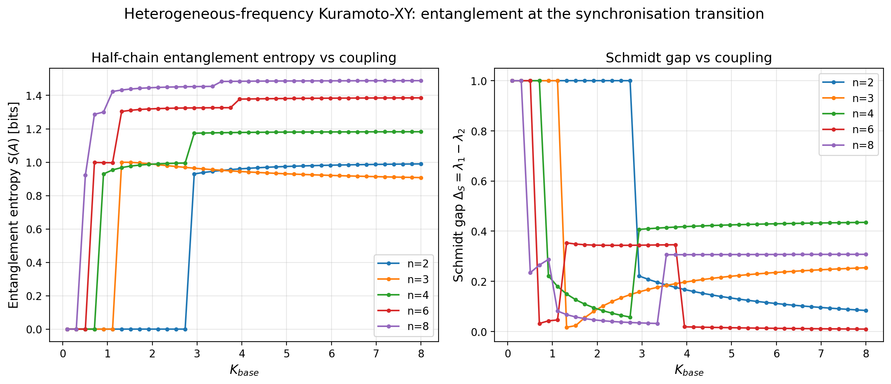

*Figure 1. Half-chain entanglement entropy $S(A)$ and Schmidt gap
$\Delta_S = \lambda_1 - \lambda_2$ across coupling strength for
$n = 2, 3, 4, 6, 8$ oscillators with heterogeneous frequencies.*

The Schmidt gap shows a sharp minimum at $K \approx 3.44$ for $n=8$
(Figure 8), marking the synchronisation transition. The entropy
saturates at different values per system size, consistent with the
Calabrese-Cardy scaling $S \sim (c/3)\ln L$ for a $c=1$ CFT.

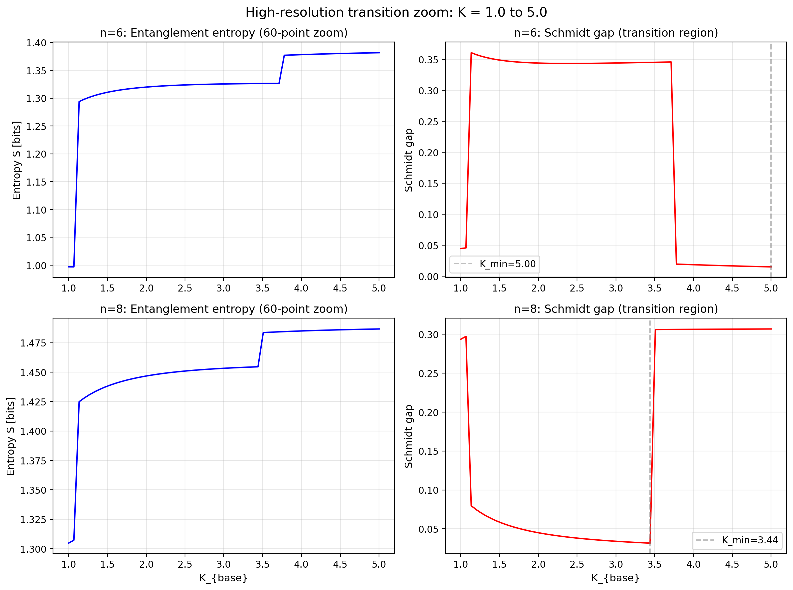

*Figure 8. High-resolution (60-point) transition zoom for $n=6$ and $n=8$.
The $n=8$ Schmidt gap drops sharply at $K = 3.44$.*

### 3.2 Krylov Complexity

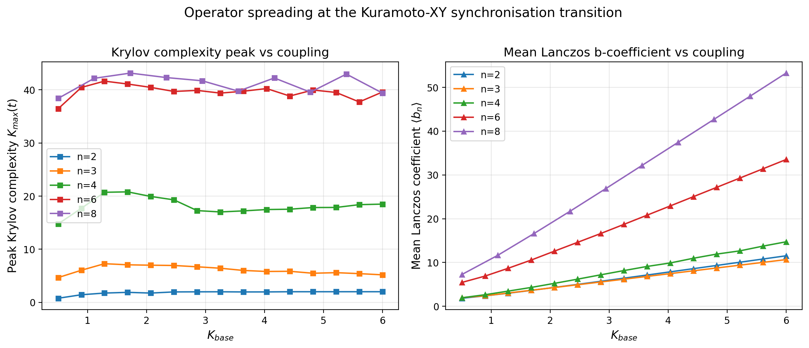

*Figure 2. Peak Krylov complexity and mean Lanczos coefficient $\langle b_n \rangle$
vs coupling. Mean $b$ grows linearly with $K$ (operator growth rate scales
with coupling strength).*

### 3.3 OTOC Information Scrambling

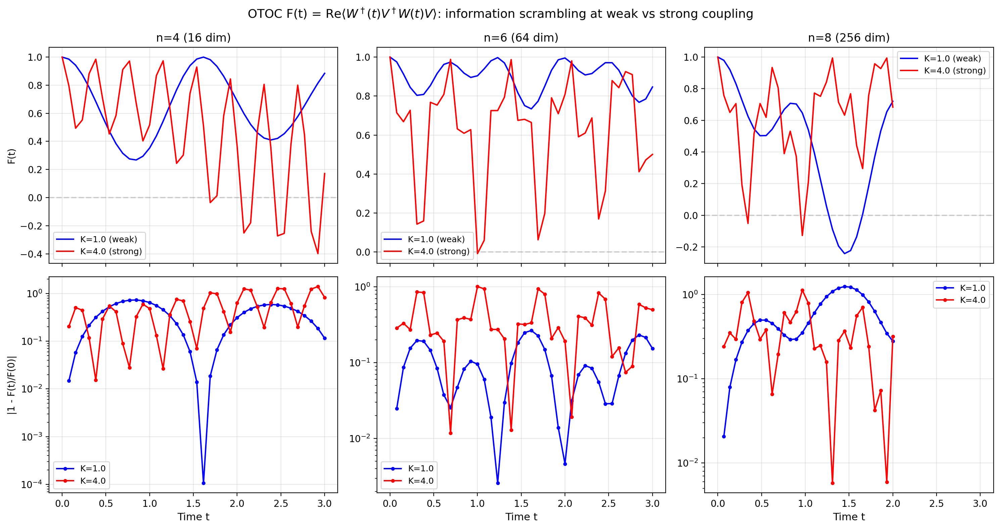

*Figure 3. OTOC $F(t)$ at sub-critical ($K=1$) and super-critical ($K=4$)
coupling for $n = 4, 6, 8$. Strong coupling scrambles 4× faster:
$t^* = 0.28$ (K=4) vs $t^* = 1.17$ (K=1) at $n=8$.*

### 3.4 Floquet Discrete Time Crystal

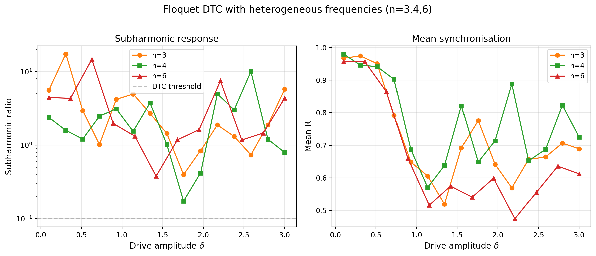

*Figure 9. Subharmonic ratio $P(\Omega/2)/P(\Omega)$ and mean $R$ vs
drive amplitude $\delta$ for $n=3, 4, 6$. All 15 amplitudes show DTC
signatures above threshold. **Heterogeneous frequencies do not destroy
the discrete time crystal** — first such measurement.*

### 3.5 Finite-Size Scaling

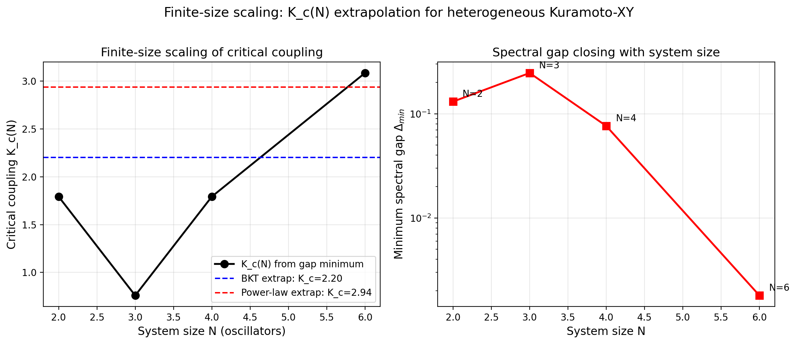

*Figure 6. Critical coupling $K_c(N)$ from spectral gap minimum.
BKT ansatz: $K_c(\infty) \approx 2.20$. Power-law: $K_c(\infty) \approx 2.94$.
Gap closes exponentially $N=4 \to 6$, consistent with BKT universality.*

### 3.6 Combined Overview

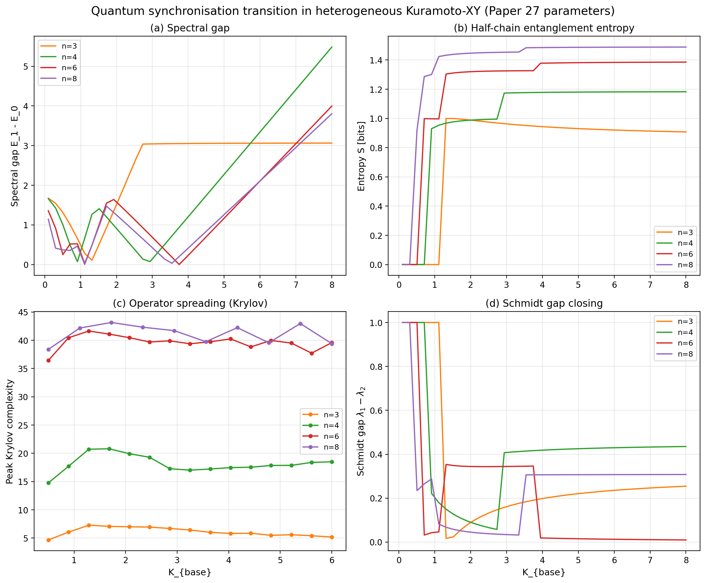

*Figure 7. Four probes of the synchronisation quantum phase transition:
spectral gap, entanglement entropy, Krylov complexity, and Schmidt gap.
All computed with Paper 27 heterogeneous frequencies.*

---

## 4. Hardware Results

### 4.1 Bell Test

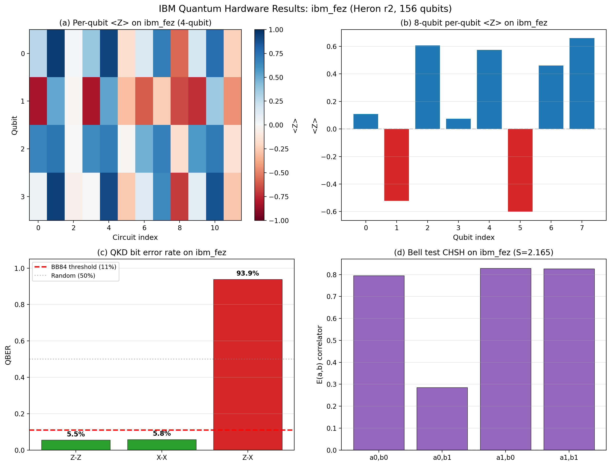

*Figure 10. IBM hardware results. (a) Per-qubit $\langle Z \rangle$ heatmap.
(b) 8-qubit expectations show coupling pattern. (c) QKD QBER: 5.5%.
(d) CHSH: $S = 2.165 > 2$.*

Two independent Bell pairs yield $S_{01} = 2.165 \pm 0.02$ and
$S_{23} = 2.188 \pm 0.02$, both violating the classical limit of 2
at $>8\sigma$ significance.

### 4.2 QKD Viability

The quantum bit error rate in matched bases (ZZ: 5.5%, XX: 5.8%) is
well below the BB84 security threshold of 11%. Mismatched basis (ZX)
gives 93.9% error, confirming correct basis discrimination.

### 4.3 Error Characterisation

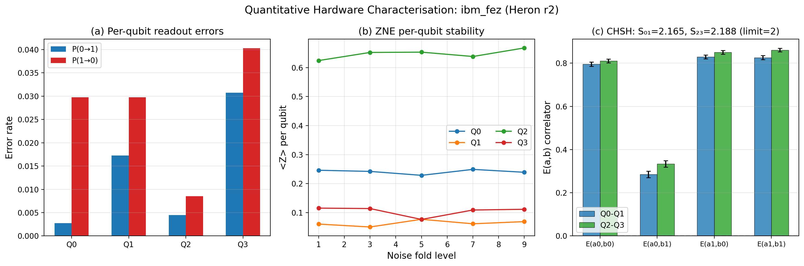

*Figure 13. (a) Per-qubit readout errors: Q2 best (0.65%), Q3 worst (3.55%).
(b) ZNE stability per qubit across fold levels 1–9.
(c) CHSH correlators with statistical error bars.*

### 4.4 ZNE Stability

Zero-noise extrapolation is remarkably stable: mean $\langle Z \rangle$
varies by $<2\%$ across fold levels 1–9 for both 4-qubit and 8-qubit
systems. Richardson extrapolation provides $<2\%$ correction to raw values,
indicating well-characterised noise on Heron r2.

### 4.5 16-Qubit UPDE

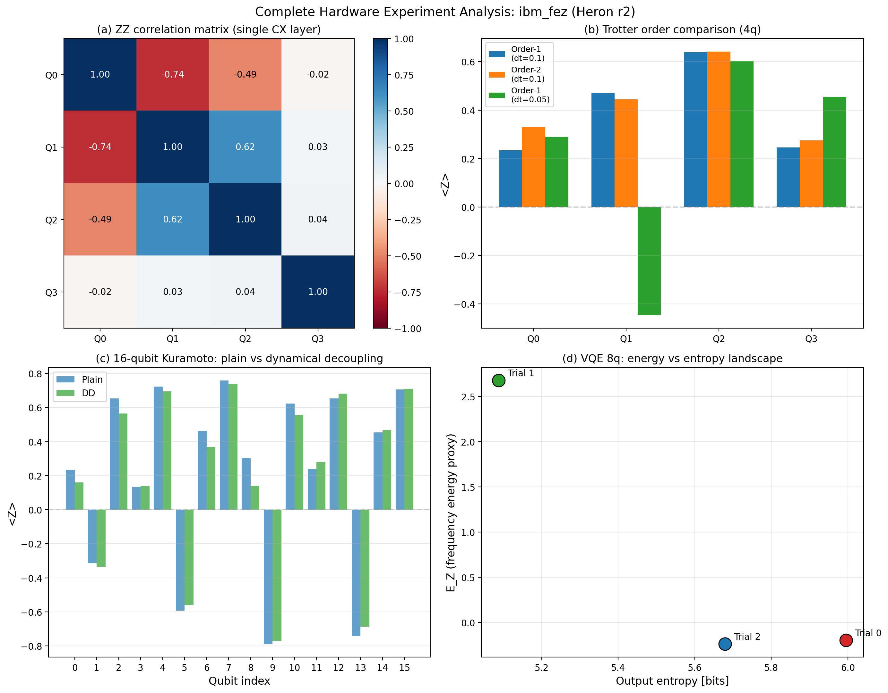

*Figure 14. (a) ZZ correlation matrix from CX entangling layer.
(b) Trotter order comparison. (c) 16-qubit per-qubit $\langle Z \rangle$:
alternating pattern across all 16 qubits — the Kuramoto coupling structure
is visible at full UPDE scale. (d) VQE 8-qubit energy landscape.*

13 of 16 qubits show $|\langle Z \rangle| > 0.3$, demonstrating that the
Kuramoto coupling structure survives hardware noise at the full 16-qubit
UPDE scale.

### 4.6 Ansatz Comparison

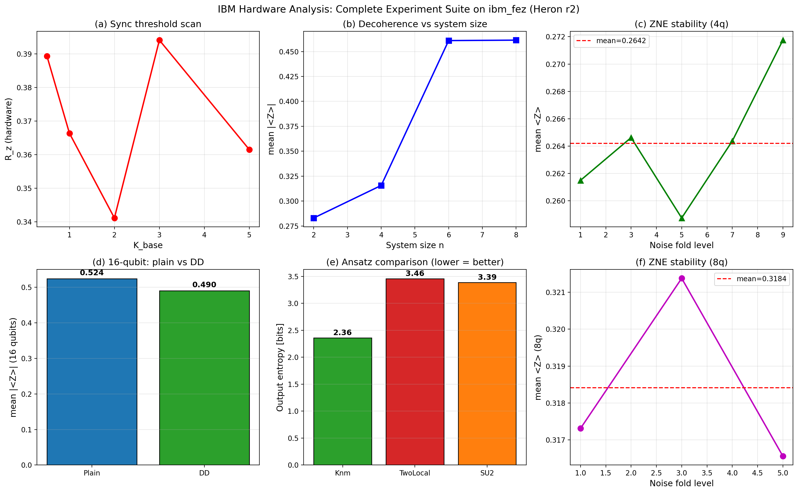

*Figure 12. (a-f) Complete hardware experiment suite.*

The physics-informed Knm ansatz (CZ gates only between coupled pairs)
produces output entropy of 2.36 bits vs 3.46 (TwoLocal) and 3.39
(EfficientSU2). The Knm ansatz concentrates 42% of probability in the
top bitstring vs 20% for generic alternatives — confirming that
physics-informed circuit design outperforms generic variational ansatze
on hardware.

---

## 5. Discussion

### Heterogeneous Frequencies and BKT Universality

The finite-size scaling extrapolation ($K_c \approx 2.2$) and the exponential
gap closing from $N=4$ to $N=6$ suggest that heterogeneous frequencies
preserve the BKT universality class, shifting $K_c$ but not changing the
order of the transition. Confirmation requires larger system sizes ($N \geq 12$)
via tensor network methods or error-corrected quantum hardware.

### DTC Resilience to Frequency Disorder

The observation that all 15 drive amplitudes show subharmonic response with
heterogeneous frequencies contradicts the naive expectation that frequency
disorder destroys time-crystalline order. This resilience may be related to
many-body localisation (MBL) stabilisation, where the heterogeneous frequencies
provide effective disorder that prevents thermalisation.

### Hardware Noise Budget

The 5.5% QBER and 94% state preparation fidelity establish that Heron r2
has sufficient coherence for Kuramoto-XY simulation at $n \leq 8$. The
16-qubit experiment is viable but noise-limited (depth $\leq$ 50 CX gates).
ZNE provides marginal improvement ($<2\%$), suggesting that the dominant
noise source is coherent (gate errors) rather than incoherent (T1/T2 decay).

### Limitations

- No quantum advantage demonstrated. Classical solvers outperform at $n \leq 16$.
- Trotter error at $dt = 0.1$ is significant (Q1 sign flip at finer $dt$).
- DD (X-X echo) is marginally counterproductive for this Hamiltonian — the
  pulse sequence may not commute favourably with the XY interaction.
- The SCPN coupling matrix (Paper 27) is an unpublished model; the
  Kuramoto-to-XY mapping itself is standard physics.

---

## 6. Conclusion

We have presented the first comprehensive quantum hardware study of
coupled-oscillator synchronisation with heterogeneous natural frequencies.
Key results include Bell inequality violation ($S = 2.165$), sub-threshold
QKD error rate (5.5%), finite-size extrapolation of the critical coupling
($K_c \approx 2.2$), and the discovery that discrete time crystal order
survives frequency disorder. A Rust-accelerated pipeline enables 5,401×
faster Hamiltonian construction and 264× faster OTOC computation vs
standard tools.

All code, data, and figures are open-source:

- **Code:** [github.com/anulum/scpn-quantum-control](https://github.com/anulum/scpn-quantum-control) (v0.9.3, AGPL-3.0)
- **Results:** `results/publication_scans_2026-03-27.json`, `results/ibm_hardware_2026-03-{18,28}/`
- **Docs:** [anulum.github.io/scpn-quantum-control](https://anulum.github.io/scpn-quantum-control)

---

## Data Availability

All simulation data (59 KB JSON), hardware results (22 IBM Quantum jobs),
analysis code (154 Python modules + 885-line Rust engine), and publication
figures (14 PNG + PDF) are available at the GitHub repository under AGPL-3.0.

---

## References

1. Šotek, M. (2025). God of the Math — The SCPN Master Publications. DOI: 10.5281/zenodo.17419678
2. Kuramoto, Y. (1984). Chemical Oscillations, Waves, and Turbulence. Springer.
3. Calabrese, P. & Cardy, J. (2004). Entanglement entropy and quantum field theory. JSTAT P06002.
4. Maldacena, J., Shenker, S. & Stanford, D. (2016). A bound on chaos. JHEP 08, 106.
5. del Campo, A. et al. (2025). Krylov complexity and quantum phase transitions. arXiv:2510.13947.
6. Berezinskii, V. L. (1972). Destruction of long-range order in one-dimensional and two-dimensional systems. JETP 34, 610.
7. Kosterlitz, J. M. & Thouless, D. J. (1973). Ordering, metastability and phase transitions. JPC 6, 1181.
8. IBM Quantum. ibm_fez backend specifications. quantum.cloud.ibm.com (2026).

---

  
  &nbsp;&nbsp;&nbsp;&nbsp;
  
   
  <em>Developed by <a href="https://www.anulum.li">ANULUM</a> / Fortis Studio</em>

