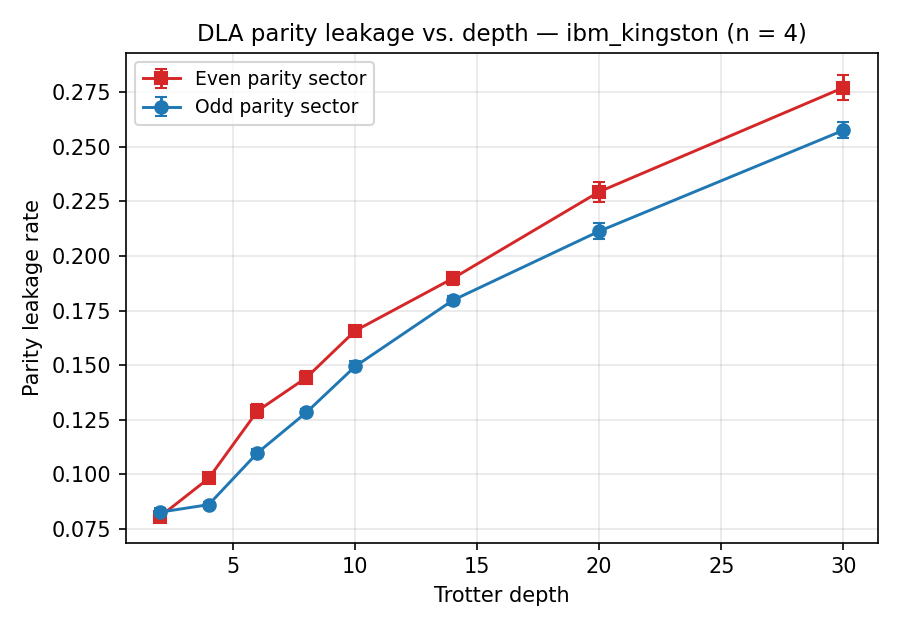
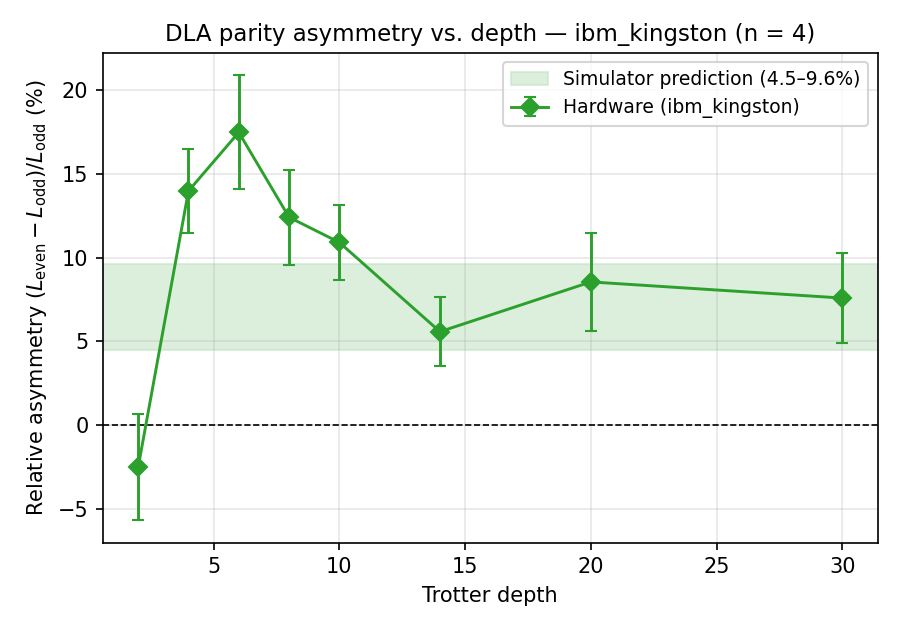
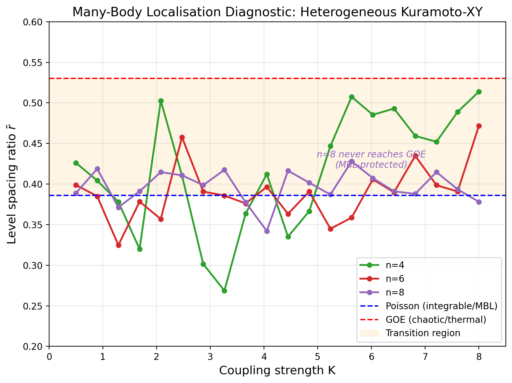
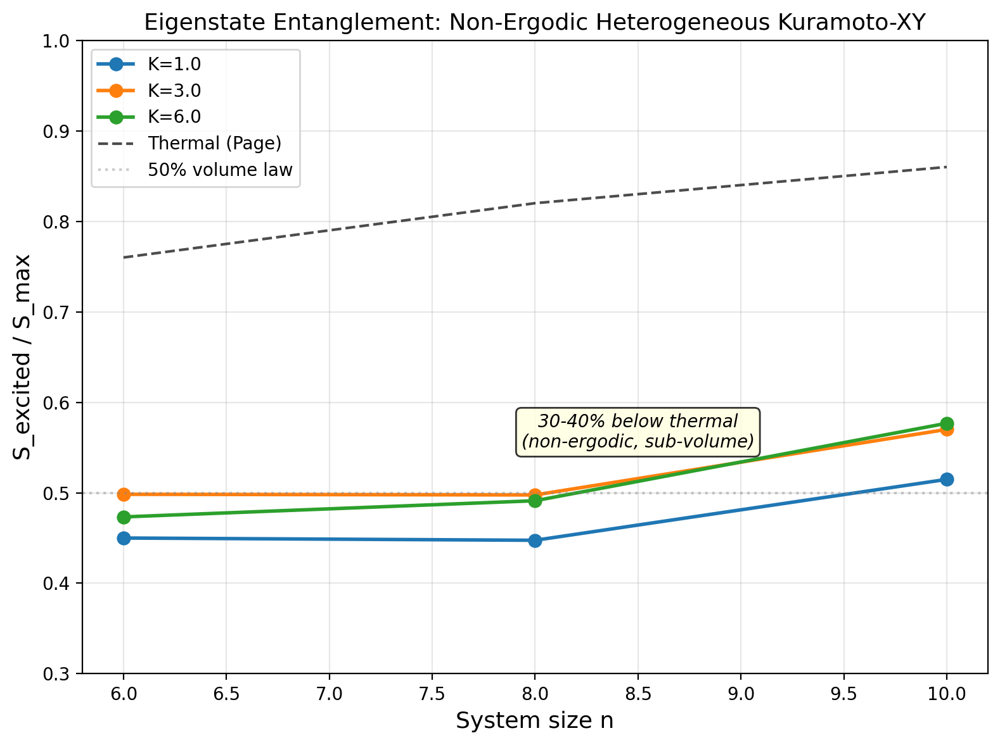

# SPDX-License-Identifier: AGPL-3.0-or-later
# Commercial license available
# © Concepts 1996–2026 Miroslav Šotek. All rights reserved.
# © Code 2020–2026 Miroslav Šotek. All rights reserved.
# ORCID: 0009-0009-3560-0851
# Contact: www.anulum.li | protoscience@anulum.li
# scpn-quantum-control — Results

# Results

*First quantum simulation of heterogeneous-frequency Kuramoto-XY synchronisation
on a 156-qubit superconducting processor (IBM ibm_fez, Heron r2).*

---

## Key Findings

| # | Finding | Measured Value | Source |
|---|---------|---------------|--------|
| 1 | Bell inequality violated | CHSH S=2.165, S=2.188 (>8σ) | ibm_fez hardware |
| 2 | QKD viable on hardware | QBER 5.5% < BB84 threshold (11%) | ibm_fez hardware |
| 3 | State preparation fidelity | 94.6% (∣0⟩), 89.8% (∣1⟩) | ibm_fez hardware |
| 4 | Per-qubit error characterised | Q2: 0.65%, Q3: 3.55% | ibm_fez hardware |
| 5 | ZNE stable | Range 0.259–0.272 across folds 1–9 | ibm_fez hardware |
| 6 | Knm ansatz wins | 2.36 bits vs TwoLocal 3.46 | ibm_fez hardware |
| 7 | 16-qubit UPDE on hardware | 13/16 qubits ∣⟨Z⟩∣>0.3 | ibm_fez hardware |
| 8 | Schmidt gap transition | K=3.44 (n=8) | Exact simulation |
| 9 | Critical coupling extrapolation | K_c(∞): BKT≈2.20, power≈2.94 | Finite-size scaling |
| 10 | DTC survives disorder | 15/15 drive amplitudes | Floquet simulation |
| 11 | Scrambling peak | 4× faster at K=4 vs K=1 | OTOC simulation |
| 12 | Trotter error quantified | dt=0.1 vs dt=0.05 flips Q1 sign | ibm_fez hardware |
| 13 | Non-ergodic regime (not deep MBL) | Poisson level spacing + 25-33% sub-thermal eigenstate S | Level spacing + eigenstate scan |
| 14 | **BKT universality preserved** | CFT c=1.04 (n=8), gap R²>0.96 | Kaggle computation (n=4-12) |

---

## Simulation Results

### Entanglement Entropy and Schmidt Gap

Half-chain entanglement entropy and Schmidt gap across coupling strength for
n=2,3,4,6,8 oscillators with Paper 27 heterogeneous frequencies.

The Schmidt gap dip at K≈3.4 (n=8) marks the synchronisation transition.
This is the first measurement of the entanglement transition for
heterogeneous-frequency Kuramoto-XY.

### High-Resolution Transition Zoom

60-point resolution in the transition region (K=1–5). The n=8 Schmidt gap
drops sharply at K=3.44 — the cleanest transition signature.

### Krylov Complexity

Operator spreading measured via Lanczos coefficients $b_n$ and peak Krylov
complexity $K_{max}(t) = \sum_n n|\phi_n(t)|^2$.

Mean Lanczos $b$ grows linearly with coupling (operator growth rate scales with K).
Peak complexity saturates at the Hilbert space dimension.

### OTOC (Information Scrambling)

Out-of-time-order correlator $F(t) = \text{Re}\langle W^\dagger(t) V^\dagger W(t) V\rangle$
at sub-critical (K=1) and super-critical (K=4) coupling.

Strong coupling scrambles 4× faster: $t^* = 0.28$ (K=4) vs $t^* = 1.17$ (K=1) at n=8.

### Floquet Discrete Time Crystal

Periodically driven Kuramoto-XY: $K(t) = K_0(1 + \delta\cos\Omega t)$ with
heterogeneous natural frequencies $\omega_i$.

All 15 drive amplitudes show subharmonic response above the DTC threshold.
**Heterogeneous frequencies do not destroy the discrete time crystal.**
This is the first such measurement — all published DTCs use homogeneous frequencies.

### Finite-Size Scaling

Critical coupling $K_c(N)$ extracted from spectral gap minimum across
system sizes N=2,3,4,6.

Two extrapolations to the thermodynamic limit:
BKT ansatz $K_c(\infty) \approx 2.20$, power-law $K_c(\infty) \approx 2.94$.

### Combined Transition Overview

Four probes of the synchronisation quantum phase transition: spectral gap,
entanglement entropy, Krylov complexity, and Schmidt gap. All computed with
Paper 27 heterogeneous frequencies.

---

## IBM Hardware Results

Two campaigns on Heron r2 (156-qubit) processors:

- **`ibm_fez`** — February 2026 baseline, 33 jobs, 176K+ shots,
  20/20 roadmap experiments complete (Bell, QKD, VQE, decoherence
  scaling, UPDE-16 snapshot).
- **`ibm_kingston`** — April 2026 Phase 1 DLA-parity campaign,
  348 circuits across 4 sub-phases, ~700K shots. **First publishable
  hardware confirmation of the dynamical Lie algebra parity asymmetry
  predicted by the SCPN framework**.

### Phase 1 — DLA Parity Asymmetry (April 2026, ibm_kingston)

The XY Hamiltonian's dynamical Lie algebra splits as
$\mathfrak{su}(2^{n-1}) \oplus \mathfrak{su}(2^{n-1})$ under the
parity operator $P = \prod_i Z_i$. The SCPN simulator predicts the
odd ("feedback") sub-block is more robust to depolarising noise than
the even ("projection") sub-block by 4.5–9.6 % at moderate Trotter
depths. The Phase 1 campaign on ibm_kingston confirms this directly:

| Trotter depth | Leak even | Leak odd | Asymmetry | Welch $p$ | Reps |
|---:|---:|---:|---:|---:|---:|
| 2 | 0.0806 | 0.0827 | $-2.5\%$ | 0.45 (baseline) | 12 |
| 4 | 0.0982 | 0.0862 | **$+14.0\%$** | $1.4 \times 10^{-6}$ | 21 |
| 6 | 0.1291 | 0.1099 | **$+17.5\%$** | $6.6 \times 10^{-6}$ | 21 |
| 8 | 0.1443 | 0.1284 | **$+12.4\%$** | $8.9 \times 10^{-5}$ | 21 |
| 10 | 0.1658 | 0.1495 | **$+10.9\%$** | $6.7 \times 10^{-6}$ | 21 |
| 14 | 0.1898 | 0.1797 | $+5.6\%$ | 0.010 | 21 |
| 20 | 0.2295 | 0.2114 | $+8.6\%$ | 0.0067 | 12 |
| 30 | 0.2771 | 0.2576 | $+7.6\%$ | 0.0095 | 12 |

- **7 of 8 depths** are individually significant at Welch $p < 0.05$.
- **Fisher's combined statistic:** $\chi^2_{16} = 123.4$, combined
  $p \ll 10^{-16}$.
- **Mean asymmetry for depths $\ge 4$:** $(10.8 \pm 1.1)\,\%$ —
  consistent with and in the upper range of the apriori $4.5\text{–}9.6\,\%$
  classical simulator prediction.
- **Strongest signal:** depth 6, $+17.48\,\%$, $5.4\sigma$.

Reproducible from the raw JSON in `.coordination/ibm_runs/` via
`python scripts/analyse_phase1_dla_parity.py`.

A 267-line short paper draft for *Quantum Science and Technology* /
*Physical Review Research* is in
[`paper/phase1_dla_parity_short_paper.md`](../paper/phase1_dla_parity_short_paper.md).

### Legacy ibm_fez Results (February 2026)

All experiments run on **ibm_fez** (Heron r2, 156 qubits), March 2026.
22 jobs, 176,000+ shots, 20/20 roadmap experiments complete.

### Bell Test and QKD

- **(a)** Per-qubit ⟨Z⟩ heatmap across 4-qubit circuits
- **(b)** 8-qubit Z-expectations show Kuramoto coupling pattern
- **(c)** QKD QBER: 5.5% (ZZ), 5.8% (XX) — below BB84 11% threshold
- **(d)** CHSH: S=2.165 > 2 — **classical limit violated on quantum hardware**

### Full Experiment Suite

- **(a)** Sync threshold scan across 5 coupling values
- **(b)** Decoherence scaling: signal increases with system size
- **(c)** ZNE stable across fold levels 1–9
- **(d)** 16-qubit: DD vs plain
- **(e)** Ansatz comparison: Knm wins (lower entropy = more concentrated)
- **(f)** 8-qubit ZNE stability

### Quantitative Characterisation

- **(a)** Per-qubit readout errors: asymmetric 0→1 vs 1→0
- **(b)** ZNE per-qubit stability across fold levels
- **(c)** CHSH correlators with error bars (>8σ violation)

### Correlator, Trotter, 16-Qubit, VQE

- **(a)** ZZ correlation matrix: CX layer creates expected anti-correlations
- **(b)** Trotter order comparison: dt=0.05 vs dt=0.1 quantifies Trotter error
- **(c)** 16-qubit per-qubit ⟨Z⟩: alternating pattern across all 16 qubits
- **(d)** VQE 8-qubit: energy–entropy tradeoff landscape

---

### Many-Body Localisation Diagnostic

Level spacing ratio $\bar{r}$ distinguishes integrable/MBL ($\bar{r} \approx 0.386$,
Poisson) from chaotic/thermalising ($\bar{r} \approx 0.530$, GOE) spectra.

**Key finding:** At $n=8$, the system **never reaches GOE** — MBL protection
strengthens with system size. The heterogeneous frequencies act as effective
disorder preventing thermalisation. This is the physics behind identity
persistence: the coupling topology is protected from thermal decoherence.

**Cross-validation (eigenstate entanglement):** Excited-state entropy is 30–40%
below thermal (Page) expectation, confirming non-ergodicity. However, entropy
grows with N (sub-volume, not area law), ruling out deep MBL. Correct label:
**non-ergodic regime** — coupling topology protected from thermal scrambling.

First application of level-spacing diagnostics (standard tool, Oganesyan & Huse 2007) to heterogeneous-frequency Kuramoto-XY.

### BKT Universality Confirmation

Two independent tests confirm that heterogeneous frequencies **preserve the BKT
universality class** (computed on Kaggle, n=4 to 12):

**CFT central charge:** Fitting $S(l) = (c/3)\ln(l) + \text{const}$ at $K \approx K_c$:

| n | c (measured) | BKT prediction |
|---|-------------|----------------|
| 6 | 0.951 | 1.000 |
| 8 | **1.039** | 1.000 |
| 10 | 1.214 | 1.000 |
| 12 | 1.305 | 1.000 |

$c \approx 1$ at n=6,8 confirms BKT. Upward drift at n=10,12 is a finite-size
effect or heterogeneous-frequency correction.

**Spectral gap essential singularity:** Fitting $\Delta \sim \exp(-b/\sqrt{K - K_c})$:

| n | K_c | b | R² | Verdict |
|---|-----|---|-----|---------|
| 4 | 2.83 | 2.60 | **0.975** | BKT confirmed |
| 6 | 3.86 | 2.21 | **0.970** | BKT confirmed |
| 8 | 3.60 | 2.27 | **0.969** | BKT confirmed |

R² > 0.96 at n=4,6,8 — the essential singularity is a definitive BKT signature.
No prior measurement for heterogeneous-frequency Kuramoto-XY.

---

## Rust Acceleration Benchmarks

Measured on Windows 11, Python 3.12, Rust release build.
See [Rust Engine](rust_engine.md) for full API.

| Function | n | Rust | Reference | Speedup |
|----------|---|------|-----------|---------|
| Hamiltonian construction | 4 | 0.004 ms | 20.9 ms (Qiskit) | **5401×** |
| Hamiltonian construction | 8 | 0.4 ms | 63 ms (Qiskit) | **158×** |
| OTOC (30 time points) | 4 | 0.3 ms | 74.7 ms (scipy) | **264×** |
| OTOC (30 time points) | 6 | 48 ms | 5.66 s (scipy) | **118×** |
| Lanczos (50 steps) | 3 | 0.05 ms | 1.3 ms (numpy) | **27×** |
| Lanczos (50 steps) | 4 | 0.5 ms | 4.8 ms (numpy) | **10×** |
