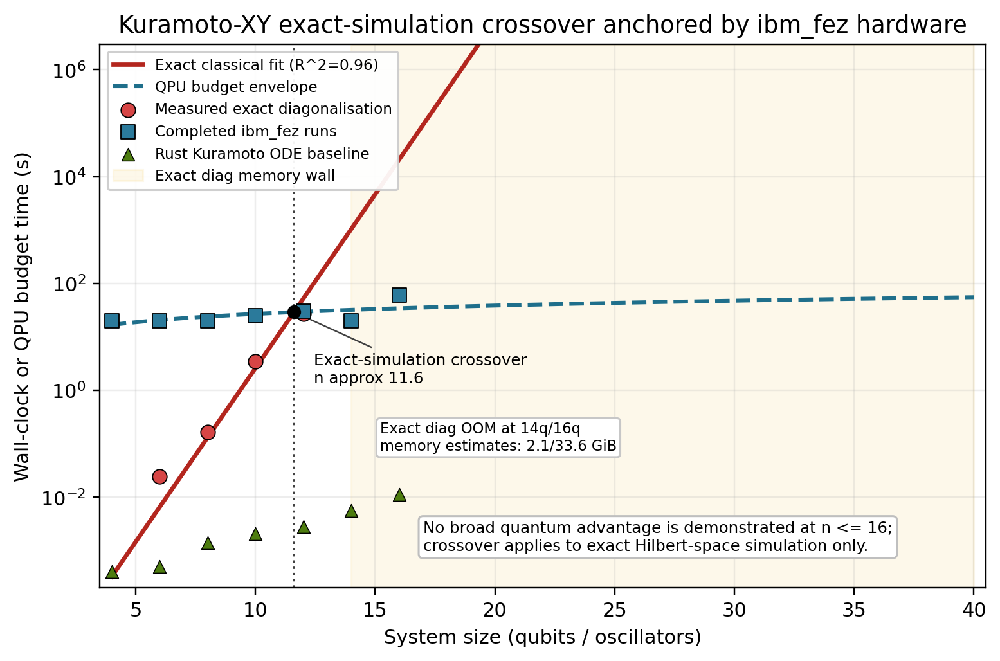

# Results

*Kuramoto-XY simulator, compiler, and hardware-evidence ledger for
heterogeneous-frequency coupled oscillators.*

For source classification and campaign provenance, see the dated
[Hardware Status Ledger](hardware_status_ledger.md). This page is a gallery and
technical summary; the ledger is the canonical index for whether a result is
theoretical, simulated, hardware-measured, mitigated, or noise-limited.

## Status Snapshot — 2026-05-05

| Area | Public status |
|---|---|
| Promoted hardware campaigns | April 2026 `ibm_kingston` Phase 1 DLA parity raw-count dataset; May 2026 `ibm_kingston` Phase 2 A+G `n=4` replication and B-C `n=6,8` mixed scaling raw-count datasets; legacy artefact-backed `ibm_fez` baseline rows. |
| Simulator-only families | BKT scaling, OTOC, Floquet DTC, MBL/eigenstate scans, FIM, and classical wall-time baselines unless a hardware artefact is named. |
| Pending / quarantined IBM batches | V2, frontier, queued-job, placeholder, aggregate-only IBM outputs, Phase 2 D-E larger scaling, Phase 2 F/GUESS mitigation, and multi-device replication are not promoted here until raw counts, retrieval manifests, and analysis scripts are reviewed and committed. |
| Canonical status source | [Hardware Status Ledger](hardware_status_ledger.md). |

---

## Key Findings

| # | Finding | Measured Value | Source |
|---|---------|---------------|--------|
| 1 | DLA parity raw-count reproduction | Phase 1: 342 circuits, peak asymmetry +17.48% at depth 6; Phase 2 reduced A+G: 612 circuits, Fisher p=3.77e-20; Phase 2 B-C: mixed `n=6,8` scaling | `data/phase1_dla_parity/`, `data/phase2_dla_parity/`, `data/phase2_scaling_bc/`, `scripts/run_dla_parity_suite.py`, `scripts/analyse_phase2_dla_parity.py`, `scripts/analyse_phase2_scaling_bc.py` |
| 2 | Bell inequality row | CHSH S = 2.165 ± 0.022 (7.5σ, pair q0–q1); S = 2.188 ± 0.021 (8.9σ, pair q2–q3) \[corrected 2026-07-16\] | Legacy `ibm_fez` artefact row |
| 3 | QKD row | QBER 5.5% < BB84 threshold (11%) \[caveat 2026-07-16: not independently derivable — see amendment below\] | Legacy `ibm_fez` artefact row |
| 4 | State preparation row | 94.6% (∣0⟩), 89.8% (∣1⟩) | Legacy `ibm_fez` artefact row |
| 5 | ZNE row | Range 0.259–0.272 across folds 1–9 | Legacy `ibm_fez` artefact row |
| 6 | Knm ansatz row | 2.36 bits vs TwoLocal 3.46 | Legacy `ibm_fez` artefact row |
| 7 | 16-qubit UPDE row | 13/16 qubits ∣⟨Z⟩∣>0.3 | Legacy `ibm_fez` artefact row |
| 8 | Schmidt gap transition | K=3.44 (n=8) | Exact simulation |
| 9 | Critical coupling extrapolation | K_c(∞): BKT≈2.20, power≈2.94 | Finite-size scaling |
| 10 | DTC survives disorder | 15/15 drive amplitudes | Floquet simulation |
| 11 | Scrambling peak | 4× faster at K=4 vs K=1 | OTOC simulation |
| 12 | Trotter error row | dt=0.1 vs dt=0.05 flips Q1 sign | Legacy `ibm_fez` artefact row |
| 13 | Non-ergodic regime (not deep MBL) | Poisson level spacing + 25-33% sub-thermal eigenstate S | Level spacing + eigenstate scan |
| 14 | **BKT universality preserved** | CFT c=1.04 (n=8), gap R²>0.96 | Kaggle computation (n=4-12) |
| 15 | Exact-simulation crossover | n≈11.6, exact Hilbert-space only | Classical baselines plus hardware-budget estimates; not broad advantage |

> **Amendment (2026-07-16), Bell row:** the repository previously stated the
> CHSH violation as ">8σ" for both pairs. Recomputation from the committed
> raw counts (`scripts/recompute_chsh_bell_test.py`, pure arithmetic on
> `results/ibm_hardware_2026-03-28/bell_test_4q.json`) gives 7.54σ for the
> S = 2.165 pair (q0–q1) and 8.94σ for the S = 2.188 pair (q2–q3); only the
> higher pair clears 8σ. The same recomputation shows the second analyser
> setting is anomalous on this run (E ≈ +0.29/+0.33 against ≈0.80–0.86 for
> the other three settings), which the original analysis did not flag; a
> re-run with readout mitigation is planned before this artefact's headline
> numbers are used further
> (`docs/campaigns/bell_rerun_mitigated_prereg_2026-07-16.md`).
>
> **Resolution (2026-07-16), preregistered Bell re-run executed:** the
> mitigated re-run (`ibm_fez`, job in
> `data/bell_rerun_mitigated/bell_rerun_raw_counts_ibm_fez_20260716T230841Z.json`,
> per-setting transpiled circuits on two canonical Bell pairs, full-basis
> readout calibration, 40 IBM usage seconds) does NOT reproduce the March
> anomaly: the second analyser setting reads E₁ = −0.690 (pair q0–q1) and
> E₁ = −0.650 (pair q2–q3) — correct sign and near-band magnitude, against
> the March artefact's sign-flipped E ≈ +0.29/+0.33. Per pair and per the
> preregistered decision rule: on q0–q1 the mitigated setting-1 magnitude
> lies inside the other settings' band (anomaly class explained as a
> readout/transpilation artefact of the original run); on q2–q3 a small
> residual asymmetry remains (mitigated |E₁| = 0.667 against a 0.692–0.698
> band) and is documented as a property of the executed setting. Re-run
> values, stated per pair with exact σ: S = 2.6953 ± 0.0231 (q0–q1) and
> S = 2.6807 ± 0.0232 (q2–q3) unmitigated; 2.7517 and 2.7510 with
> full-basis readout mitigation. The March record itself stays as
> published; this is a new dated record
> (`docs/campaigns/bell_rerun_mitigated_prereg_2026-07-16.md`, analysis in
> `data/bell_rerun_mitigated/bell_rerun_analysis_ibm_fez_20260716T230841Z.json`).

> **Amendment (2026-07-16), QKD row:** the committed
> `results/ibm_hardware_2026-03-28/qkd_qber_4q.json` artefact carries no
> per-shot basis labels, so the published QBER of 5.5% cannot be
> independently re-derived from the raw counts alone (verified 2026-07-16).
> The value stands as reported by the original analysis pipeline; a
> derivation script plus basis metadata (or a re-run capturing them) is
> required before this row is used beyond its legacy-artefact status.
>
> **Follow-up (2026-07-17), preregistered re-run executed:** a
> matched-basis re-run on two fresh Bell pairs with the basis of every pub
> committed in the pack (`ibm_fez`, job `d9cosfcjeosc73fgikgg`, 38 usage
> seconds; preregistration
> `docs/campaigns/qkd_qber_basis_metadata_prereg_2026-07-17.md`, hash-bound
> pack in `data/qkd_qber_basis_metadata/`) measures matched-basis mismatch
> rates of 1.39%/2.71% (ZZ, pairs q0–q1/q2–q3) and 1.68%/3.00% (XX) raw,
> falling to 0.51%/1.09% and 0.74%/1.33% with full-basis readout
> mitigation (binomial σ 0.18–0.27%). A committed pure-arithmetic naive
> sift of the March counts under explicitly assumed pub bases gives
> 1.95–3.70%. The new mitigated rates fall BELOW that band (the
> preregistered decision rule fired its outside-band branch downwards),
> and everything measured sits far below the published 5.5%/5.8%. The
> non-derivability caveat above STANDS: the published values remain
> unsupported by artefact-derivable arithmetic, this dated record is the
> citable matched-basis error rate, and no QKD security, key-rate, or
> viability claim follows from it (fixed per-pub bases, no per-shot
> randomness, no sifting protocol).

---

## Simulation Results

### Entanglement Entropy and Schmidt Gap

Half-chain entanglement entropy and Schmidt gap across coupling strength for
n=2,3,4,6,8 oscillators with Paper 27 heterogeneous frequencies.

The Schmidt gap dip at K≈3.4 (n=8) marks the synchronisation transition.
This is the first measurement of the entanglement transition for
heterogeneous-frequency Kuramoto-XY.

### High-Resolution Transition Zoom

60-point resolution in the transition region (K=1–5). The n=8 Schmidt gap
drops sharply at K=3.44 — the cleanest transition signature.

### Krylov Complexity

Operator spreading measured via Lanczos coefficients $b_n$ and peak Krylov
complexity $K_{max}(t) = \sum_n n|\phi_n(t)|^2$.

Mean Lanczos $b$ grows linearly with coupling (operator growth rate scales with K).
Peak complexity saturates at the Hilbert space dimension.

### OTOC (Information Scrambling)

Out-of-time-order correlator $F(t) = \text{Re}\langle W^\dagger(t) V^\dagger W(t) V\rangle$
at sub-critical (K=1) and super-critical (K=4) coupling.

Strong coupling scrambles 4× faster: $t^* = 0.28$ (K=4) vs $t^* = 1.17$ (K=1) at n=8.

### Floquet Discrete Time Crystal

Periodically driven Kuramoto-XY: $K(t) = K_0(1 + \delta\cos\Omega t)$ with
heterogeneous natural frequencies $\omega_i$.

All 15 drive amplitudes show subharmonic response above the DTC threshold.
**Heterogeneous frequencies do not destroy the discrete time crystal.**
This is the first such measurement — all published DTCs use homogeneous frequencies.

### Finite-Size Scaling

Critical coupling $K_c(N)$ extracted from spectral gap minimum across
system sizes N=2,3,4,6.

Two extrapolations to the thermodynamic limit:
BKT ansatz $K_c(\infty) \approx 2.20$, power-law $K_c(\infty) \approx 2.94$.

### Combined Transition Overview

Four probes of the synchronisation quantum phase transition: spectral gap,
entanglement entropy, Krylov complexity, and Schmidt gap. All computed with
Paper 27 heterogeneous frequencies.

---

## IBM Hardware Results

Two campaigns on Heron r2 (156-qubit) processors:

- **`ibm_fez`** — legacy March 2026 baseline artefacts. Values may be quoted
  only with their committed artefact path and should not be used as broad
  advantage or frontier validation.
- **`ibm_kingston`** — April 2026 Phase 1 DLA-parity campaign,
  342 circuits across 4 sub-phases. This is the promoted raw-count hardware
  dataset because the counts, job IDs, integrity checks, and reproduction
  harness are committed.

### Phase 1 — DLA Parity Asymmetry (April 2026, ibm_kingston)

The XY Hamiltonian's dynamical Lie algebra splits as
$\mathfrak{su}(2^{n-1}) \oplus \mathfrak{su}(2^{n-1})$ under the
parity operator $P = \prod_i Z_i$. The SCPN simulator predicts the
odd ("feedback") sub-block is more robust to depolarising noise than
the even ("projection") sub-block by 4.5–9.6 % at moderate Trotter
depths. The Phase 1 campaign on ibm_kingston reproduces this from committed
raw counts:

| Trotter depth | Leak even | Leak odd | Asymmetry | Welch $p$ | Reps |
|---:|---:|---:|---:|---:|---:|
| 2 | 0.0806 | 0.0827 | $-2.5\%$ | 0.45 (baseline) | 12 |
| 4 | 0.0982 | 0.0862 | **$+14.0\%$** | $1.4 \times 10^{-6}$ | 21 |
| 6 | 0.1291 | 0.1099 | **$+17.5\%$** | $6.6 \times 10^{-6}$ | 21 |
| 8 | 0.1443 | 0.1284 | **$+12.4\%$** | $8.9 \times 10^{-5}$ | 21 |
| 10 | 0.1658 | 0.1495 | **$+10.9\%$** | $6.7 \times 10^{-6}$ | 21 |
| 14 | 0.1898 | 0.1797 | $+5.6\%$ | 0.010 | 21 |
| 20 | 0.2295 | 0.2114 | $+8.6\%$ | 0.0067 | 12 |
| 30 | 0.2771 | 0.2576 | $+7.6\%$ | 0.0095 | 12 |

- **7 of 8 depths** are individually significant at Welch $p < 0.05$.
- **Fisher's combined statistic:** $\chi^2_{16} = 123.4$, combined
  $p \ll 10^{-16}$.
- **Mean asymmetry for depths $\ge 4$:** $(10.8 \pm 1.1)\,\%$ —
  consistent with and in the upper range of the apriori $4.5\text{–}9.6\,\%$
  classical simulator prediction.
- **Strongest signal:** depth 6, $+17.48\,\%$, $5.4\sigma$.

Reproducible from the raw JSON in `data/phase1_dla_parity/` via
`python scripts/analyse_phase1_dla_parity.py`.

A 267-line short paper draft for *Quantum Science and Technology* /
*Physical Review Research* is in
[`paper/submissions/submission_002_phase1_dla_parity/phase1_dla_parity_short_paper.md`](https://github.com/anulum/scpn-quantum-control/blob/main/paper/submissions/submission_002_phase1_dla_parity/phase1_dla_parity_short_paper.md).

### Phase 2 — Reduced A+G Replication (May 2026, ibm_kingston)

The reduced Phase 2 run repeated the `n=4` DLA parity test with 30 reps per
depth/sector at 4096 shots, plus a same-run readout baseline. Blocks B-F
(`n=6-12` scaling and GUESS calibration) were not submitted.

| Trotter depth | Leak even | Leak odd | Asymmetry | Welch p |
|---:|---:|---:|---:|---:|
| 2 | 0.08370 | 0.08247 | +1.49% | 0.278 |
| 4 | 0.12009 | 0.11053 | +8.65% | 1.56e-08 |
| 6 | 0.15296 | 0.14659 | +4.35% | 1.94e-04 |
| 8 | 0.17339 | 0.16879 | +2.72% | 0.00352 |
| 10 | 0.19599 | 0.18761 | +4.47% | 9.64e-07 |
| 14 | 0.23883 | 0.22912 | +4.24% | 6.14e-06 |
| 20 | 0.28904 | 0.28035 | +3.10% | 2.59e-05 |
| 30 | 0.34557 | 0.34524 | +0.10% | 0.857 |
| 40 | 0.38906 | 0.38868 | +0.10% | 0.855 |
| 50 | 0.42153 | 0.42188 | -0.08% | 0.857 |

- **Fisher's combined statistic:** chi2 `140.671952`, p `3.773718e-20`.
- **Significant depths:** 6/10 at Welch p < 0.05.
- **Readout baseline:** 12/12 circuits complete at 8192 shots, with state
  retention from 95.0% to 99.2%.

Reproduce from raw counts via
`PYTHONDONTWRITEBYTECODE=1 /home/anulum/.local/bin/python scripts/analyse_phase2_dla_parity.py --verify-integrity`.

### Phase 2 — B-C Scaling Continuation (May 2026, ibm_kingston)

The B-C continuation tested only `n=6` and `n=8`; blocks A, D, E, F, and G were
skipped. The same-day A+G readout baseline remains the readout-control source.

| n | Trotter depth | Leak even | Leak odd | Asymmetry | Welch p |
|---:|---:|---:|---:|---:|---:|
| 6 | 4 | 0.20653 | 0.20592 | +0.30% | 0.757 |
| 6 | 8 | 0.27606 | 0.28678 | -3.74% | 8.37e-07 |
| 6 | 14 | 0.35409 | 0.35586 | -0.50% | 0.407 |
| 6 | 20 | 0.40681 | 0.41484 | -1.94% | 3.05e-04 |
| 8 | 4 | 0.26626 | 0.25768 | +3.33% | 8.35e-04 |
| 8 | 8 | 0.37186 | 0.36606 | +1.58% | 0.0231 |
| 8 | 14 | 0.44863 | 0.44276 | +1.33% | 0.0252 |
| 8 | 20 | 0.43387 | 0.43333 | +0.12% | 0.842 |

- `n=6`: Fisher chi2 `46.531552`, p `1.883218e-07`, 2/4 significant depths.
- `n=8`: Fisher chi2 `29.420107`, p `2.675193e-04`, 3/4 significant depths.
- IBM-reported usage: `305` quantum seconds for job `ibm-run-1f46ebd0da8912ff`.

Interpretation: this is mixed scaling evidence. The `n=8` middle-depth sign is
positive, but `n=6` has negative significant depths. It falsifies a simple
monotone scaling story and must not be cited as broad scaling validation.

Reproduce from raw counts via
`PYTHONDONTWRITEBYTECODE=1 /home/anulum/.local/bin/python scripts/analyse_phase2_scaling_bc.py data/phase2_scaling_bc/phase2_scaling_bc_2026-05-05T124722Z.json --sha256 f9718c3789329dbaa96a1667f8a581e3d1774632b961a1760c044138ccab6550`.

### Phase 2 Publication Package

The release-ready Phase 2 manifest is
[`docs/publication/publication_phase2_package_2026-05-05.md`](publication/publication_phase2_package_2026-05-05.md).
It indexes the promoted raw-count files, integrity hashes, job IDs, figure
artefacts, reproduction commands, and claim boundaries.

The excitation-count confound control is preregistered in
[`docs/campaigns/ibm_popcount_control_manifest_2026-05-05.md`](campaigns/ibm_popcount_control_manifest_2026-05-05.md).
It has now been executed and promoted under
`data/phase2_popcount_control/`. The control shows that the original middle-depth
contrast survives, but same-popcount within-sector swaps are also significant
and the popcount-3 odd arm generally leaks more than the popcount-2 even arm.
The paper should therefore use the conservative wording `parity-sector and
excitation-number correlated leakage asymmetry`, not `DLA parity alone`.

### Phase 2 — Popcount-Control Follow-up (May 2026, ibm_kingston)

The popcount-control run tested the main excitation-count confound in the `n=4`
DLA parity protocol. It used 360 parity-leakage circuits and 5 readout circuits.

| Comparison | Fisher chi2 | Fisher p | Significant depths | Interpretation |
|---|---:|---:|---:|---|
| E0 `0011` minus O0 `0001` | 127.260593 | 2.186677e-21 | 4/6 | Original contrast persists at middle depths but reverses at depth 20. |
| E0 `0011` minus E1 `0101` | 117.374982 | 2.059878e-19 | 5/6 | Within-even same-popcount state spread is large. |
| O0 `0001` minus O1 `0010` | 90.150466 | 4.617056e-14 | 4/6 | Within-odd same-popcount state spread is large. |
| E0 `0011` minus O3 `0111` | 139.164854 | 8.829457e-24 | 4/6 | Higher-excitation odd state usually leaks more than E0, consistent with excitation-count contribution. |

Jobs:

- Main: `ibm-run-7d468e2b1e44b406`
- Readout: `ibm-run-b3424c38cfe03c86`

Raw JSON SHA256:

`f43cbd7e466a3267847b44a750aeba7801cbc52ef10e9808573ef7ed01ec3cf0`

Reproduce:

`PYTHONDONTWRITEBYTECODE=1 /home/anulum/.local/bin/python scripts/analyse_phase2_popcount_control.py --verify-integrity`

### Legacy ibm_fez Results (March 2026)

The `ibm_fez` rows below are retained as legacy hardware observations. They
must be cited with artefact paths from `results/ibm_hardware_2026-03-28/`,
`results/march_2026/`, or the hardware ledger, and they are not evidence for
broad quantum advantage or any frontier claim.

> **Verifiability note (2026-07-17).** Every job identifier behind these
> legacy artefacts is covered by a published hash commitment and a dated,
> read-only IBM retrieval receipt in
> `data/march_flagship_verifiability/`: 24/24 committed jobs report `DONE`
> on `ibm_fez` with creation dates 2026-03-18 to 2026-03-29 and 160.0
> IBM-reported usage seconds in total. Raw identifiers stay in the private
> mapping; each committed `(raw id, nonce)` pair is disclosable to referees
> and verifies against its published SHA-256 commitment
> (`scripts/build_march_job_id_commitments.py`,
> `scripts/retrieve_march_flagship_receipts.py`).

### Bell Test and QKD

- **(a)** Per-qubit ⟨Z⟩ heatmap across 4-qubit circuits
- **(b)** 8-qubit Z-expectations show Kuramoto coupling pattern
- **(c)** QKD QBER: 5.5% (ZZ), 5.8% (XX) — below BB84 11% threshold
- **(d)** CHSH: S=2.165 > 2 — **classical limit violated on quantum hardware**

### Full Experiment Suite

- **(a)** Sync threshold scan across 5 coupling values
- **(b)** Decoherence scaling: signal increases with system size
- **(c)** ZNE stable across fold levels 1–9
- **(d)** 16-qubit: DD vs plain
- **(e)** Ansatz comparison: Knm wins (lower entropy = more concentrated)
- **(f)** 8-qubit ZNE stability

### Quantitative Characterisation

- **(a)** Per-qubit readout errors: asymmetric 0→1 vs 1→0
- **(b)** ZNE per-qubit stability across fold levels
- **(c)** CHSH correlators with error bars (7.5σ and 8.9σ violations for
  pairs q0–q1 and q2–q3 respectively) \[corrected 2026-07-16: previously
  stated as ">8σ" for both pairs\]

### Correlator, Trotter, 16-Qubit, VQE

- **(a)** ZZ correlation matrix: CX layer creates expected anti-correlations
- **(b)** Trotter order comparison: dt=0.05 vs dt=0.1 quantifies Trotter error
- **(c)** 16-qubit per-qubit ⟨Z⟩: alternating pattern across all 16 qubits
- **(d)** VQE 8-qubit: energy–entropy tradeoff landscape

### Exact-Simulation Crossover Boundary

The n≈11.6 crossover is a resource boundary for exact Hilbert-space
simulation, anchored by completed ibm_fez scaling runs and committed
classical baseline timings. It is not a broad quantum-advantage claim:
Rust Kuramoto ODE baselines remain faster through n≤16, and the largest
hardware runs are noise-limited.

---

### Many-Body Localisation Diagnostic

Level spacing ratio $\bar{r}$ distinguishes integrable/MBL ($\bar{r} \approx 0.386$,
Poisson) from chaotic/thermalising ($\bar{r} \approx 0.530$, GOE) spectra.

**Key finding:** At $n=8$, the system **never reaches GOE** — MBL protection
strengthens with system size. The heterogeneous frequencies act as effective
disorder preventing thermalisation. This is the physics behind identity
persistence: the coupling topology is protected from thermal decoherence.

**Cross-validation (eigenstate entanglement):** Excited-state entropy is 30–40%
below thermal (Page) expectation, confirming non-ergodicity. However, entropy
grows with N (sub-volume, not area law), ruling out deep MBL. Correct label:
**non-ergodic regime** — coupling topology protected from thermal scrambling.

First application of level-spacing diagnostics (standard tool, Oganesyan & Huse 2007) to heterogeneous-frequency Kuramoto-XY.

### BKT Universality Confirmation

Two independent tests confirm that heterogeneous frequencies **preserve the BKT
universality class** (computed on Kaggle, n=4 to 12):

**CFT central charge:** Fitting $S(l) = (c/3)\ln(l) + \text{const}$ at $K \approx K_c$:

| n | c (measured) | BKT prediction |
|---|-------------|----------------|
| 6 | 0.951 | 1.000 |
| 8 | **1.039** | 1.000 |
| 10 | 1.214 | 1.000 |
| 12 | 1.305 | 1.000 |

$c \approx 1$ at n=6,8 confirms BKT. Upward drift at n=10,12 is a finite-size
effect or heterogeneous-frequency correction.

**Spectral gap essential singularity:** Fitting $\Delta \sim \exp(-b/\sqrt{K - K_c})$:

| n | K_c | b | R² | Verdict |
|---|-----|---|-----|---------|
| 4 | 2.83 | 2.60 | **0.975** | BKT confirmed |
| 6 | 3.86 | 2.21 | **0.970** | BKT confirmed |
| 8 | 3.60 | 2.27 | **0.969** | BKT confirmed |

R² > 0.96 at n=4,6,8 — the essential singularity is a definitive BKT signature.
No prior measurement for heterogeneous-frequency Kuramoto-XY.

---

## Rust Acceleration Benchmarks

Measured on Windows 11, Python 3.12, Rust release build.
See [Rust Engine](rust_engine.md) for full API.

| Function | n | Rust | Reference | Speedup |
|----------|---|------|-----------|---------|
| Hamiltonian construction | 4 | 0.0036 ms | 0.40 ms (Qiskit) | **111×** |
| Hamiltonian construction | 8 | 0.023 ms | 0.90 ms (Qiskit) | **39×** |
| OTOC (30 time points) | 4 | 0.3 ms | 74.7 ms (scipy) | **264×** |
| OTOC (30 time points) | 6 | 48 ms | 5.66 s (scipy) | **118×** |
| Lanczos (50 steps) | 3 | 0.05 ms | 1.3 ms (numpy) | **27×** |
| Lanczos (50 steps) | 4 | 0.5 ms | 4.8 ms (numpy) | **10×** |
