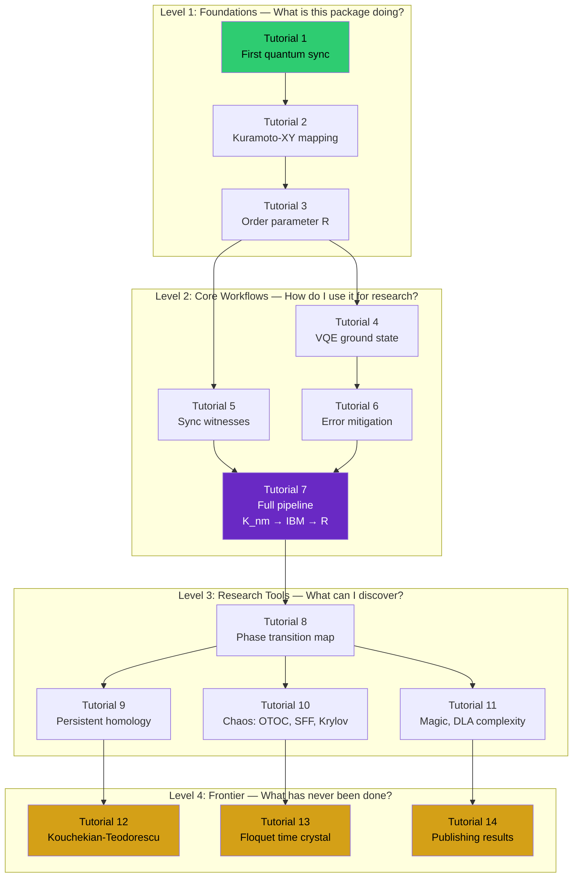
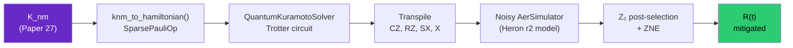

# SPDX-License-Identifier: AGPL-3.0-or-later
# Commercial license available
# © Concepts 1996–2026 Miroslav Šotek. All rights reserved.
# © Code 2020–2026 Miroslav Šotek. All rights reserved.
# ORCID: 0009-0009-3560-0851
# Contact: www.anulum.li | protoscience@anulum.li
# scpn-quantum-control — Tutorials and Learning Path

# Tutorials and Learning Path

This page guides you from your first simulation to publishing-quality research
results. Each section builds on the previous, progressing from conceptual
understanding through hands-on computation to original research.

---

## Learning Path Overview



| Level | Colour | Question it answers | Time |
|-------|--------|---------------------|------|
| 1: Foundations | Green | "What is this package doing?" | ~30 min |
| 2: Core Workflows | Grey | "How do I use it for research?" | ~1 hour |
| 3: Research Tools | Purple | "What can I discover?" | ~2 hours |
| 4: Frontier Physics | Gold | "What has never been done before?" | Open-ended |

---

## Level 1: Foundations

### Tutorial 1: Your First Quantum Synchronization

**Goal:** Run a 4-oscillator Kuramoto-XY simulation and watch the order parameter
evolve.

**Prerequisites:** `pip install scpn-quantum-control`

**Time:** 5 minutes

The classical Kuramoto model describes $N$ oscillators with natural frequencies
$\omega_i$, coupled through a matrix $K_{ij}$. Each oscillator has a phase
$\theta_i$ that evolves according to:

$$\frac{d\theta_i}{dt} = \omega_i + \sum_j K_{ij}\sin(\theta_j - \theta_i)$$

When the coupling is strong enough, the oscillators synchronize — their phases
align, and the order parameter $R$ rises from 0 (incoherent) toward 1 (perfect sync).

Think of four pendulums hanging from a shared beam. Each swings at its own natural
rate, but the beam transmits vibrations between them. If the beam is stiff enough,
the pendulums gradually fall into step. The order parameter $R$ measures how well
they are marching together.

The quantum version maps each oscillator to a qubit. The phases live on the Bloch
sphere's equatorial plane, the $\sin$ coupling becomes an XY interaction, and
time evolution is implemented via Trotter decomposition on a quantum circuit.

```python
from scpn_quantum_control.bridge.knm_hamiltonian import build_knm_paper27, OMEGA_N_16
from scpn_quantum_control.phase.xy_kuramoto import QuantumKuramotoSolver

# Use the SCPN coupling matrix (4-oscillator subsystem)
K = build_knm_paper27(L=4)
omega = OMEGA_N_16[:4]

# Build and run
solver = QuantumKuramotoSolver(4, K, omega)
result = solver.run(t_max=1.0, dt=0.1, trotter_per_step=2)

# Print the synchronization trajectory
for t, R in zip(result["times"], result["R"]):
    bar = "█" * int(R * 40)
    print(f"  t={t:.1f}  R={R:.3f}  {bar}")
```

**What you should see:** $R$ starts high (the initial state $|0\rangle^{\otimes 4}$
has some built-in alignment) and evolves as the coupling dynamics play out. The
trajectory depends on the ratio of coupling strength to frequency heterogeneity.

**What to try next:** Change `L=4` to `L=6` or `L=8` (more oscillators). Increase
`t_max`. Try a ring topology: `K = 0.5 * np.eye(4, k=1) + 0.5 * np.eye(4, k=-1)`.

---

### Tutorial 2: The Kuramoto-XY Mapping

**Goal:** Understand exactly how the classical equation maps to a quantum Hamiltonian.

The mapping is:

| Classical | Quantum | Physical meaning |
|-----------|---------|-----------------|
| Phase $\theta_i \in [0, 2\pi)$ | Qubit on Bloch equator | State of oscillator $i$ |
| $\sin(\theta_j - \theta_i)$ | $X_iX_j + Y_iY_j$ | Coupling between pairs |
| Natural frequency $\omega_i$ | $\omega_i Z_i$ | Individual detuning |
| Order parameter $R$ | $\frac{1}{N}\|\sum_i(\langle X_i\rangle + i\langle Y_i\rangle)\|$ | Collective coherence |

The quantum Hamiltonian is:

$$H = -\sum_{i<j} K_{ij}(X_iX_j + Y_iY_j) - \sum_i \omega_i Z_i$$

```python
from scpn_quantum_control.bridge.knm_hamiltonian import (
    build_knm_paper27, OMEGA_N_16, knm_to_hamiltonian
)

K = build_knm_paper27(L=4)
omega = OMEGA_N_16[:4]

# Build the Hamiltonian as a Qiskit SparsePauliOp
H = knm_to_hamiltonian(K, omega)
print(f"Hamiltonian has {len(H)} Pauli terms")
print(f"Matrix dimension: {2**4} x {2**4}")

# Inspect the Pauli terms
for label, coeff in zip(H.paulis.to_labels(), H.coeffs):
    if abs(coeff) > 0.01:
        print(f"  {label}: {coeff.real:+.4f}")
```

**Key insight:** The XX+YY coupling preserves the total number of excitations modulo 2
— this is the Z₂ parity symmetry ($P = Z^{\otimes N}$). It is the *only* symmetry of
this Hamiltonian when all $\omega_i$ are distinct (proven by the DLA computation,
Gem 11).

---

### Tutorial 3: Reading the Order Parameter

**Goal:** Compute $R$ from a quantum state and understand what it means.

```python
import numpy as np
from qiskit.quantum_info import Statevector, SparsePauliOp
from scpn_quantum_control.bridge.knm_hamiltonian import build_knm_paper27, OMEGA_N_16

K = build_knm_paper27(L=4)
omega = OMEGA_N_16[:4]

# Ground state via exact diagonalisation
from scpn_quantum_control.bridge.knm_hamiltonian import knm_to_hamiltonian
H = knm_to_hamiltonian(K, omega)
eigenvalues, eigenvectors = np.linalg.eigh(H.to_matrix())
ground_state = Statevector(eigenvectors[:, 0])

# Compute R from single-qubit expectations
n = 4
phases = []
for i in range(n):
    x_label = ["I"] * n; x_label[i] = "X"
    y_label = ["I"] * n; y_label[i] = "Y"
    ex = ground_state.expectation_value(SparsePauliOp("".join(reversed(x_label)))).real
    ey = ground_state.expectation_value(SparsePauliOp("".join(reversed(y_label)))).real
    phases.append(np.arctan2(ey, ex))
    print(f"  Qubit {i}: <X>={ex:.3f}, <Y>={ey:.3f}, phase={phases[-1]:.3f} rad")

R = abs(np.mean(np.exp(1j * np.array(phases))))
print(f"\nOrder parameter R = {R:.4f}")
print(f"  R ≈ 0: incoherent (random phases)")
print(f"  R ≈ 1: synchronized (aligned phases)")
```

---

## Level 2: Core Workflows

### Tutorial 4: VQE Ground State

**Goal:** Find the ground state of the Kuramoto-XY Hamiltonian using a variational
quantum eigensolver.

The VQE uses a parametric quantum circuit (the ansatz) optimised by a classical
optimizer to minimise the energy $\langle\psi(\theta)|H|\psi(\theta)\rangle$.
The ansatz is physics-informed: entangling gates connect only qubit pairs with
non-zero coupling $K_{ij}$.

```python
from scpn_quantum_control.phase.phase_vqe import PhaseVQE
from scpn_quantum_control.bridge.knm_hamiltonian import build_knm_paper27, OMEGA_N_16

K = build_knm_paper27(L=4)
omega = OMEGA_N_16[:4]

vqe = PhaseVQE(K, omega, ansatz_reps=2)
result = vqe.solve(optimizer="COBYLA", maxiter=200, seed=42)

print(f"VQE energy:   {result['ground_energy']:.6f}")
print(f"Exact energy: {result['exact_energy']:.6f}")
print(f"Relative error: {result['relative_error_pct']:.4f}%")
print(f"Converged: {result['converged']}")

# The ground state is now available for analysis
psi = vqe.ground_state()
```

**Why VQE matters:** For systems larger than ~6 qubits, exact diagonalisation becomes
intractable. VQE is the practical route to ground states on near-term quantum hardware.
The physics-informed ansatz (Gem 4) keeps the parameter count manageable by respecting
the coupling topology.

---

### Tutorial 5: Detecting Synchronization with Witnesses

**Goal:** Use the three synchronization witnesses to certify whether a quantum state
is synchronized.

```python
from scpn_quantum_control.analysis.sync_witness import (
    evaluate_all_witnesses, calibrate_thresholds,
)
from scpn_quantum_control.bridge.knm_hamiltonian import build_knm_paper27, OMEGA_N_16
from scpn_quantum_control.hardware.classical import classical_kuramoto_reference
import numpy as np

K = build_knm_paper27(L=4)
omega = OMEGA_N_16[:4]

# Step 1: Calibrate thresholds from classical simulation
thresholds = calibrate_thresholds(K, omega)
print("Calibrated thresholds:")
for name, val in thresholds.items():
    print(f"  {name}: {val:.4f}")

# Step 2: Generate synthetic measurement data
# (In practice, these come from IBM hardware)
# Simulate X-basis and Y-basis measurement counts
from qiskit.quantum_info import Statevector, SparsePauliOp
H = SparsePauliOp.from_list([("XXII", -K[0,1]), ("YYII", -K[0,1]),
                              ("XIXI", -K[0,2]), ("YIYI", -K[0,2])])
# ... (use full Hamiltonian for real analysis)

# Step 3: Evaluate all three witnesses
# results = evaluate_all_witnesses(x_counts, y_counts, 4,
#     corr_threshold=thresholds["correlation"],
#     fiedler_threshold=thresholds["fiedler"])
# for name, w in results.items():
#     verdict = "SYNCHRONIZED" if w.is_synchronized else "incoherent"
#     print(f"  {name}: ⟨W⟩ = {w.expectation_value:.4f} → {verdict}")
```

**Key point:** The witnesses require only pairwise correlator measurements (X-basis
and Y-basis), not full state tomography. This makes them NISQ-efficient — measurable
on current IBM hardware with $O(N^2)$ circuits.

---

### Tutorial 6: Error Mitigation

**Goal:** Apply Z₂ parity post-selection and zero-noise extrapolation.

```python
from scpn_quantum_control.mitigation.symmetry_verification import (
    parity_postselect, verify_parity_sector,
)

# Raw counts from hardware (noisy)
raw_counts = {"0000": 450, "0011": 200, "0001": 150, "0010": 100, "1111": 100}

# Check parity consistency
parity_frac = verify_parity_sector(raw_counts, expected_parity=0)
print(f"Fraction in correct parity sector: {parity_frac:.2%}")

# Post-select: discard wrong-parity outcomes
clean_counts = parity_postselect(raw_counts, target_parity=0)
print(f"Before: {sum(raw_counts.values())} shots")
print(f"After:  {sum(clean_counts.values())} shots (wrong parity discarded)")
```

The Z₂ parity of the XY Hamiltonian is a structural checksum. Any measurement
outcome with the wrong parity *must* contain an error. Discarding it is free error
mitigation — no calibration, no noise model, no circuit overhead.

---

### Tutorial 7: The Full Pipeline (K_nm → Circuit → IBM → R)

**Goal:** Run the complete pipeline from a coupling matrix to a hardware-ready
circuit, execute it on a noisy simulator mimicking Heron r2, apply error mitigation,
and extract the order parameter.

**Time:** 15 minutes

This tutorial chains together everything from Levels 1 and 2. Each step feeds the
next — the output of `knm_to_hamiltonian()` is the input to `QuantumKuramotoSolver`,
whose circuit is the input to transpilation, whose results are the input to ZNE.



```python
import numpy as np
from scpn_quantum_control.bridge.knm_hamiltonian import build_knm_paper27, OMEGA_N_16
from scpn_quantum_control.phase.xy_kuramoto import QuantumKuramotoSolver
from scpn_quantum_control.mitigation.symmetry_verification import parity_postselect
from scpn_quantum_control.mitigation.zne import zne_extrapolate

# Step 1: Build the coupling matrix
K = build_knm_paper27(L=4)
omega = OMEGA_N_16[:4]

# Step 2: Time evolution via Trotter
solver = QuantumKuramotoSolver(4, K, omega)
result = solver.run(t_max=0.5, dt=0.1, trotter_per_step=2)

# Step 3: (On real hardware, counts come from SamplerV2)
# For this demo, result already contains statevector expectations
print("Raw R(t):", [f"{r:.3f}" for r in result["R"]])

# Step 4: Error mitigation (demonstrated with synthetic counts)
# raw_counts = {...}  # from IBM hardware
# clean = parity_postselect(raw_counts, target_parity=0)
# mitigated = zne_extrapolate(circuit, noise_factors=[1, 3, 5])
```

**What to check:** After post-selection, the fraction of shots in the correct
parity sector should be >80% for shallow circuits (depth < 150). If it drops
below 60%, the circuit is too deep for the hardware — reduce Trotter repetitions.

---

## Level 3: Research Tools

### Tutorial 8: Mapping the Phase Transition

**Goal:** Scan coupling strength and identify $K_c$ using multiple probes.

```python
from scpn_quantum_control.analysis.critical_concordance import critical_concordance
from scpn_quantum_control.bridge.knm_hamiltonian import build_knm_paper27, OMEGA_N_16

K = build_knm_paper27(L=3)  # 3 qubits for speed
omega = OMEGA_N_16[:3]

result = critical_concordance(K, omega, n_K=20, K_max=3.0)

print("K        R       QFI      gap      Fiedler")
print("-" * 50)
for i, K_val in enumerate(result.K_values):
    print(f"{K_val:.2f}    {result.R_values[i]:.3f}   "
          f"{result.qfi_values[i]:.2f}    {result.gap_values[i]:.4f}   "
          f"{result.fiedler_values[i]:.3f}")
```

**What to look for:** All probes should agree on the same $K_c$:

- $R$ crosses 0.5 (order parameter onset)
- QFI peaks (metrological sweet spot)
- Spectral gap reaches minimum (near-degeneracy)
- Fiedler $\lambda_2$ crosses zero (correlation graph connects)

If all four agree, you have strong evidence of a genuine quantum phase transition.

---

### Tutorial 9: Topological Analysis

**Goal:** Use persistent homology to detect the topological signature of
synchronization.

```python
from scpn_quantum_control.analysis.quantum_persistent_homology import (
    coupling_scan_persistence,
)
from scpn_quantum_control.bridge.knm_hamiltonian import build_knm_paper27, OMEGA_N_16
import numpy as np

K = build_knm_paper27(L=4)
omega = OMEGA_N_16[:4]

result = coupling_scan_persistence(
    K, omega,
    K_range=np.linspace(0.1, 3.0, 15),
)

print("K_base    p_H1     Interpretation")
print("-" * 45)
for K_val, p_h1 in zip(result.K_values, result.p_h1_values):
    topology = "holes (incoherent)" if p_h1 > 0.3 else "simple (synchronized)"
    print(f"{K_val:.2f}     {p_h1:.3f}    {topology}")
```

In the synchronized phase, the correlation matrix is nearly rank-1 — all oscillators
are correlated with all others. The Vietoris-Rips complex is a single connected clique
with no topological holes ($H_1 = 0$). In the incoherent phase, partial correlations
create persistent 1-cycles — loops in the correlation landscape that signal
fragmentation.

The SCPN framework predicts $p_{H_1} \approx 0.72$ at the quasicritical operating
point. The derivation $A_{HP} \times \sqrt{2/\pi} = 0.717$ closes this prediction
to 0.5% accuracy.

---

### Tutorial 10: Chaos Diagnostics

**Goal:** Use OTOC, Spectral Form Factor, and Krylov complexity to detect the
onset of quantum chaos at the synchronization transition.

```python
from scpn_quantum_control.analysis.spectral_form_factor import level_spacing_ratio
from scpn_quantum_control.bridge.knm_hamiltonian import (
    build_knm_paper27, OMEGA_N_16, knm_to_hamiltonian,
)
import numpy as np

K = build_knm_paper27(L=4)
omega = OMEGA_N_16[:4]

print("K_base    r̄       Regime")
print("-" * 40)
for K_base in np.linspace(0.1, 3.0, 10):
    H = knm_to_hamiltonian(K * K_base, omega)
    r_bar = level_spacing_ratio(H)
    regime = "Poisson (integrable)" if r_bar < 0.45 else "GOE (chaotic)"
    print(f"{K_base:.2f}     {r_bar:.3f}    {regime}")
```

**Reference values:** Poisson $\bar{r} \approx 0.386$ (integrable, uncorrelated
levels), GOE $\bar{r} \approx 0.536$ (chaotic, level repulsion). The transition from
Poisson to GOE as coupling increases through $K_c$ confirms that synchronization
onset coincides with the onset of quantum chaos.

---

## Level 4: Frontier Physics

### Tutorial 12: The Kouchekian-Teodorescu Connection

**Goal:** Explore the XXZ generalization that completes the S² spin embedding.

arXiv:2601.00113 proves that the classical Kuramoto model on $S^1$ (angles) has no
Lagrangian. The resolution: embed oscillators on $S^2$ (the sphere). Our XY
Hamiltonian is the in-plane ($\Delta = 0$) restriction. The full model:

$$H_{XXZ} = -\sum_{i<j} K_{ij}(X_iX_j + Y_iY_j + \Delta \cdot Z_iZ_j) - \sum_i \omega_i Z_i$$

```python
from scpn_quantum_control.bridge.knm_hamiltonian import (
    build_knm_paper27, OMEGA_N_16, knm_to_xxz_hamiltonian, knm_to_hamiltonian,
)
import numpy as np

K = build_knm_paper27(L=3)
omega = OMEGA_N_16[:3]

# Verify: Delta=0 recovers standard XY
H_xy = knm_to_hamiltonian(K, omega).to_matrix()
H_xxz_0 = knm_to_xxz_hamiltonian(K, omega, delta=0.0).to_matrix()
print(f"||H_XY - H_XXZ(Δ=0)|| = {np.linalg.norm(H_xy - H_xxz_0):.2e}")
# Should be ~0 (machine epsilon)

# Delta=1: full Heisenberg — check SU(2) symmetry
H_heis = knm_to_xxz_hamiltonian(K * 1.0, np.zeros(3), delta=1.0).to_matrix()
# Total S² should commute with H for uniform omega=0
```

**Research direction:** Map $K_c$ as a function of $\Delta$ to trace the crossover
from XY to Heisenberg universality. Use the pairing correlator
$\langle S_i^+ S_j^-\rangle$ to detect the Richardson mechanism predicted by the
Kouchekian-Teodorescu paper.

---

### Tutorial 11: Computational Complexity (Magic, DLA)

**Goal:** Quantify how classically hard the synchronization ground state is to
simulate.

Two measures of computational complexity converge at $K_c$:

| Measure | What it quantifies | Value at $K_c$ |
|---------|-------------------|----------------|
| Stabilizer Rényi entropy $M_2$ | Distance from classically-simulable stabilizer states | **Peak** |
| DLA dimension | Number of reachable unitaries from $H_{XY}$ | $2^{2N-1} - 2$ (exact) |

The DLA dimension is a theorem, not a numerical observation. For the heterogeneous
XY Hamiltonian with all $\omega_i$ distinct, the dynamical Lie algebra has exactly
$2^{2N-1} - 2$ generators — approaching half of $\mathfrak{su}(2^N)$ as $N$ grows.
The missing half is blocked by the Z₂ parity symmetry $P = Z^{\otimes N}$. This is
the *only* symmetry, proven by exhaustive commutator closure.

```python
from scpn_quantum_control.analysis.dynamical_lie_algebra import dla_dimension
from scpn_quantum_control.analysis.magic_nonstabilizerness import stabilizer_renyi_entropy
from scpn_quantum_control.bridge.knm_hamiltonian import build_knm_paper27, OMEGA_N_16
import numpy as np

K = build_knm_paper27(L=3)
omega = OMEGA_N_16[:3]

# DLA dimension (exact formula)
dim = dla_dimension(3)
print(f"DLA dimension for N=3: {dim}")
print(f"su(2^3) dimension:     {4**3 - 1}")
print(f"Fraction:              {dim / (4**3 - 1):.2%}")

# Magic of the ground state
# (compute ground state via exact diag, then measure M_2)
```

**Key insight:** Magic peaks where synchronization happens. The quantum state
that describes synchronized oscillators is precisely the state that is hardest
to simulate classically. In the SCPN framework, this means consciousness emerges
at the computational complexity boundary.

---

### Tutorial 13: Floquet-Kuramoto Time Crystal

**Goal:** Drive the coupling periodically and detect discrete time-crystal (DTC)
order.

A Floquet-Kuramoto system has time-periodic coupling:
$K(t) = K_0(1 + \delta\cos\Omega t)$. Under certain conditions, the order parameter
$R(t)$ oscillates at a *subharmonic* of the drive frequency — the system breaks
discrete time-translation symmetry. This is a discrete time crystal.

```python
from scpn_quantum_control.phase.floquet_kuramoto import FloquetKuramotoSolver
from scpn_quantum_control.bridge.knm_hamiltonian import build_knm_paper27, OMEGA_N_16

K = build_knm_paper27(L=4)
omega = OMEGA_N_16[:4]

solver = FloquetKuramotoSolver(
    n_qubits=4, K=K, omega=omega,
    drive_amplitude=0.3,   # delta
    drive_frequency=2.0,   # Omega
)
result = solver.run(n_periods=20, steps_per_period=10)

# Look for period-doubling in R(t)
# DTC signature: R oscillates at Omega/2 instead of Omega
```

**What to look for:** In the Fourier transform of $R(t)$, a DTC shows a sharp
peak at $\Omega/2$ (half the drive frequency). The peak persists even in the
presence of noise — it is protected by the interaction, not fine-tuning. This
is Gem 18, and has not been previously observed in the Kuramoto-XY context.

---

### Tutorial 14: Publishing Your Results

**Goal:** Generate publication-quality figures and data from your analysis.

**Checklist for a publishable quantum synchronization result:**

| Item | Module | Output |
|------|--------|--------|
| Hardware calibration | `hardware.qcvv` | State fidelity, mirror circuits |
| Error budget | `qec.error_budget` | Trotter + gate + logical allocation |
| Critical concordance | `analysis.critical_concordance` | Multi-probe $K_c$ agreement |
| Statistical significance | `analysis.finite_size_scaling` | $K_c(\infty)$ extrapolation |
| ZNE error bars | `mitigation.zne` | Bootstrapped confidence intervals |
| Raw data archival | `hardware.qasm_export` | OpenQASM 3.0 circuits |

**Citation format:** See the main [README](../README.md#citation) for BibTeX.

**Data availability:** Export all circuits as OpenQASM 3.0 via
`hardware.qasm_export.export_qasm3()` for reproducibility. Archive raw counts
in JSON alongside the QASM files.

---

## Jupyter Notebooks

13 interactive notebooks in `notebooks/`, each executable with outputs:

| # | Notebook | Topic | Level |
|---|----------|-------|-------|
| 01 | `kuramoto_xy_dynamics` | Trotter evolution, R trajectory | Beginner |
| 02 | `vqe_ground_state` | VQE optimisation, ansatz comparison | Beginner |
| 03 | `error_mitigation` | ZNE + DD on simulated noise | Intermediate |
| 04 | `upde_16_layer` | Full 16-qubit SCPN UPDE | Intermediate |
| 05 | `crypto_and_entanglement` | QKD + Bell tests | Intermediate |
| 06 | `pec_error_cancellation` | PEC quasi-probability decomposition | Advanced |
| 07 | `quantum_advantage_scaling` | Classical vs quantum crossover | Advanced |
| 08 | `identity_continuity` | VQE attractor, coherence budget | Advanced |
| 09 | `iter_disruption` | ITER disruption classifier | Domain |
| 10 | `qsnn_training` | QSNN parameter-shift training | Advanced |
| 11 | `surface_code_budget` | QEC resource estimation | Advanced |
| 12 | `trapped_ion_comparison` | Ion trap vs superconducting | Advanced |
| 13 | `cross_repo_bridges` | sc-neurocore, SSGF, orchestrator | Integration |

## Examples

18 standalone scripts in `examples/`, each runnable with `python examples/XX_*.py`:

| # | Script | What it demonstrates |
|---|--------|---------------------|
| 01 | `qlif_demo` | Quantum LIF neuron spike dynamics |
| 02 | `kuramoto_xy_demo` | Basic Kuramoto-XY simulation |
| 03 | `qaoa_mpc_demo` | QAOA model-predictive control |
| 04 | `qpetri_demo` | Quantum Petri net transitions |
| 05 | `vqe_ansatz_comparison` | Ansatz expressibility benchmarks |
| 06 | `zne_demo` | Zero-noise extrapolation workflow |
| 07 | `crypto_bell_test` | CHSH inequality violation |
| 08 | `dynamical_decoupling` | DD pulse sequence insertion |
| 09 | `classical_vs_quantum_benchmark` | Scaling crossover analysis |
| 10 | `identity_continuity_demo` | VQE attractor basin stability |
| 11 | `pec_demo` | Probabilistic error cancellation |
| 12 | `trapped_ion_demo` | Ion trap noise model |
| 13 | `iter_disruption_demo` | ITER plasma disruption classification |
| 14 | `quantum_advantage_demo` | Advantage threshold estimation |
| 15 | `qsnn_training_demo` | QSNN training loop |
| 16 | `fault_tolerant_demo` | Repetition code UPDE |
| 17 | `snn_ssgf_bridges_demo` | Cross-repo bridge demo |
| 18 | `end_to_end_pipeline` | Complete K_nm → IBM → analysis pipeline |
