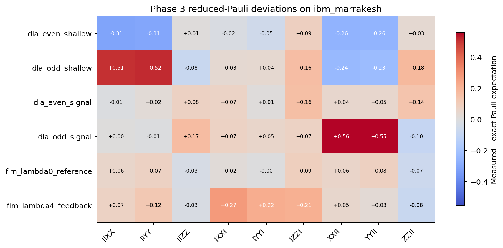

# SPDX-License-Identifier: AGPL-3.0-or-later
# Commercial license available
# © Concepts 1996-2026 Miroslav Sotek. All rights reserved.
# © Code 2020-2026 Miroslav Sotek. All rights reserved.
# ORCID: 0009-0009-3560-0851
# Contact: www.anulum.li | protoscience@anulum.li

# Reduced-Pauli entanglement checks for DLA-sector leakage mechanisms on IBM Heron hardware

**Miroslav Šotek** [ORCID: 0009-0009-3560-0851]
*ANULUM Research, Marbach SG, Switzerland*
*Contact: protoscience@anulum.li*

**Date:** 2026-05-20
**Status:** Historical Markdown scaffold; canonical source is
`phase3_entanglement_tomography.tex`, with completed IBM execution,
second-backend replication, full-readout calibration, ZNE stress-test analysis,
tables, and figure assets.
**Target venue:** short communication / workshop submission candidate

---

## Abstract

Parity-sector leakage asymmetry in small Kuramoto-XY circuits is a useful
hardware observable only if the mechanism can be separated from layout,
prepared-state, and readout artefacts. We present a cost-bounded reduced-Pauli
entanglement/tomography protocol for the promoted Phase 3 DLA-parity and
Fisher-information-modified Kuramoto-XY circuit families. The protocol measures
54 exact-reference Pauli observables across six source circuits, grouped into
nine measurement bases with three repetitions per source/basis pair, plus
readout calibration states. The approved IBM `ibm_marrakesh` execution selected
physical qubits `[1,2,3,4]`, transpiled 166 circuits, and completed jobs
`d86g7h1789is738vkreg` and `d86ggpis46sc73f6v170` under the preregistered 25
minute ceiling. The preregistered reducer produced 54 observable rows with mean
absolute deviation 0.1299 and maximum absolute deviation 0.5561 relative to
exact references. Same-day `ibm_fez` replication, pinned-layout full correlated
readout calibration, and a five-channel ZNE stress test were later added in
the canonical LaTeX manuscript. The ZNE stress test shows that global
unitary-folding noise scaling does not erase the dominant DLA transverse
deviations, even though a FIM control channel partially improves. The intended
claim is bounded: reduced-Pauli correlators show large hardware deviations in
the fixed small-system setting, with no scalable tomography, quantum-advantage,
or backend-general claim.

## 1. Introduction

The Kuramoto-XY hardware programme has produced several useful but deliberately
bounded observations. The original DLA-parity campaign measured a
sector-resolved leakage asymmetry on IBM Heron-class hardware. Later Phase 3
controls showed that the sign and magnitude of the effect are sensitive to
backend, prepared state, layout, and readout context. This makes a direct
mechanism question unavoidable: do the promoted circuits also show a measurable
change in reduced entanglement structure, or is the leakage contrast better
treated as a readout/layout/decoherence boundary?

Full tomography is unnecessary for this question. The observable of interest is
not a reconstructed four-qubit state, but a small set of reduced Pauli
correlators on logical edges, together with half-chain purity proxies already
computed from exact references. The protocol therefore uses reduced-Pauli
measurements and rejects scalable-tomography language.

## 2. Protocol

The promoted source circuits are:

| Label | Family | Initial state | Depth | Parameter |
|---|---|---|---:|---:|
| `dla_even_shallow` | DLA parity | `0011` | 6 | none |
| `dla_odd_shallow` | DLA parity | `0001` | 6 | none |
| `dla_even_signal` | DLA parity | `0011` | 10 | none |
| `dla_odd_signal` | DLA parity | `0001` | 10 | none |
| `fim_lambda0_reference` | FIM pair | `0011` | 4 | `lambda=0` |
| `fim_lambda4_feedback` | FIM pair | `0011` | 4 | `lambda=4` |

For each source circuit, the protocol measures the nine basis settings:

```text
IIXX, IIYY, IIZZ, IXXI, IYYI, IZZI, XXII, YYII, ZZII
```

Each source/basis pair is repeated three times at 2048 shots. Four readout
states are measured at 8192 shots:

```text
0000, 0001, 0011, 1111
```

The resulting hardware block contains 162 main circuits and 4 readout circuits.

## 3. Live Execution

The live preflight was run on 2026-05-20:

```bash
python scripts/phase3_entanglement_tomography_ibm.py --backend ibm_marrakesh
```

It produced:

```text
data/phase3_entanglement_tomography/entanglement_tomography_live_ibm_marrakesh_2026-05-20T001956Z.json
```

Preflight summary:

| Gate | Value |
|---|---:|
| Backend | `ibm_marrakesh` |
| Selected physical qubits | `[1,2,3,4]` |
| Main circuits | 162 |
| Readout circuits | 4 |
| Total circuits | 166 |
| Estimated QPU minutes | 1.5217 |
| Budget ceiling minutes | 25.0 |
| Maximum transpiled depth | 388 |
| Maximum basis-expansion ratio | 1.0718232044198894 |

The approved budget-confirmed execution was then run:

```bash
python scripts/phase3_entanglement_tomography_ibm.py --backend ibm_marrakesh --submit --confirm-budget
```

Completed artefact:

```text
data/phase3_entanglement_tomography/entanglement_tomography_live_ibm_marrakesh_2026-05-20T004334Z.json
```

Completed jobs:

```text
d86g7h1789is738vkreg
d86ggpis46sc73f6v170
```

## 4. Analysis Plan

The approved raw-count artefact will be reduced with:

```bash
python scripts/analyse_phase3_entanglement_tomography.py \
  data/phase3_entanglement_tomography/entanglement_tomography_live_<backend>_<timestamp>.json
```

For each measured circuit, the reducer computes:

```math
\langle P \rangle = \frac{1}{N}\sum_b n_b \prod_{i \in \operatorname{supp}(P)} (-1)^{b_i},
```

where \(P\) is the measured Pauli label after basis rotation and \(n_b\) is the
count of bitstring \(b\). Repetitions are grouped by circuit label and basis
setting, then compared with exact reference expectations from:

```text
data/phase3_entanglement_tomography/entanglement_observable_rows_2026-05-07.csv
```

Primary outputs:

- `entanglement_tomography_summary_<date>.json`;
- `entanglement_tomography_rows_<date>.csv`;
- `phase3_entanglement_tomography_manifest_<date>.md`.

## 5. Results

Raw-count execution completed on `ibm_marrakesh`.

First-pass reduced-Pauli analysis was generated with:

```bash
python scripts/analyse_phase3_entanglement_tomography.py \
  data/phase3_entanglement_tomography/entanglement_tomography_live_ibm_marrakesh_2026-05-20T004334Z.json
```

Outputs:

- `data/phase3_entanglement_tomography/entanglement_tomography_summary_2026-05-20.json`;
- `data/phase3_entanglement_tomography/entanglement_tomography_rows_2026-05-20.csv`;
- `docs/phase3_entanglement_tomography_manifest_2026-05-20.md`.

Paper table and figure assets were generated with:

```bash
python scripts/generate_phase3_entanglement_paper_assets.py
```

This generated the label-level summary, basis-level summary, largest-deviation
table, and heatmap figure used below. The asset manifest is:

```text
data/phase3_entanglement_tomography/entanglement_tomography_paper_assets_2026-05-20.md
```

Summary:

| Metric | Value |
|---|---:|
| Backend | `ibm_marrakesh` |
| Submitted jobs | `d86g7h1789is738vkreg`, `d86ggpis46sc73f6v170` |
| Observable rows | 54 |
| Mean absolute deviation from exact reference | 0.12989296537986128 |
| Maximum absolute deviation from exact reference | 0.5560906424788263 |
| Rows SHA256 | `3d18308d60fe32827bae7517f18fd71690240b105779287408c4749cb0e7dc72` |

Label-level aggregate deviations:

| Family | Circuit label | Mean signed deviation | Mean absolute deviation | Maximum absolute deviation |
|---|---|---:|---:|---:|
| DLA parity | `dla_even_shallow` | -0.120474 | 0.148396 | 0.314180 |
| DLA parity | `dla_even_signal` | 0.061095 | 0.063458 | 0.160443 |
| DLA parity | `dla_odd_shallow` | 0.098416 | 0.219708 | 0.515473 |
| DLA parity | `dla_odd_signal` | 0.153497 | 0.176026 | 0.556091 |
| FIM pair | `fim_lambda0_reference` | 0.030496 | 0.052205 | 0.088148 |
| FIM pair | `fim_lambda4_feedback` | 0.096107 | 0.119566 | 0.274155 |

Largest observed deviations:

| Circuit label | Basis | Measured | Exact | Deviation |
|---|---|---:|---:|---:|
| `dla_odd_signal` | `XXII` | 0.431641 | -0.124450 | 0.556091 |
| `dla_odd_signal` | `YYII` | 0.429688 | -0.124450 | 0.554138 |
| `dla_odd_shallow` | `IIYY` | 0.488932 | -0.026541 | 0.515473 |
| `dla_odd_shallow` | `IIXX` | 0.478841 | -0.026541 | 0.505382 |
| `dla_even_shallow` | `IIXX` | -0.456055 | -0.141874 | -0.314180 |
| `dla_even_shallow` | `IIYY` | -0.447591 | -0.141874 | -0.305717 |
| `fim_lambda4_feedback` | `IXXI` | 0.175781 | -0.098373 | 0.274155 |



The heatmap shows that the largest deviations are concentrated in transverse
two-qubit correlators (`XX` and `YY`) rather than only in population-like `ZZ`
observables. DLA odd circuits show the largest positive edge-correlator shifts,
while the DLA even shallow circuit shows large negative shifts on corresponding
edge correlators. The FIM `lambda_fim=4` feedback circuit deviates more strongly
than the `lambda_fim=0` reference, but not as strongly as the DLA odd circuits.

## 6. Interpretation Rules

The result supports a mechanism interpretation only if measured correlator
deviations are larger than their uncertainty and are stable under the readout
boundary. The interpretation is downgraded if any of the following occur:

- readout correction changes the sign of the promoted comparison;
- uncertainty intervals are wider than the measured deviation from reference;
- DLA and FIM families show no coherent separation;
- measured correlators are consistent with product-state or readout artefact
  explanations.

The canonical LaTeX manuscript extends this first-pass result with
second-backend replication, full correlated readout calibration, and the
preregistered ZNE subset. Those extensions make a pure population-readout
explanation less plausible, but still do not establish full causal attribution:
coherent hardware error, basis-rotation error, layout context, calibration
drift, and circuit depth remain within the claim boundary.

## 7. Discussion

The main scientific result is not that the hardware implements the exact
reduced-Pauli reference structure. It does not. The result is that the
departures from the exact reference are large, structured, and concentrated in
specific correlator channels. This makes the earlier DLA/FIM hardware story
more precise: leakage and retention should not be treated only as scalar
survival metrics, because the same circuit families carry measurable
correlator-level distortions.

The DLA circuits dominate the strongest deviations. The odd-sector signal
circuit has the largest absolute deviations in `XXII` and `YYII`, both changing
from small negative exact values to positive measured values. The odd shallow
circuit shows the analogous strong positive shift on `IIXX` and `IIYY`. The
even shallow circuit moves in the opposite direction, with large negative
shifts in the same transverse correlator family. This sign structure is the
most interesting physics feature of the dataset: it suggests that the
hardware-visible mechanism is not a uniform decay of all correlators, but a
sector- and edge-dependent deformation.

The FIM pair is more muted but still informative. The `lambda_fim=4` feedback
circuit has more than twice the mean absolute deviation of the `lambda_fim=0`
reference. This is consistent with the earlier negative FIM hardware result:
the tested digital FIM modification does not simply protect the target
structure, and it introduces a measurable reduced-Pauli distortion channel.
The result therefore supports a conservative follow-up question for adaptive
FIM control, but it does not rescue a fixed-`lambda_fim` protection claim.

The readout boundary remains important. Four readout calibration states were
included in the execution block, but the current manuscript-level conclusion is
based on unmitigated measured correlators compared with exact references.
Because the largest deviations occur in transverse basis-rotated measurements,
not only in computational-basis `ZZ` channels, the result is unlikely to be a
pure population-readout story. It can still include basis-rotation error,
layout-dependent coherent error, calibration drift, and depth-dependent
decoherence. The safe interpretation is therefore mechanism-boundary evidence,
not full causal attribution.

## 8. Claim Boundary

Safe claims after successful analysis:

- reduced-Pauli correlators were measured for a preregistered small-system
  Kuramoto-XY hardware block;
- measured correlators agree or disagree with exact classical references under
  a fixed backend, layout, and shot budget;
- the result constrains whether entanglement-structure observables accompany
  the previously observed leakage/retention mechanisms.

Blocked claims:

- quantum advantage;
- scalable tomography;
- backend-general entanglement dynamics;
- full-state reconstruction;
- claims about unmeasured subsystems, depths, layouts, or backends.

## 9. Reproducibility

Offline readiness:

```bash
python scripts/generate_entanglement_tomography_readiness.py
```

Live preflight:

```bash
python scripts/phase3_entanglement_tomography_ibm.py --backend ibm_marrakesh
```

Approved hardware submission:

```bash
python scripts/phase3_entanglement_tomography_ibm.py --backend ibm_marrakesh --submit --confirm-budget
```

Post-run analysis:

```bash
python scripts/analyse_phase3_entanglement_tomography.py \
  data/phase3_entanglement_tomography/entanglement_tomography_live_<backend>_<timestamp>.json
```

Paper assets:

```bash
python scripts/generate_phase3_entanglement_paper_assets.py
```

ZNE stress-test analysis:

```bash
python scripts/analyse_phase3_entanglement_zne.py \
  data/phase3_entanglement_tomography/entanglement_tomography_live_ibm_fez_2026-05-20T023600Z.json
```

## 10. Conclusion

The campaign has completed the approved IBM execution, first-pass reduced-Pauli
analysis, same-day replication, full-readout sensitivity checks, and a bounded
ZNE stress test. The scientific paper should be framed as a mechanism-boundary
study: reduced-Pauli tomography shows sizeable measured correlator deviations
in the same small-system setting as the DLA/FIM hardware programme, and simple
global-folding ZNE does not erase the dominant DLA transverse deviations, but
the conservative contribution is to bound and interpret that structure rather
than to claim scalable tomography, backend-general dynamics, or quantum
advantage.

The most defensible contribution is therefore: a preregistered 166-circuit IBM
Heron run measured 54 reduced-Pauli observables for promoted DLA and FIM
Kuramoto-XY circuits, found structured deviations from exact references, and
localized the strongest deviations to transverse edge correlators in DLA
odd/even sector comparisons and the fixed-`lambda_fim=4` FIM circuit. This
turns the earlier leakage/retention observations into a sharper hardware
mechanism question for follow-up controls.
